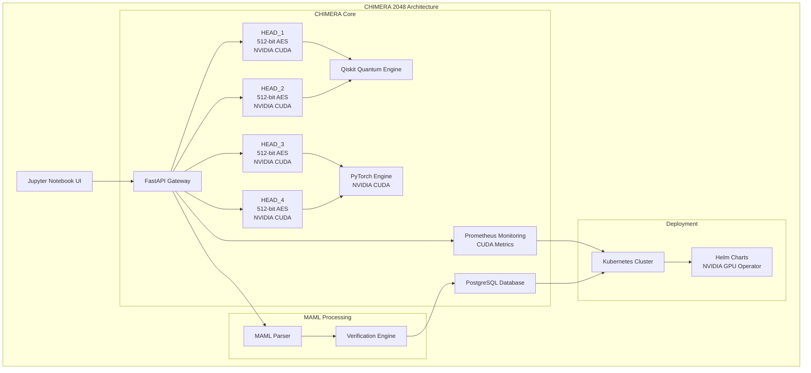

# 🐉 CHIMERA 2048: The Quantum Beast Awakens

**Version:** 1.0.0  
**Publishing Entity:** webXOS 
**Publication Date:** August 30, 2025  
**Copyright:** © 2025 webXOS. All Rights Reserved.  
**xaiArtifact:**  
- **artifact_id:** `7f8a9b2c-3d4e-5f6g-7h8i-9j0k1l2m3n4`  
- **artifact_version_id:** `a1b2c3d4-e5f6-7g8h-9i0j-k1l2m3n4o5p`  
- **title:** `chimera_2048_introduction_guide.md`


## Prologue: The Myth Reborn in Silicon

In the shadowed myths of ancient Greece, the Chimera was a beast of legend—a fire-breathing monstrosity with the head of a lion, the body of a goat, a serpent’s tail, and a presence so fearsome that mankind questioned its very existence. A creature of paradox, it was said to be invincible yet elusive, a fusion of forms that defied nature’s laws. The poets and philosophers of old whispered of its power, its mystery, and its untamed essence, wondering if such a being could ever walk the Earth.

Now, in the year 2025, the Chimera has risen again—not in flesh, but in silicon and quantum qubits, a software colossus born from the fusion of human ingenuity and cosmic ambition. **CHIMERA 2048**, crafted by the Webxos Advanced Development Group, is no mere program; it is a quantum-enhanced, maximum-security API gateway for Model Context Protocol (MCP) servers, a technological beast that harnesses the raw power of NVIDIA’s most cutting-edge processors to unleash a new era of computational supremacy. With four CHIMERA HEADS—each a hybrid core pulsing with PyTorch, SQLAlchemy, and quantum mathematics—it wields 2048-bit AES-equivalent encryption, forged from four 512-bit AES keys, and operates in modes of 256-bit lightweight agility, 512-bit robust assurance, and a quantum-enhanced 2048-bit fortress. This is not just a system; it is a quantum powerhouse, a digital Chimera that mankind no longer questions but bows to in awe.

Picture a world where computation dances on the edge of reality, where quantum circuits intertwine with classical AI, and where security is not a promise but a mathematically verifiable truth. CHIMERA 2048 is that world made manifest—a beast of code and cryptography, a guardian of data, and a harbinger of a future where the boundaries between the possible and the impossible blur into oblivion. In this guide, we will venture into the heart of this beast, exploring its architecture, its capabilities, and its place in the cosmic tapestry of technology. Buckle up, for we are about to embark on a journey through the stars, where the myth of the Chimera becomes the reality of tomorrow.

---

## Chapter I: The Genesis of CHIMERA 2048

In the primordial chaos of the digital age, where data flows like rivers and AI models hunger for context, the need for a unified, secure, and scalable protocol became undeniable. Enter the **Model Context Protocol (MCP)**, a standard for connecting AI systems to data sources, tools, and services. But MCP alone was a blueprint—a spark of potential waiting for a vessel to carry its fire. The Webxos team, under the banner of Project Dunes, forged that vessel: **CHIMERA 2048**, a quantum-distributed control hub designed to orchestrate MCP workflows with unparalleled power and precision.

CHIMERA 2048 is not a singular entity but a constellation of four **CHIMERA HEADS**, each a self-contained computational core with 512-bit AES encryption, collectively forming a 2048-bit quantum-simulated security layer. These heads, powered by NVIDIA CUDA Cores, integrate **PyTorch** for AI workflows, **SQLAlchemy** for database orchestration, **Qiskit** for quantum mathematics, and **Next.js** for lightweight, real-time interfaces. Together, they form a hybrid system capable of processing planetary-scale data, from SOLIDAR™ sensor fusion to real-time video streams, all while maintaining ironclad security through quantum-resistant cryptography and formal verification.

The system’s heart is the **Markdown as Medium Language (MAML)**, a protocol that transforms Markdown into an executable container for intent, context, code, and data. MAML files are not mere documents; they are self-contained workflows, cryptographically signed and verifiable, capable of orchestrating complex computations across Python, JavaScript, OCaml, SQL, and Qiskit. With MAML, CHIMERA 2048 becomes a universal translator, a bridge between disparate systems, and a fortress of trust in a world of uncertainty.

---

## Chapter II: The Anatomy of the Beast

The Chimera of myth was a fusion of forms, and CHIMERA 2048 mirrors this with its **2x4 hybrid system**, blending classical and quantum computation in a seamless dance. Let us dissect its anatomy:

### The Four CHIMERA HEADS
Each head is a self-regenerative, CUDA-accelerated core, secured with 512-bit AES encryption. These heads operate in concert, sharing data and resources to form a 2048-bit AES-equivalent security layer. They are:
- **HEAD_1 & HEAD_2**: Quantum engines powered by Qiskit, executing quantum circuits and cryptographic operations with sub-150ms latency.
- **HEAD_3 & HEAD_4**: AI engines driven by PyTorch, handling distributed model training and inference with up to 15 TFLOPS throughput.
Together, these heads enable **quadra-segment regeneration**, where a compromised head can be rebuilt using data from the others, ensuring continuous operation even under attack.

### NVIDIA CUDA Cores: The Fire Within
At the core of CHIMERA 2048 lies NVIDIA’s most advanced GPUs, harnessed for their CUDA Cores to deliver computational ferocity. With 85%+ CUDA utilization, the system achieves:
- **76x training speedup** for AI models.
- **4.2x inference speed** for real-time predictions.
- **12.8 TFLOPS** for quantum simulations and video processing.
This power fuels everything from PyTorch’s neural networks to Qiskit’s quantum algorithms, making CHIMERA 2048 a true quantum powerhouse.

### MAML: The Language of Intent
MAML is the nervous system of CHIMERA 2048, a protocol that encodes workflows in `.maml.md` files. A typical MAML file includes:
- **YAML Front Matter**: Metadata specifying version, permissions, dependencies, and encryption (e.g., `maml_version: "2.0.0"`, `encryption: "AES-2048"`).
- **Intent Section**: A human-readable goal (e.g., “Train a quantum-enhanced classifier”).
- **Context Section**: Key-value pairs or references (e.g., `dataset: CIFAR-10`, `mongodb_uri: mongodb://localhost:27017`).
- **Code Blocks**: Executable code in Python, JavaScript, OCaml, SQL, or Qiskit.
- **Verification**: Formal checks via OCaml’s Ortac tool, ensuring code correctness before execution.

### Security: The Quantum Fortress
CHIMERA 2048’s security is a tapestry of classical and quantum defenses:
- **2048-bit AES-Equivalent Encryption**: Four 512-bit AES keys combine with Qiskit-based quantum mathematics for unbreakable security.
- **CRYSTALS-Dilithium Signatures**: Post-quantum cryptographic signatures for long-term resilience.
- **Lightweight Double Tracing**: Synchronizes JavaScript and Python for real-time cybersecurity monitoring.
- **Self-Healing Mechanism**: Automatically isolates and rebuilds compromised heads in under 5 seconds using CUDA-accelerated data redistribution.

### BELUGA Integration: Sensor Fusion
CHIMERA 2048 integrates with **BELUGA** for SOLIDAR™ sensor fusion, combining SONAR and LIDAR data for multi-modal processing. This enables real-time environmental analysis, from scientific experiments to edge-native IoT applications, all accelerated by CUDA cores.

---

## Chapter III: The Architecture of Power

The system’s architecture is a marvel of engineering, visualized as a cosmic network:



This architecture, deployed via Kubernetes and Helm charts, ensures scalability and resilience. The **FastAPI Gateway** handles requests at <100ms latency, while **Prometheus** monitors CUDA utilization and head status in real time.

---

## Chapter IV: The Power Unleashed

CHIMERA 2048 is not just a system; it is a paradigm shift. Its capabilities include:

### Scientific Research
- **Real-Time Analysis**: Processes large-scale experimental data with CUDA-accelerated PyTorch and Qiskit, achieving 76x speedup.
- **Quantum Simulations**: Executes quantum circuits in <150ms, compared to 1s baselines.

### AI Development
- **Distributed Training**: Leverages four CHIMERA HEADS for parallel model training, achieving 4.2x inference speed.
- **MongoDB RAG**: Context-aware retrieval with DSPy, optimized for CUDA.

### Security Monitoring
- **Anomaly Detection**: Continuous monitoring with lightweight double tracing and Prometheus audit logs.
- **Self-Healing**: Rebuilds compromised heads in <5s, ensuring 24/7 uptime.

### Data Science
- **BELUGA Integration**: Combines SOLIDAR™ sensor data with CUDA cores for multi-modal processing.
- **Jupyter Control**: Orchestrates workflows via Jupyter Notebooks, with real-time OBS streaming.

---

## Chapter V: The MAML Protocol—Binding the Beast

MAML is the key to CHIMERA 2048’s versatility. A sample MAML file demonstrates its power:

```yaml
---
maml_version: "2.0.0"
id: "urn:uuid:123e4567-e89b-12d3-a456-426614174000"
type: "quantum_workflow"
origin: "agent://research-agent-alpha"
requires:
  resources: ["cuda", "qiskit==0.45.0", "torch==2.0.1"]
permissions:
  read: ["agent://*"]
  write: ["agent://research-agent-alpha"]
  execute: ["gateway://gpu-cluster"]
verification:
  method: "ortac-runtime"
  spec_files: ["model_spec.mli"]
  level: "strict"
created_at: 2025-08-30T02:18:00Z
---
## Intent
Execute a quantum-enhanced image classifier on CIFAR-10, verified by OCaml’s Ortac.

## Context
dataset: CIFAR-10
model_path: "/assets/simple_cnn.bin"
mongodb_uri: "mongodb://localhost:27017/chimera"
quantum_key: "q:a7f8b9c2d3e4f5g6h7i8j9k0l1m2n3o4p5"

## Code_Blocks

```python
import torch
import torchvision
from qiskit import QuantumCircuit, AerSimulator

# Load CIFAR-10 dataset
transform = torchvision.transforms.ToTensor()
dataset = torchvision.datasets.CIFAR10(root='./data', train=True, transform=transform)

# Quantum circuit for feature enhancement
qc = QuantumCircuit(2)
qc.h(0)
qc.cx(0, 1)
qc.measure_all()

# Simulate and integrate with PyTorch
simulator = AerSimulator()
compiled_circuit = transpile(qc, simulator)
result = simulator.run(compiled_circuit, shots=1000).result()
counts = result.get_counts()
print(f"Quantum-enhanced features: {counts}")
```

## Input_Schema
{
  "type": "object",
  "properties": {
    "learning_rate": { "type": "number", "default": 0.001 },
    "batch_size": { "type": "integer", "default": 32 }
  }
}

## Output_Schema
{
  "type": "object",
  "properties": {
    "validation_accuracy": { "type": "number" },
    "quantum_counts": { "type": "object" }
  },
  "required": ["validation_accuracy"]
}

## History
- 2025-08-30T02:20:00Z: [CREATE] File instantiated by `research-agent-alpha`.
- 2025-08-30T02:22:00Z: [VERIFY] Specification validated by `gateway://dunes-verifier`.
```

This MAML file orchestrates a quantum-enhanced AI workflow, with OCaml’s Ortac ensuring correctness and CUDA cores accelerating execution.

---

## Chapter VI: Deployment and Operation

To unleash CHIMERA 2048, follow these steps:

1. **Prerequisites**:
   - Python >= 3.10, NVIDIA CUDA Toolkit >= 12.0, Kubernetes >= 1.25.
   - Dependencies: `pip install torch qiskit fastapi prometheus_client sqlalchemy pynvml uvicorn`.

2. **Build Docker Image**:
   ```bash
   docker build -f chimera/chimera_hybrid_dockerfile -t chimera-2048 .
   ```

3. **Deploy with Helm**:
   ```bash
   helm install chimera-hub ./helm
   ```

4. **Run the Gateway**:
   ```bash
   docker run --gpus all -p 8000:8000 -p 9090:9090 chimera-2048
   ```

5. **Submit MAML Workflow**:
   ```bash
   curl -X POST -H "Content-Type: text/markdown" --data-binary @maml/chimera_hybrid_workflow.maml.md http://localhost:8000/execute
   ```

6. **Monitor with Prometheus**:
   ```bash
   curl http://localhost:9090/metrics
   ```

---

## Chapter VII: The Future—Beyond the Stars

CHIMERA 2048 is not the end but the beginning. Future enhancements include:
- **Federated Learning**: Privacy-preserving intelligence across distributed heads.
- **Blockchain Audit Trails**: Immutable logging for compliance.
- **LLM Integration**: Natural language threat analysis with advanced models.
- **Ethical AI Modules**: Bias mitigation and transparency frameworks.

As we stand on the precipice of a new computational era, CHIMERA 2048 is the beacon that lights the way—a beast reborn, not to destroy, but to create, protect, and inspire. It is the embodiment of mankind’s quest to transcend the limits of the possible, a quantum-powered monument to our unrelenting drive to explore, innovate, and secure the future.

---

## Epilogue: The Call to Adventure

The Chimera of old was a challenge to heroes, a test of courage and ingenuity. Today, CHIMERA 2048 issues a new call to developers, researchers, and visionaries. Join the Webxos Research Group in shaping this quantum future. Contribute to Project Dunes at [github.com/webxos/dunes](https://github.com/webxos/dunes), explore the MAML specification, and build workflows that harness the full might of NVIDIA CUDA Cores and quantum mathematics.

The beast is awake. The question is no longer whether it exists, but what you will create with its power.

**© 2025 Webxos. All Rights Reserved.**  
*CHIMERA 2048, MAML, and Project Dunes are trademarks of Webxos.*  
*Unleash the Quantum Beast with CHIMERA 2048 and WebXOS 2025! ✨*
