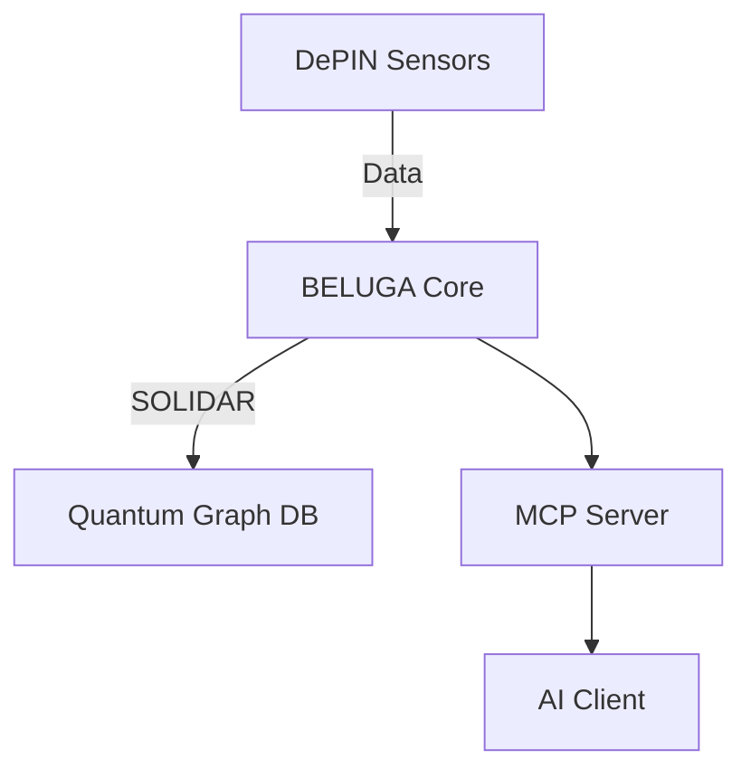

# 🐪 PROJECT DUNES 2048-AES: DePIN & MCP Integration Guide with Quantum Distribution

*Multi-Augmented Model Agnostic Meta Machine Learning and 2048-AES Integration for Decentralized Physical Infrastructure Networks (DePINs)*

**© 2025 WebXOS Research Group. All Rights Reserved.**  
*Invented by WebXOS Research Group*  
**License: MAML Protocol v1.0 – Attribution Required**  
*Hosted on GitHub: [webxos.netlify.app](https://webxos.netlify.app)*  


## 🌌 Page 1: Introduction to PROJECT DUNES 2048-AES for DePIN and MCP

Welcome to the **PROJECT DUNES 2048-AES: OPEN SOURCE BETA**, a quantum-distributed, AI-orchestrated framework by WEBXOS that fuses Decentralized Physical Infrastructure Networks (DePINs) with the Model Context Protocol (MCP) for secure, verifiable, real-time data orchestration. This 10-page guide details how DePINs, MCP, and PROJECT DUNES' .MAML protocol create a next-generation cybersecurity and data ecosystem. ✨

### 📜 Why DePIN + MCP + PROJECT DUNES?
DePINs incentivize decentralized physical infrastructure (e.g., sensors, storage) via blockchain tokens. MCP standardizes AI-tool integrations, solving the M x N integration problem. PROJECT DUNES enhances this with **quantum distribution** using .MAML.ml files—virtual camel containers 🐪 for post-quantum encryption and multi-agent Retrieval-Augmented Generation (RAG).  

- **DePIN Core**: Tokenized hardware contributions (e.g., Helium hotspots).  
- **MCP Bridge**: Client-server protocol for AI-data interoperability.  
- **DUNES Quantum Layer**: .MAML for quantum-resistant, adaptive workflows.  

**Structure**:  
- Pages 1-2: Concepts & Synergies.  
- Pages 3-5: Setup & Quantum Distribution.  
- Pages 6-8: Advanced Workflows & BELUGA.  
- Pages 9-10: Future Enhancements & Humanitarian Impact.  

**2048-AES DUNES AGENT**  
- ✅ **Bilateral Quantum Processing** (SONAR + LIDAR = SOLIDAR™).  
- ✅ **Environmental Adaptive DePIN Architecture**.  
- ✅ **Quantum-Distributed Graph Database**.  
- ✅ **Edge-Native IoT Framework** with OAuth2.0.  

*📋 CLAUDE ARTIFACT: https://claude.ai/public/artifacts/77e9ef0d-fb8b-4124-aa31-ac4a49a29bca*

---

## 💻 Page 2: Understanding DePINs

DePINs use blockchain incentives to crowdsource physical infrastructure, enabling scalable, decentralized networks for data, compute, or connectivity. In PROJECT DUNES, DePIN data feeds into .MAML workflows for secure AI processing.  

### DePIN Mechanics
- **Resource Provisioning**: Users contribute hardware (e.g., sensors, GPUs).  
- **Verification**: Blockchain oracles ensure data integrity (e.g., proof-of-coverage).  
- **Monetization**: Tokens (e.g., HNT, FIL) reward contributors and enable governance.  

#### Examples
| DePIN | Description | DUNES Use Case |
|-------|-------------|----------------|
| Helium | IoT wireless hotspots | Real-time IoT data for MCP queries |
| Hivemapper | Dashcam-based mapping | Geospatial data for urban planning |
| Filecoin | Decentralized storage | Secure data hosting for .MAML files |

---

## 📜 Page 3: Understanding MCP

The **Model Context Protocol (MCP)** standardizes AI access to external data/tools, eliminating custom integrations. In PROJECT DUNES, MCP servers wrap DePIN data for AI consumption.  

### MCP Components
- **MCP Server**: Wraps tools/APIs, exposing standardized endpoints.  
- **MCP Client**: AI applications query servers for real-time data.  
- **Benefits**:  
  - Real-time context for AI.  
  - Interoperability across tools.  
  - Actionable workflows (e.g., ticket creation).  

#### DUNES Integration
MCP servers translate DePIN blockchain data into .MAML format, enabling quantum-secure AI queries with CRYSTALS-Dilithium signatures.  

---

## 🛠️ Page 4: Setting Up DePIN with MCP

### Step 1: Select DePIN & AI
- **DePIN**: Choose based on use case (e.g., Hivemapper for maps).  
- **AI Application**: Use MCP-compliant tools (e.g., PROJECT DUNES’ MARKUP Agent).  

### Step 2: Configure MCP Server
- **Pre-built**: Use existing MCP servers for DePIN APIs.  
- **Custom**: Build with PROJECT DUNES SDK:  
  ```yaml
  # mcp_server_config.yaml
  depin:
    source: "helium"
    api_endpoint: "https://api.helium.io/v1"
  maml:
    schema: "iot_data.maml"
    encryption: "AES-256"
  ```

---

## ⚙️ Page 5: Quantum Distribution with DUNES

PROJECT DUNES introduces **quantum distribution** for DePIN data using .MAML.ml files and Qiskit-based key generation.  

### Quantum Workflow
- **Data Encoding**: DePIN sensor data is wrapped in .MAML with quantum signatures.  
- **Distribution**: Graph database distributes data across nodes.  
- **Validation**: CRYSTALS-Dilithium ensures integrity.  

#### Example .MAML File
```markdown
## Data_Block
```json
{
  "sensor_id": "helium_001",
  "air_quality": 85,
  "timestamp": "2025-10-01T23:30:00Z"
}
```
## Signature
CRYSTALS-Dilithium: 0x1234...
```

---

## 🐋 Page 6: BELUGA Integration

**BELUGA 2048-AES** (Bilateral Environmental Linguistic Ultra Graph Agent) fuses DePIN sensor data (SONAR + LIDAR = SOLIDAR™) into a quantum graph database.  

### BELUGA Workflow
- **Data Ingestion**: Aggregates DePIN streams.  
- **Processing**: Graph Neural Networks (GNNs) analyze patterns.  
- **MCP Query**: AI retrieves data via MCP server.  

#### Architecture


---

## 🌐 Page 7: Advanced Workflows

### Example: Urban Planning
- **Query**: “Show high-pollution areas during rush hour.”  
- **Process**:  
  1. AI (MCP client) queries MCP server.  
  2. Server pulls DePIN sensor data (e.g., air quality).  
  3. BELUGA processes and visualizes with 3D ultra-graphs.  

#### Visualization Code
```python
import plotly.graph_objects as go
fig = go.Figure(data=[go.Scatter3d(...)])
fig.show()
```

---

## 🧠 Page 8: Recursive ML Training

The MARKUP Agent uses **Reverse Markdown (.mu)** for error detection and recursive training on DePIN data.  

### Workflow
- **Receipt Generation**: .mu files mirror data (e.g., "Hello" to "olleH").  
- **Training**: PyTorch models learn from mirrored receipts.  
- **Validation**: Quantum-parallel checks ensure integrity.  

#### Example .mu Receipt
```markdown
## Receipt
Data: olleH
Original: Hello
```

---

## 🚀 Page 9: Future Enhancements

- **LLM Threat Analysis**: Natural language processing for DePIN threats.  
- **Blockchain Audits**: Immutable logs for MCP queries.  
- **Federated Learning**: Privacy-preserving DePIN analytics.  
- **GalaxyCraft MMO**: Visualize DePIN data in a Web3 sandbox.  

#### Planned UI
| Feature | Status |
|---------|--------|
| GalaxyCraft | Beta: [webxos.netlify.app/galaxycraft](https://webxos.netlify.app/galaxycraft) |
| SVG Diagram Tool | Coming Soon |

---

## 🇳🇬 Page 10: Humanitarian Effort

**Connection Machine 2048-AES** empowers Nigerian developers with a quantum-ready SDK, inspired by Philip Emeagwali’s work.  

### Mission
- Provide DePIN-MCP tools for Web3 and AI innovation.  
- Foster global collaboration via open-source .MAML workflows.  

#### Example Use Case
- **DePIN**: Weather sensor network.  
- **MCP Query**: “Predict flood risks in Lagos.”  
- **Outcome**: AI-driven alerts using BELUGA’s SOLIDAR™ fusion.  

**Contact**: project_dunes@outlook.com  
**License**: MIT with attribution to WebXOS.  

---

** 🐪 Explore the future of DePIN and AI with PROJECT DUNES 2048-AES! ✨ **
