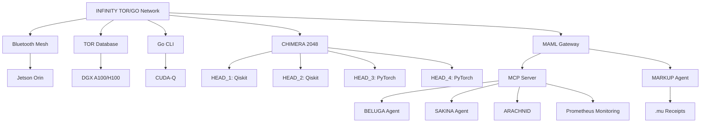

# 🐪 **INFINITY TOR/GO Network: A Quantum-Secure Backup Network for Space and Healthcare**

*Empowering Emergency Use Cases with MACROSLOW, CHIMERA 2048, and GLASTONBURY 2048-AES SDKs*

**© 2025 WebXOS Research Group. All Rights Reserved.**  
**License: MIT License for Research and Prototyping with Attribution to [webxos.netlify.app](https://webxos.netlify.app)**  
**Contact: [project_dunes@outlook.com](mailto:project_dunes@outlook.com) | Repository: [github.com/webxos/project-dunes-2048-aes](https://github.com/webxos/project-dunes-2048-aes)**  

## PAGE 2: Architecture of INFINITY TOR/GO
The **INFINITY TOR/GO Network** (TORGO) is a meticulously engineered, quantum-secure, decentralized framework designed to ensure robust communication and data storage for emergency scenarios in **space exploration** and **healthcare systems**. As a core component of the **MACROSLOW ecosystem**, TORGO integrates with the **GLASTONBURY 2048-AES Suite SDK** and **CHIMERA 2048-AES SDK**, leveraging **Bluetooth Mesh**, **TOR-based database storage**, and **Go CLI tools** to deliver unparalleled resilience. Optimized for NVIDIA’s high-performance hardware—**Jetson Orin**, **A100/H100 GPUs**, and **Isaac Sim**—TORGO combines classical and quantum computing to support critical missions, from Mars colony rescues to hospital IoT continuity. This page provides a detailed exploration of TORGO’s architecture, highlighting its technical components, security mechanisms, and integration with **MAML (Markdown as Medium Language)** workflows, offering developers a blueprint for building fault-tolerant networks in 2025.

### Architectural Pillars
TORGO’s architecture is built on three synergistic pillars, each optimized for NVIDIA hardware and designed to operate under extreme conditions:

1. **Bluetooth Mesh Networking**:
   - **Function**: Facilitates low-latency, many-to-many communication for IoT devices, autonomous robots, and edge nodes, forming a self-organizing network that persists without centralized infrastructure.
   - **Implementation**: Utilizes **Bluetooth 5.0+ Mesh Protocol**, supporting up to 32,767 nodes with sub-100ms latency and a range of 1km per hop (extendable via relays). Each node acts as a relay, broadcaster, or listener, ensuring connectivity in disrupted environments like Martian terrains or hospital wards during outages.
   - **NVIDIA Optimization**: Runs on **NVIDIA Jetson Orin Nano/AGX** (40–275 TOPS), leveraging Tensor Cores for real-time data processing and routing. For example, in a Mars rescue, **ARACHNID’s** 9,600 IoT sensors use Jetson Orin to relay vitals data across the mesh.
   - **Security**: Employs **256-bit AES encryption** for lightweight, low-power communication, with **MAML.ml** files defining dynamic routing rules. The **MARKUP Agent** validates mesh configurations, generating `.mu` receipts (e.g., reversing “Route” to “etuoR”) for auditability.
   - **Workflow Example**: A MAML file orchestrates mesh routing:
     ```yaml
     ---
     maml_version: "2.0.0"
     id: "urn:uuid:123e4567-e89b-12d3-a456-426614174001"
     type: "mesh_config"
     origin: "agent://torgo-mesh-agent"
     requires:
       resources: ["jetson_orin", "bluetooth-meshd"]
     ---
     ## Intent
     Configure Bluetooth Mesh for Mars colony IoT relay.
     ## Code_Blocks
     ```python
     from bluetooth_mesh import MeshNetwork
     network = MeshNetwork(nodes=9600, latency_target=0.1)
     network.configure(relay_mode="dynamic")
     ```
     ```

2. **TOR-Based Database Storage**:
   - **Function**: Provides anonymous, decentralized storage for sensitive data, ensuring privacy and fault tolerance by sharding information across distributed nodes.
   - **Implementation**: Adapts **TOR (The Onion Router)** for encrypted data storage, with shards distributed across nodes using **MongoDB** for high-speed retrieval and **SQLAlchemy** for metadata management. Data is accessed via TOR’s hidden services (e.g., `.onion` addresses), ensuring anonymity.
   - **NVIDIA Optimization**: Leverages **NVIDIA DGX A100/H100 GPUs** (up to 3,000 TFLOPS) for cryptographic operations, achieving 12.8 TFLOPS for data sharding, encryption, and verification. **CUDA-accelerated** processes handle **CRYSTALS-Dilithium signatures** for post-quantum security.
   - **Security**: Combines **512-bit AES encryption** with **CRYSTALS-Dilithium** for quantum-resistant integrity, validated by **OCaml/Ortac** for formal correctness. The **MARKUP Agent** generates `.mu` receipts for data transactions (e.g., “Store” to “erotS”).
   - **Workflow Example**: A MAML file manages data storage:
     ```yaml
     ---
     maml_version: "2.0.0"
     id: "urn:uuid:987f6543-a21b-12d3-c456-426614174002"
     type: "data_storage"
     origin: "agent://torgo-storage-agent"
     requires:
       resources: ["dgx_a100", "tor", "mongodb"]
     ---
     ## Intent
     Store patient vitals in TOR-based database.
     ## Code_Blocks
     ```python
     from sqlalchemy import create_engine
     from tor_db import TorStorage
     engine = create_engine("mongodb://tor:9050/torgo")
     storage = TorStorage(engine)
     storage.store(data="vitals_mars_colony.csv", encrypt="512-bit-aes")
     ```
     ```

3. **Go CLI for Operations**:
   - **Function**: Offers a lightweight, cross-platform command-line interface for network setup, monitoring, and emergency orchestration, ensuring maintainability in resource-constrained environments.
   - **Implementation**: Written in **Go 1.21**, with commands like `torgo start --mesh-config torgo_mesh.yaml`, `torgo sync --data vitals`, and `torgo restore --node node_id` for managing network state. Go’s concurrency model (goroutines) ensures efficient handling of thousands of nodes.
   - **NVIDIA Optimization**: Integrates with **CUDA-Q** for quantum circuit simulations, enabling CLI-driven quantum workflows (e.g., optimizing rescue trajectories). Runs on **Jetson Orin** for edge operations and **DGX systems** for high-performance tasks.
   - **Security**: Embeds **MAML.mu** receipts for auditability, ensuring all CLI operations are logged and reversible. **OAuth2.0** via AWS Cognito authenticates CLI access.
   - **Workflow Example**: A Go CLI command triggers a quantum workflow:
     ```bash
     torgo execute --maml emergency_workflow.maml.md --quantum
     ```
     ```yaml
     ---
     maml_version: "2.0.0"
     id: "urn:uuid:456e7890-f12g-34h5-i678-901234567890"
     type: "quantum_workflow"
     origin: "agent://torgo-quantum-agent"
     requires:
       resources: ["cuda-q", "qiskit"]
     ---
     ## Intent
     Optimize Mars rescue trajectory using quantum circuit.
     ## Code_Blocks
     ```python
     from qiskit import QuantumCircuit
     qc = QuantumCircuit(8)
     qc.h(range(8))
     qc.measure_all()
     ```
     ```

### Integration with CHIMERA 2048 and MCP
TORGO integrates seamlessly with **CHIMERA 2048’s four-headed architecture**, where each head handles specific tasks:
- **HEAD_1 & HEAD_2** (Qiskit-based): Execute quantum circuits for trajectory optimization or data validation, with sub-150ms latency.
- **HEAD_3 & HEAD_4** (PyTorch-based): Perform AI inference and training for sensor fusion, achieving 15 TFLOPS throughput.
- **FastAPI Gateway**: Routes MAML workflows to MCP servers at <100ms latency, monitored by **Prometheus**.
- **Quadra-Segment Regeneration**: Rebuilds compromised nodes in <5s, ensuring 99.9% uptime.

The **Model Context Protocol (MCP)** acts as a semantic bridge, with **MAML.ml** files defining workflows that coordinate **BELUGA Agent** (sensor fusion), **SAKINA Agent** (ethical decision-making), and **ARACHNID** (rocket booster control). The **MARKUP Agent** ensures data integrity by generating `.mu` receipts for all transactions, enabling self-checking and rollback.

### Visual Representation


### Performance Metrics
- **Latency**: <100ms for mesh communication, <150ms for quantum circuit execution.
- **Throughput**: 15 TFLOPS for AI inference, 12.8 TFLOPS for quantum simulations.
- **Scalability**: Supports 32,767 nodes, extendable to 100,000+ with future enhancements.
- **Security**: 2048-bit AES-equivalent, CRYSTALS-Dilithium signatures, lightweight double tracing.
- **Resilience**: 99.9% uptime via quadra-segment regeneration.

### Why This Architecture?
TORGO’s architecture combines **decentralization**, **quantum readiness**, and **lightweight operations** to ensure reliability in extreme conditions. By leveraging NVIDIA’s ecosystem and **MAML workflows**, it empowers developers to build backup networks that thrive in chaos, from space missions to medical emergencies. Fork the repository at [github.com/webxos/project-dunes-2048-aes](https://github.com/webxos/project-dunes-2048-aes) to contribute to this resilient framework.

**© 2025 WebXOS Research Group. MIT License with Attribution.**
