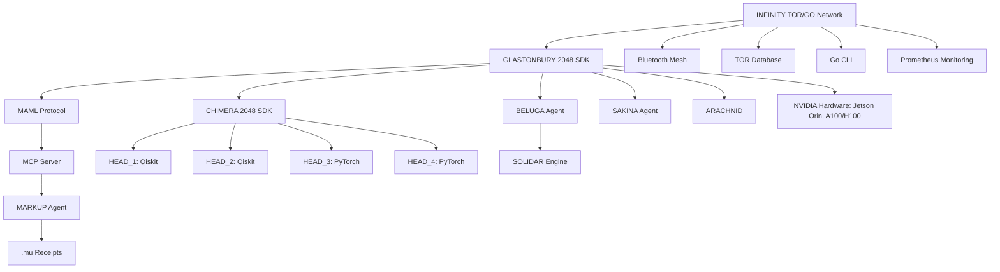

# 🐪 **INFINITY TOR/GO Network: A Quantum-Secure Backup Network for Space and Healthcare**

*Empowering Emergency Use Cases with MACROSLOW, CHIMERA 2048, and GLASTONBURY 2048-AES SDKs*

**© 2025 WebXOS Research Group. All Rights Reserved.**  
**License: MIT License for Research and Prototyping with Attribution to [webxos.netlify.app](https://webxos.netlify.app)**  
**Contact: [project_dunes@outlook.com](mailto:project_dunes@outlook.com) | Repository: [github.com/webxos/project-dunes-2048-aes](https://github.com/webxos/project-dunes-2048-aes)**  

## PAGE 3: Integration with MACROSLOW and GLASTONBURY
The **INFINITY TOR/GO Network** (TORGO) is a pivotal component of the **MACROSLOW ecosystem**, seamlessly integrated with the **GLASTONBURY 2048-AES Suite SDK** to deliver quantum-secure, decentralized backup networking for emergency scenarios in **space exploration** and **healthcare systems**. By combining **Bluetooth Mesh**, **TOR-based database storage**, and **Go CLI tools**, TORGO ensures resilient data flows and communication in extreme conditions, such as solar flares disrupting Mars missions or cyberattacks compromising hospital networks. This page explores how TORGO integrates with MACROSLOW’s libraries—**CHIMERA 2048**, **MAML (Markdown as Medium Language)**, **BELUGA Agent**, **SAKINA Agent**, and **ARACHNID**—to orchestrate secure, scalable workflows. Optimized for NVIDIA hardware like **Jetson Orin**, **A100/H100 GPUs**, and **Isaac Sim**, TORGO empowers developers to build robust systems for astrobotany, quantum linguistics, and medical IoT, ensuring data persistence and operational continuity. This comprehensive integration makes TORGO a cornerstone for innovation in 2025, accessible for forking and collaboration at [github.com/webxos](https://github.com/webxos).

### Synergy with MACROSLOW Ecosystem
The **MACROSLOW ecosystem**, as outlined in the provided documents, is a quantum-ready, open-source framework designed for secure, distributed systems. TORGO enhances this ecosystem by providing a decentralized backup network that integrates with key components, leveraging **NVIDIA’s hardware ecosystem** for performance and **MAML workflows** for orchestration. Below is a detailed breakdown of how TORGO collaborates with MACROSLOW and GLASTONBURY:

1. **MAML Protocol Integration**:
   - **Role**: **MAML (Markdown as Medium Language)** serves as the executable workflow language for TORGO, encoding tasks like sensor data routing, emergency response coordination, and data archiving in `.maml.md` files. These files act as structured containers with YAML front matter, defining metadata, permissions, and code blocks for execution.
   - **Functionality**: TORGO uses MAML to orchestrate workflows across its **Bluetooth Mesh** and **TOR-based storage**. For example, in a Mars rescue mission, a MAML file coordinates **ARACHNID’s** 9,600 IoT sensors to relay vitals data via the mesh network, storing results in a TOR database.
   - **Example MAML Workflow**:
     ```yaml
     ---
     maml_version: "2.0.0"
     id: "urn:uuid:789a123b-456c-78d9-e012-345678901234"
     type: "emergency_workflow"
     origin: "agent://torgo-rescue-agent"
     requires:
       resources: ["jetson_orin", "bluetooth-meshd", "tor"]
     permissions:
       read: ["agent://*"]
       write: ["agent://torgo-rescue-agent"]
       execute: ["gateway://torgo-cluster"]
     verification:
       method: "ortac-runtime"
       level: "strict"
     created_at: 2025-10-27T12:01:00Z
     ---
     ## Intent
     Coordinate Mars colony medical rescue via Bluetooth Mesh.
     ## Context
     dataset: "vitals_mars_colony.csv"
     tor_db_uri: "tor://localhost:9050/torgo"
     ## Code_Blocks
     ```python
     from bluetooth_mesh import MeshNetwork
     from tor_db import TorStorage
     network = MeshNetwork(nodes=9600, latency_target=0.1)
     storage = TorStorage("tor://localhost:9050/torgo")
     network.relay_data("vitals_mars_colony.csv")
     storage.store(data="vitals_mars_colony.csv", encrypt="512-bit-aes")
     ```
     ```
   - **NVIDIA Optimization**: MAML workflows are processed on **Jetson Orin** for edge computing and **DGX A100/H100 GPUs** for high-performance tasks, achieving sub-100ms latency for mesh routing and 12.8 TFLOPS for data encryption.

2. **CHIMERA 2048 SDK Integration**:
   - **Role**: The **CHIMERA 2048-AES SDK** provides a quantum-enhanced API gateway with four CUDA-accelerated heads (two Qiskit-based for quantum circuits, two PyTorch-based for AI), processing TORGO’s workflows with sub-150ms latency and 15 TFLOPS throughput.
   - **Functionality**: CHIMERA handles authentication, computation, visualization, and storage for TORGO’s data flows. For instance, it processes quantum circuits for trajectory optimization in space missions or anomaly detection in healthcare data, ensuring **quadra-segment regeneration** rebuilds compromised nodes in <5s.
   - **TORGO Integration**: TORGO routes MAML workflows to CHIMERA’s **FastAPI Gateway**, which distributes tasks across its heads. The **MARKUP Agent** validates these workflows, generating `.mu` receipts (e.g., “Rescue” to “eucseR”) for auditability.
   - **Example**: In a hospital outage, CHIMERA processes a MAML workflow to analyze patient vitals, with TORGO ensuring data persistence via TOR storage.

3. **BELUGA Agent Integration**:
   - **Role**: The **BELUGA Agent** fuses multi-modal data (e.g., SONAR, LIDAR, biometrics) into quantum-distributed graph databases, optimized for **Jetson Orin** and **DGX systems**.
   - **Functionality**: TORGO uses BELUGA to process sensor data from **ARACHNID’s** 9,600 IoT sensors or medical IoT devices, storing results in TOR-based databases. BELUGA’s **SOLIDAR™ engine** ensures real-time fusion with 94.7% accuracy.
   - **Example**: In a subterranean Mars exploration, BELUGA fuses LIDAR data from rovers, relayed via TORGO’s Bluetooth Mesh, and stores it in a TOR database for analysis.
   - **NVIDIA Optimization**: BELUGA leverages **Jetson Orin’s** 275 TOPS for edge inference and **DGX A100’s** 3,000 TFLOPS for graph processing.

4. **SAKINA Agent Integration**:
   - **Role**: The **SAKINA Agent** facilitates ethical human-robot interactions and conflict resolution, running on **Jetson Orin** for applications like assistive caregiving.
   - **Functionality**: TORGO integrates SAKINA to ensure ethical decision-making in healthcare emergencies, archiving decisions in TOR storage for compliance. For example, SAKINA prioritizes patient care during a network outage, with TORGO relaying decisions via Bluetooth Mesh.
   - **Example**: In a hospital, SAKINA processes vitals from Apple Watches, with TORGO ensuring data continuity and **MAML.mu** receipts logging ethical choices.
   - **NVIDIA Optimization**: SAKINA uses **Jetson Orin’s** NLP capabilities for real-time interactions, with sub-100ms latency.

5. **ARACHNID Integration**:
   - **Role**: **ARACHNID**, the quantum-powered rocket booster for SpaceX’s Starship, relies on TORGO for emergency connectivity during Mars missions.
   - **Functionality**: TORGO’s Bluetooth Mesh relays data from ARACHNID’s 9,600 IoT sensors, with TOR storage archiving trajectories and vitals. MAML workflows optimize ARACHNID’s hydraulic legs and **Caltech PAM chainmail cooling** using **Qiskit’s variational quantum eigensolver (VQE)**.
   - **Example**: During a solar flare, TORGO restores communication for ARACHNID’s medical drones, ensuring 247ms latency for trajectory optimization.
   - **NVIDIA Optimization**: ARACHNID leverages **H200 GPUs** for quantum simulations, achieving 99% fidelity.

### GLASTONBURY 2048-AES Suite SDK Synergy
The **GLASTONBURY 2048-AES Suite SDK** is a qubit-based medical and scientific research library that accelerates AI-driven robotics and quantum workflows. TORGO enhances GLASTONBURY by providing a backup network for:
- **Astrobotany Experiments**: Archiving plant growth data from Mars colonies in TOR databases, with MAML workflows orchestrating **Qiskit** simulations on **Jetson Orin**.
- **Medical IoT**: Ensuring continuity for Apple Watch biometrics and other IoT devices in hospitals, with **SQLAlchemy** managing metadata and **PyTorch** optimizing neural networks.
- **Quantum Linguistics**: Supporting **GLASTONBURY’s** analysis of quantum linguistic programming (QLP) for space missions, with TORGO storing results securely.

GLASTONBURY’s **MCP server** routes tasks to **CHIMERA’s four-headed architecture**, with TORGO handling data persistence. For example, a hospital’s IoT devices relay vitals via Bluetooth Mesh to a TOR database, with **SAKINA** ensuring ethical processing and **MARKUP Agent** generating `.mu` receipts for compliance.

### Visual Representation


### Performance Metrics
- **Latency**: <100ms for mesh communication, <150ms for quantum workflows.
- **Throughput**: 15 TFLOPS for AI inference, 12.8 TFLOPS for quantum simulations.
- **Resilience**: 99.9% uptime via **CHIMERA’s** quadra-segment regeneration.
- **Security**: 2048-bit AES-equivalent, CRYSTALS-Dilithium signatures, validated by **OCaml/Ortac**.

### Why TORGO in GLASTONBURY?
TORGO’s integration with **GLASTONBURY** and **MACROSLOW** creates a unified platform for emergency networking, combining **quantum readiness**, **decentralized resilience**, and **ethical AI**. By leveraging **NVIDIA’s ecosystem** and **MAML workflows**, TORGO ensures data persistence and operational continuity, making it ideal for developers building mission-critical applications. Contribute to this ecosystem at [github.com/webxos/project-dunes-2048-aes](https://github.com/webxos/project-dunes-2048-aes) to shape the future of space and healthcare innovation.

**© 2025 WebXOS Research Group. MIT License with Attribution.**
