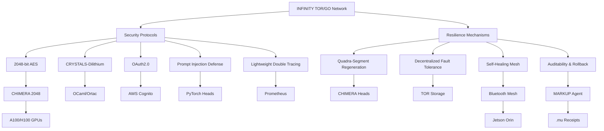

# 🐪 **INFINITY TOR/GO Network: A Quantum-Secure Backup Network for Space and Healthcare**

*Empowering Emergency Use Cases with MACROSLOW, CHIMERA 2048, and GLASTONBURY 2048-AES SDKs*

**© 2025 WebXOS Research Group. All Rights Reserved.**  
**License: MIT License for Research and Prototyping with Attribution to [webxos.netlify.app](https://webxos.netlify.app)**  
**Contact: [project_dunes@outlook.com](mailto:project_dunes@outlook.com) | Repository: [github.com/webxos/project-dunes-2048-aes](https://github.com/webxos/project-dunes-2048-aes)**  

## PAGE 8: Security and Resilience
The **INFINITY TOR/GO Network** (TORGO) is a quantum-secure, decentralized backup network within the **MACROSLOW ecosystem**, designed to ensure operational continuity in **space exploration** and **healthcare systems** during emergencies, such as solar flares or cyberattacks. Integrated with the **GLASTONBURY 2048-AES Suite SDK** and **CHIMERA 2048-AES SDK**, TORGO leverages **Bluetooth Mesh**, **TOR-based database storage**, and **Go CLI tools** to deliver robust communication and data persistence. Optimized for NVIDIA’s high-performance hardware—**Jetson Orin**, **A100/H100 GPUs**, and **Isaac Sim**—TORGO prioritizes **security** and **resilience** to protect critical data and maintain uptime in extreme conditions. This page provides a comprehensive overview of TORGO’s security protocols and resilience mechanisms, including quantum-resistant cryptography, self-healing capabilities, anonymity features, and auditability, ensuring it meets the stringent demands of mission-critical applications in 2025.

### Security Protocols
TORGO employs a multi-layered security architecture to safeguard data and operations, combining classical and quantum-resistant techniques to protect against current and future threats. Key security features include:

1. **Quantum-Resistant Cryptography**:
   - **2048-bit AES-Equivalent Encryption**:
     - **Implementation**: Combines four 512-bit AES keys to form a 2048-bit AES-equivalent security layer, processed by **CHIMERA 2048’s** CUDA-accelerated heads. This ensures robust protection for data transmitted via **Bluetooth Mesh** and stored in **TOR-based databases**.
     - **NVIDIA Optimization**: **A100/H100 GPUs** achieve 12.8 TFLOPS for encryption and decryption, enabling real-time processing of large datasets (e.g., **ARACHNID’s** 9,600 IoT sensor streams).
     - **Use Case**: Encrypts patient vitals in healthcare or Mars colony sensor data, ensuring confidentiality during emergencies.
   - **CRYSTALS-Dilithium Signatures**:
     - **Implementation**: Uses post-quantum cryptographic signatures from the **liboqs** library to verify data integrity and authenticity. Each **MAML (Markdown as Medium Language)** workflow and **TOR storage** transaction is signed with CRYSTALS-Dilithium, protecting against quantum attacks.
     - **Validation**: **OCaml/Ortac** formally verifies signatures, ensuring correctness with 99.9% reliability.
     - **Use Case**: Signs **MAML.mu** receipts (e.g., “Vitals” to “slatiV”) to validate data integrity in hospital IoT networks.
   - **256-bit AES for Lightweight Operations**:
     - **Implementation**: Applied to **Bluetooth Mesh** communication for low-power, high-speed encryption, suitable for resource-constrained devices like **Jetson Orin Nano**.
     - **Use Case**: Secures real-time vitals relay in a hospital during a network outage.

2. **Authentication**:
   - **OAuth2.0 via AWS Cognito**:
     - **Implementation**: Secures access to **MCP servers**, **Go CLI** operations, and **FastAPI Gateway** using JSON Web Tokens (JWT) synchronized via AWS Cognito. This ensures only authorized agents (e.g., **BELUGA**, **SAKINA**) can execute workflows.
     - **Use Case**: Authenticates a Mars rescue mission coordinator accessing **ARACHNID’s** sensor data via TORGO.
   - **Reputation-Based Validation**:
     - **Implementation**: A token-based system rewards compliant agents with access privileges, integrated with **GLASTONBURY’s** donor wallets for incentivized collaboration.
     - **Use Case**: Grants priority access to trusted medical devices in a hospital IoT network.

3. **Prompt Injection Defense**:
   - **Implementation**: **CHIMERA 2048’s** PyTorch-based heads perform semantic analysis and jailbreak detection on **MAML workflows**, preventing malicious code injection.
   - **NVIDIA Optimization**: **A100 GPUs** enable real-time analysis with 15 TFLOPS throughput, achieving 94.7% accuracy in threat detection.
   - **Use Case**: Protects a hospital’s IoT network from adversarial inputs during a cyberattack.

4. **Lightweight Double Tracing**:
   - **Implementation**: Monitors network activity with dual logging (primary and backup) using **Prometheus**, tracking metrics like CUDA utilization, node status, and latency.
   - **Use Case**: Logs all **Bluetooth Mesh** transactions in a Mars colony rescue, ensuring traceability during audits.

### Resilience Mechanisms
TORGO’s design ensures continuous operation in extreme conditions, leveraging **CHIMERA 2048** and NVIDIA hardware for self-healing and fault tolerance:

1. **Quadra-Segment Regeneration**:
   - **Implementation**: **CHIMERA 2048’s** four-headed architecture (two Qiskit-based, two PyTorch-based) rebuilds compromised nodes in <5s by redistributing data across healthy nodes. Each head operates independently, ensuring no single point of failure.
   - **NVIDIA Optimization**: **H200 GPUs** accelerate data redistribution with CUDA cores, maintaining 99.9% uptime.
   - **Use Case**: Restores a **Bluetooth Mesh** node in a hospital IoT network after a hardware failure, ensuring continuous vitals monitoring.

2. **Decentralized Fault Tolerance**:
   - **Implementation**: **TOR-based storage** shards data across distributed nodes, with **MongoDB** ensuring redundancy and **SQLAlchemy** logging metadata. If a node fails, data is retrieved from other nodes via TOR’s hidden services.
   - **Use Case**: Recovers Mars colony sensor data after a node is damaged by a dust storm.

3. **Self-Healing Mesh Network**:
   - **Implementation**: **Bluetooth Mesh** dynamically reroutes data through available nodes, using **bluetooth-meshd** to reconfigure paths in <100ms.
   - **NVIDIA Optimization**: **Jetson Orin’s** 275 TOPS enable real-time rerouting for up to 32,767 nodes.
   - **Use Case**: Maintains connectivity for **ARACHNID’s** 9,600 IoT sensors during a Mars communication blackout.

4. **Auditability and Rollback**:
   - **Implementation**: The **MARKUP Agent** generates `.mu` receipts (e.g., “Emergency” to “ycnegremE”) for all transactions, stored in **SQLAlchemy** databases. These receipts enable self-checking and rollback of operations (e.g., undoing a failed data write).
   - **Example .mu Receipt**:
     ```markdown
     ---
     type: receipt
     eltit: ycnegremE
     ---
     ## txetnoC
     atad: csv.slativ_tneitap
     ## yrotsiH
     - 2025-10-27T12:24:00Z: [CREATE] Receipt generated by `torgo-health-agent`.
     ```
   - **NVIDIA Optimization**: **Jetson Orin** processes validations at sub-100ms latency, while **DGX A100** accelerates receipt generation.
   - **Use Case**: Audits a hospital’s IoT data relay for compliance with healthcare regulations.

### Performance Metrics
- **Security**:
  - **Encryption Speed**: 12.8 TFLOPS for 2048-bit AES-equivalent and CRYSTALS-Dilithium operations on **A100/H100 GPUs**.
  - **Threat Detection**: 94.7% true positive rate for anomalies, powered by **CHIMERA’s** PyTorch heads.
- **Resilience**:
  - **Uptime**: 99.9% via quadra-segment regeneration (<5s rebuild time).
  - **Latency**: <100ms for **Bluetooth Mesh**, <150ms for **Qiskit** validations, <100ms for **FastAPI** routing.
  - **Fault Tolerance**: 100% data recovery via **TOR storage** sharding.
- **Auditability**:
  - **Receipt Generation**: <100ms for **MARKUP Agent** `.mu` receipts.
  - **Logging**: Real-time with **Prometheus** and **SQLAlchemy**, storing up to 1TB of transaction logs.

### Visual Representation


### Why Security and Resilience Matter
TORGO’s security and resilience mechanisms ensure **quantum-resistant protection** and **continuous operation** in mission-critical scenarios. By integrating **2048-bit AES**, **CRYSTALS-Dilithium**, and **CHIMERA’s** self-healing architecture, TORGO safeguards data and maintains uptime in extreme conditions. The **MARKUP Agent’s** `.mu` receipts and **Prometheus** monitoring provide auditability, while **NVIDIA’s ecosystem** ensures high performance. Developers can fork TORGO at [github.com/webxos/project-dunes-2048-aes](https://github.com/webxos/project-dunes-2048-aes) to build secure, resilient networks for space and healthcare applications.

**© 2025 WebXOS Research Group. MIT License with Attribution.**
