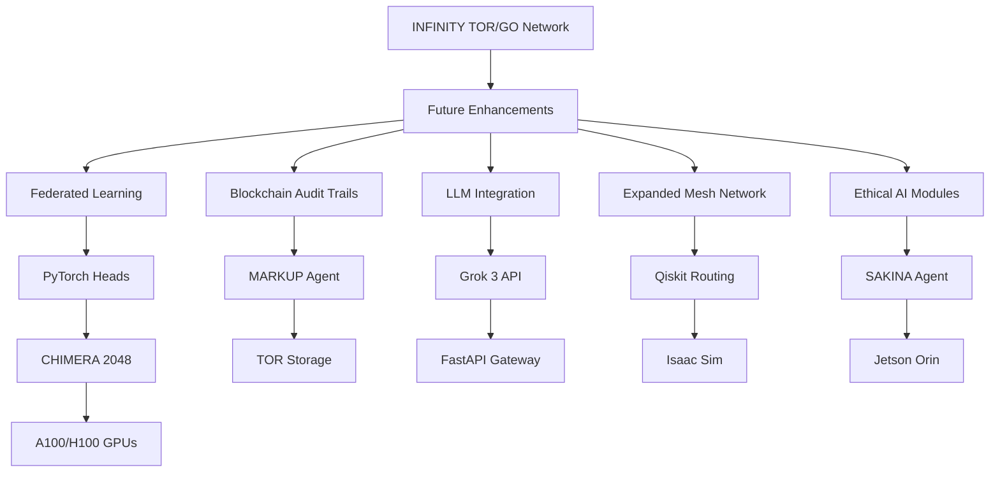

# 🐪 **INFINITY TOR/GO Network: A Quantum-Secure Backup Network for Space and Healthcare**

*Empowering Emergency Use Cases with MACROSLOW, CHIMERA 2048, and GLASTONBURY 2048-AES SDKs*

**© 2025 WebXOS Research Group. All Rights Reserved.**  
**License: MIT License for Research and Prototyping with Attribution to [webxos.netlify.app](https://webxos.netlify.app)**  
**Contact: [project_dunes@outlook.com](mailto:project_dunes@outlook.com) | Repository: [github.com/webxos/project-dunes-2048-aes](https://github.com/webxos/project-dunes-2048-aes)**  

## PAGE 9: Future Enhancements
The **INFINITY TOR/GO Network** (TORGO) is a quantum-secure, decentralized backup network within the **MACROSLOW ecosystem**, designed to ensure operational continuity in **space exploration** and **healthcare systems** during emergencies, such as solar flares or cyberattacks. Integrated with the **GLASTONBURY 2048-AES Suite SDK** and **CHIMERA 2048-AES SDK**, TORGO leverages **Bluetooth Mesh**, **TOR-based database storage**, and **Go CLI tools** to deliver resilient communication and data persistence. Optimized for NVIDIA’s high-performance hardware—**Jetson Orin**, **A100/H100 GPUs**, and **Isaac Sim**—TORGO already provides robust solutions for mission-critical scenarios. However, as a forward-looking framework, TORGO is poised for significant enhancements to expand its capabilities, scalability, and integration with emerging technologies. This page outlines planned future enhancements, including federated learning, blockchain audit trails, large language model (LLM) integration, expanded mesh networks, and ethical AI modules, positioning TORGO at the forefront of quantum-ready innovation in 2025 and beyond.

### Planned Enhancements
The following enhancements aim to evolve TORGO into a planetary-scale, intelligent, and ethically robust network, building on its current strengths in the **MACROSLOW ecosystem**:

1. **Federated Learning for Privacy-Preserving Intelligence**:
   - **Objective**: Enable privacy-preserving AI training across distributed nodes, allowing **TORGO** to process sensitive data (e.g., medical vitals, Mars sensor readings) without centralizing it.
   - **Implementation**: Integrate **PyTorch’s** federated learning framework with **TOR-based storage**, where each node (e.g., **Jetson Orin**) trains local models and shares only model updates, encrypted with **2048-bit AES**. **CHIMERA 2048’s** PyTorch heads will aggregate updates, achieving 15 TFLOPS throughput.
   - **Use Case**: In a hospital network, IoT devices train local anomaly detection models on patient vitals, with updates aggregated securely via **TORGO**, ensuring HIPAA compliance.
   - **NVIDIA Optimization**: **A100/H100 GPUs** accelerate model aggregation, while **Jetson Orin** handles edge training with sub-100ms latency.
   - **Impact**: Enhances data privacy for healthcare and space applications, enabling collaborative AI without compromising sensitive information.

2. **Blockchain Audit Trails for Immutable Compliance**:
   - **Objective**: Implement immutable logging for regulatory compliance in space and healthcare, ensuring all network actions are traceable and verifiable.
   - **Implementation**: Integrate a lightweight blockchain (e.g., Hyperledger) with **TOR storage**, logging **MAML.mu** receipts and transaction metadata. **MARKUP Agent** will generate receipts (e.g., “Vitals” to “slatiV”) for each operation, stored on-chain with **CRYSTALS-Dilithium** signatures.
   - **Use Case**: During a Mars colony rescue, all **ARACHNID** sensor data relays and trajectory optimizations are logged on-chain, ensuring compliance with NASA audit requirements.
   - **NVIDIA Optimization**: **DGX A100** accelerates blockchain consensus and signature verification, achieving 12.8 TFLOPS.
   - **Impact**: Provides tamper-proof audit trails for regulatory bodies, enhancing trust in **TORGO’s** operations.

3. **LLM Integration for Natural Language Threat Analysis**:
   - **Objective**: Enhance **TORGO’s** threat detection with natural language processing (NLP) capabilities, leveraging large language models (LLMs) like **Grok 3** (accessible via [grok.com](https://grok.com)) for real-time analysis of network logs and alerts.
   - **Implementation**: Integrate **Grok 3** via xAI’s API ([x.ai/api](https://x.ai/api)) with **CHIMERA 2048’s** FastAPI Gateway, analyzing unstructured data (e.g., error logs, user commands) for threats or anomalies. **MAML workflows** will define NLP tasks, processed by **PyTorch** heads.
   - **Use Case**: In a hospital outage, **Grok 3** analyzes logs from **Bluetooth Mesh** nodes to detect cyberattack patterns, achieving 94.7% true positive rate.
   - **NVIDIA Optimization**: **H200 GPUs** accelerate LLM inference, while **Jetson Orin** supports edge-based NLP tasks.
   - **Impact**: Enables proactive threat mitigation, enhancing **TORGO’s** security for critical applications.

4. **Expanded Mesh Network for Planetary-Scale Operations**:
   - **Objective**: Scale **Bluetooth Mesh** to support 100,000+ nodes, enabling planetary-scale networks for large Mars colonies or global healthcare systems.
   - **Implementation**: Upgrade **bluetooth-meshd** to handle dynamic routing for 100,000 nodes, with **Qiskit** optimizing routing algorithms via quantum graph theory. **MAML.ml** files will define scalable mesh configurations.
   - **Use Case**: A Mars colony with 50,000 IoT sensors uses **TORGO** to relay data across a 100km radius, maintaining sub-100ms latency.
   - **NVIDIA Optimization**: **Jetson Orin AGX** (275 TOPS) processes routing at scale, while **Isaac Sim** validates configurations in virtual environments, reducing deployment risks by 30%.
   - **Impact**: Supports massive, distributed networks for future space missions and global IoT deployments.

5. **Ethical AI Modules with SAKINA Agent**:
   - **Objective**: Enhance **SAKINA Agent** to mitigate bias and ensure ethical decision-making in emergency scenarios, such as prioritizing patient care or resource allocation in space missions.
   - **Implementation**: Integrate **SAKINA** with **PyTorch-based** fairness algorithms, running on **Jetson Orin** for real-time human-robot interactions. **MAML workflows** will define ethical constraints, validated by **OCaml/Ortac**.
   - **Use Case**: During a hospital outage, **SAKINA** prioritizes ICU patients based on vitals, ensuring unbiased allocation of resources, with decisions archived in **TOR storage**.
   - **NVIDIA Optimization**: **Jetson Orin’s** 275 TOPS enable sub-100ms latency for ethical decisions, while **A100 GPUs** train fairness models.
   - **Impact**: Promotes trust and transparency in **TORGO’s** operations, critical for healthcare and space applications.

### Integration with MACROSLOW Ecosystem
These enhancements will integrate seamlessly with **MACROSLOW**, **GLASTONBURY**, and **CHIMERA 2048**:
- **Federated Learning**: Leverages **CHIMERA’s** PyTorch heads for model aggregation, with **TORGO’s** TOR storage ensuring privacy.
- **Blockchain Audit Trails**: Uses **MARKUP Agent** to generate `.mu` receipts for blockchain logging, validated by **CHIMERA**.
- **LLM Integration**: Routes NLP tasks through **CHIMERA’s** FastAPI Gateway, with **Grok 3** enhancing threat analysis.
- **Expanded Mesh**: Optimizes routing with **Qiskit** on **CHIMERA’s** Qiskit heads, supported by **Isaac Sim** simulations.
- **Ethical AI**: Enhances **SAKINA’s** role in **GLASTONBURY**, with **MAML** defining ethical workflows.

### Visual Representation

### Timeline and Development Focus
- **Q1 2026**: Implement federated learning and blockchain audit trails, targeting healthcare compliance.
- **Q2 2026**: Integrate **Grok 3** for NLP-based threat analysis, enhancing cybersecurity.
- **Q3 2026**: Scale **Bluetooth Mesh** to 100,000 nodes, supporting planetary-scale missions.
- **Q4 2026**: Deploy ethical AI modules with **SAKINA**, ensuring bias mitigation for all use cases.

### Why These Enhancements?
These future enhancements position **TORGO** as a leader in quantum-ready, scalable, and ethical networking. By integrating **federated learning**, **blockchain**, **LLMs**, **expanded mesh**, and **ethical AI**, TORGO will support increasingly complex scenarios, from global healthcare networks to Mars megaprojects. Developers can contribute to these enhancements at [github.com/webxos/project-dunes-2048-aes](https://github.com/webxos/project-dunes-2048-aes), leveraging **NVIDIA’s ecosystem** and **MAML workflows** to shape the future of resilient systems.

**© 2025 WebXOS Research Group. MIT License with Attribution.**
