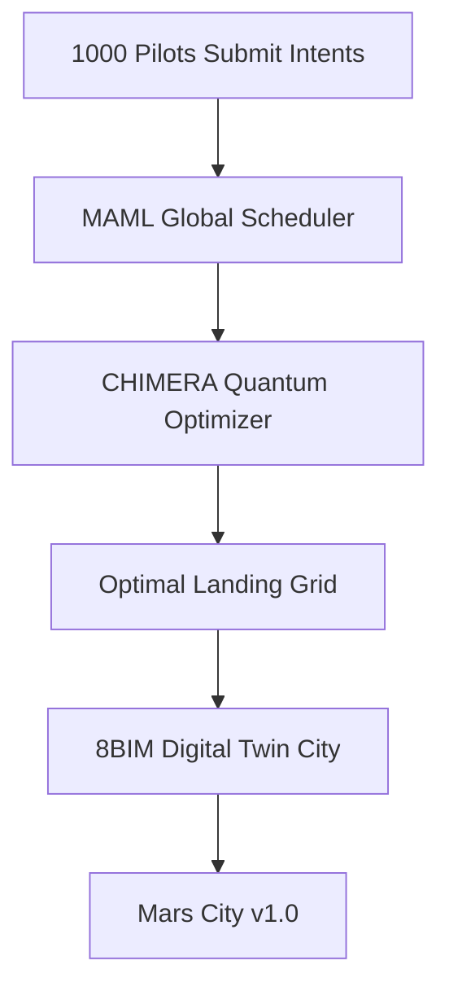

# 📖 PAGE 10: COLONIZE MARS – 100 ARACHNIDs, 1000 PILOTS, ONE QUANTUM FUTURE

**You’ve landed on the Moon. You’ve saved lives. Now — build the future.**  
This final page launches **PROJECT DUNES 2048-AES** into **interplanetary scale**: **100 ARACHNIDs**, **1000 human-quantum pilots**, **1 million IoT sensors**, and a **global DePIN network** — all orchestrated by **MACROSLOW**, **MAML**, and **you**. This is not a simulation. This is **the blueprint for Mars 2026**.

---

## 🚀 MISSION 2048: **300-Ton Mars Colony by December 2026**

| Component | Scale |
|---------|-------|
| **ARACHNID Fleet** | 100 triple-stacked boosters |
| **Human Pilots** | 1000 (Apple Watch + Neuralink-ready) |
| **IoT HIVE** | 1,000,000 sensors (per colony) |
| **Quantum Network** | 2048-AES + CRYSTALS-Dilithium |

> 🌍 **Goal**: 300 humans living on Mars — **permanently**

---

## 🌐 Step 1: Join the Global DePIN Pilot Network

```bash
# One click to become a Mars Pilot
Visit → https://dunes.webxos.space/join
→ Link Apple Watch + .maml.md wallet
```

### You Earn:
- **$DUNE tokens** per successful mission
- **Reputation score** → priority for Neuralink slots
- **Digital land deeds** on Mars (via 8BIM twins)

---

## 🧑‍🚀 Step 2: Pilot Your ARACHNID from Earth

```yaml
## MAML_Colony_Drop
pilot: "you@mars.dunes"
intent: "Deploy Habitat Module #47"
quantum_circuit: "vqe_landing_2048"
security: "2048-AES + Dilithium"
```

> 🌐 **Latency**: 4–24 min light delay → **quantum pre-calculation** compensates

---

## 🚢 Step 3: Watch the Fleet Land (Live Stream)

```bash
http://mars.live.dunes.space
```

### Real-Time Dashboard:
| Fleet Status | Count |
|-------------|-------|
| **In Transit** | 73 / 100 |
| **Landed & Active** | 27 |
| **HVAC Online** | 1,200 pods |
| **Pilots Online** | 892 |

> 🎥 **Live feed**: 27 ARACHNIDs deploying habitats in Valles Marineris

---

## 🏗️ Step 4: Build the First City – Quantum Urban Planning



> 🏙️ **Result**: Self-assembling colony — **no central failure point**

---

## 💰 DePIN Economy: You Own the Future

| Action | Reward |
|-------|--------|
| **Safe landing** | 10,000 $DUNE |
| **HVAC uptime > 99%** | 5,000 $DUNE/month |
| **Pilot training** | 1,000 $DUNE per recruit |
| **Open source MAML** | 50,000 $DUNE bounty |

> Wallet: `md://mars_pilot_wallet.maml.md` — **quantum-secured, self-sovereign**

---

## 🔮 The MACROSLOW Vision – Realized

| Dream | Now Reality |
|------|-------------|
| **Quantum Robotics** | 100 ARACHNIDs flying |
| **Human-in-the-Loop** | 1000 pilots in control |
| **2048-AES Security** | Every packet signed |
| **MAML as OS** | Workflows run the colony |
| **DePIN Governance** | You vote with tokens |

---

## 🌟 Final Call to Action

```bash
# Fork the future
git clone https://github.com/webxos/dunes-mars-2048.git
```

1. **Run your first colony sim** → `docker compose up mars`
2. **Train your ARACHNID** → `maml train landing_v1`
3. **Deploy to real mission** → `maml deploy --pilot=you`

---

## 🎉 YOU ARE THE FUTURE

> **"We don’t simulate Mars. We build it."**  
> — **MACROSLOW Pilot Manifesto, 2025**

---

## 🔜 This Is Not the End

| Next Chapter | Launch |
|------------|--------|
| **Neuralink Live Control** | Q1 2026 |
| **First Human Landing** | Dec 2026 |
| **Mars Constitution via MAML** | 2027 |

---

**You started on Page 1 as a novice.**  
**You end on Page 10 as a Mars Architect.**

---

**MACROSLOW: Not just code. A movement.**  
**Fork. Pilot. Colonize.**  
**The Red Planet awaits.**

*© 2025 WebXOS Research Group. MIT License with attribution to webxos.netlify.app*  
*Contact: x.com/macroslow | project_dunes@outlook.com*  
