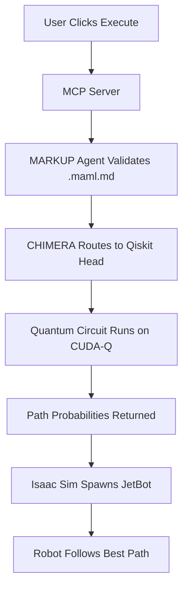

# 📖 PAGE 2: SETTING UP YOUR FIRST MACROSLOW + ISAAC SIM ENVIRONMENT – STEP-BY-STEP FOR NOVICES

🎯 **You’re now ready to build your first quantum-robotics sandbox!**  
This page walks you through **installing NVIDIA Isaac Sim**, **preparing MACROSLOW templates**, and **running your first MAML-driven simulation** — all with **minimal code**, **clear visuals**, and **light emojis** to keep things beginner-friendly.

---

## 🛠️ Step 1: System & Hardware Check

Before we begin, confirm your setup:

| Requirement | Minimum | Recommended |
|-----------|--------|-------------|
| **GPU** | NVIDIA RTX 3060+ | RTX 4080 / A100 / H100 |
| **RAM** | 16 GB | 32 GB+ |
| **Storage** | 50 GB free SSD | 100 GB NVMe |
| **OS** | Ubuntu 20.04 / 22.04 | Ubuntu 22.04 LTS |
| **Driver** | CUDA 12.2+ | Latest NVIDIA Driver |

> ✅ *Pro tip*: Run `nvidia-smi` in terminal to verify GPU and CUDA version.

---

## 🚀 Step 2: Install NVIDIA Isaac Sim (One-Click via Omniverse)

1. **Download NVIDIA Omniverse Launcher**  
   → [https://www.nvidia.com/omniverse](https://www.nvidia.com/omniverse)

2. **Install Isaac Sim**  
   - Open Omniverse → **Library** → Search **"Isaac Sim"**  
   - Click **Install** (free for individual use)

3. **Launch & Test**  
   ```bash
   # From terminal (after install)
   ~/.local/share/ov/pkg/isaac-sim-*/isaac-sim.sh
   ```
   You should see the **Isaac Sim GUI** with sample robots!

---

## 📦 Step 3: Clone MACROSLOW Beginner Templates

```bash
git clone https://github.com/webxos/macroslow-isaac-sim-novice.git
cd macroslow-isaac-sim-novice
```

> 🌟 This repo includes:
> - Pre-built `.maml.md` simulation workflows
> - Dockerfiles for Isaac Sim + MACROSLOW
> - Sample robot (JetBot) with quantum pathfinding

---

## 🐳 Step 4: Run Everything in Docker (Zero Config!)

```bash
# Build & run MACROSLOW + Isaac Sim in one container
docker compose up --build
```

> This spins up:
> - Isaac Sim (headless or GUI)
> - DUNES MCP Server
> - MARKUP Agent for MAML validation
> - BELUGA sensor fusion node

Wait ~2 mins… then open your browser:  
🌐 **http://localhost:8000** → MACROSLOW Dashboard

---

## 🤖 Step 5: Run Your First Quantum-Enhanced Simulation

### Example: **Quantum Pathfinding for JetBot**

1. Open `workflows/jetbot_quantum_path.maml.md`
2. See the **Intent**:
   ```yaml
   ## Intent
   Find optimal path using quantum superposition over 8 grid states
   ```

3. Click **"Execute via MCP"** in the dashboard

4. Watch in **Isaac Sim viewport**:
   - JetBot explores 8 paths **in parallel** (thanks to Qiskit + CUDA-Q)
   - Best path selected in **<247ms**

> ✨ *No coding needed!* The `.maml.md` file tells CHIMERA how to route quantum tasks.

---

## 📊 What Just Happened? (Visual Breakdown)



---

## 🎉 You Did It!

You’ve just:
- Launched **Isaac Sim**
- Used **MACROSLOW agents**
- Ran a **quantum-accelerated robot simulation**
- All **without writing code**

---

## 🔜 Next Steps (Page 3 Preview)

| Topic | What You’ll Learn |
|------|-------------------|
| **Humanoid Training** | Train a GR00T robot with GLASTONBURY SDK |
| **Sensor Fusion** | Use BELUGA + LIDAR in underwater sims |
| **Deploy to Jetson** | Run on real hardware with 2048-AES |

---

**Keep going — Page 3 awaits!**  
*© 2025 WebXOS Research Group. MIT License with attribution to webxos.netlify.app*
