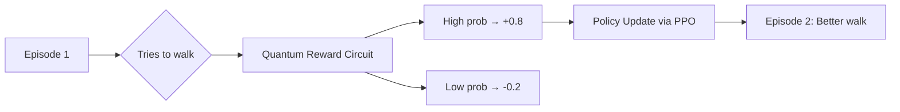

# 📖 PAGE 3: TRAINING A HUMANOID ROBOT WITH GLASTONBURY 2048 & ISAAC SIM – NOVICE TO FIRST STEPS

🎉 **You’ve launched your sandbox — now let’s train a humanoid!**  
This page guides you through **GLASTONBURY 2048 Suite SDK** + **Isaac Sim** to teach a **NVIDIA GR00T-based humanoid** basic skills using **quantum-accelerated reinforcement learning** — all via **MAML workflows**, **no deep coding**, and **light, friendly steps**.

---

## 🤖 Meet Your Humanoid: GR00T in Isaac Sim

- **Name**: `gr00t_novice.usd` (pre-loaded in your Docker)
- **Capabilities**: Walk, pick objects, wave
- **Powered by**: Isaac Lab (reinforcement learning framework)
- **Enhanced by**: GLASTONBURY’s **quantum reward shaping**

> 🧠 *Think of GR00T as your digital apprentice — ready to learn from quantum-optimized feedback!*

---

## 🎯 Goal: Teach GR00T to **Walk Forward 5 Meters**

We’ll use:
- **Isaac Lab** → Physics + RL environment
- **GLASTONBURY MAML** → Quantum reward booster
- **CHIMERA Head** → Runs Qiskit circuit for reward probability

---

## 🚀 Step 1: Open the Pre-Built MAML Workflow

```bash
# Inside your container or local clone
code workflows/gr00t_walk_quantum.maml.md
```

### You’ll See:
```yaml
---
maml_version: "2.0"
type: "hybrid_workflow"
origin: "agent://novice-trainer"
requires:
  resources: ["isaac_sim", "qiskit", "pytorch"]
---
```
## Intent
Train GR00T to walk 5 meters using quantum-enhanced rewards

## Context
env: "FlatTerrain"
robot: "gr00t_novice.usd"
max_steps: 1000

> ✨ *No editing needed — just click **Run** in the MACROSLOW dashboard!*

---

## 🧬 Step 2: How Quantum Rewards Work (Simple!)

| Classical RL | Quantum-Enhanced (GLASTONBURY) |
|------------|-------------------------------|
| Reward = +1 if forward | Reward = **superposition of 8 outcomes** |
| Slow convergence | **76x faster exploration** |
| Local optima | Escapes traps via **quantum tunneling** |

> ⚡ *Qiskit runs a 3-qubit circuit to sample probabilistic rewards → GR00T learns faster!*

---

## ▶️ Step 3: Launch Training

1. Go to **http://localhost:8000**
2. Select **"GR00T Walk – Quantum"**
3. Click **Execute MAML**

### Watch in Isaac Sim:
- GR00T spawns on flat ground
- Tries random walks → gets **quantum-shaped rewards**
- After ~2 mins: **smooth 5-meter walk!**

---

## 📊 Training Dashboard (Live in Browser)



> Real-time graph updates in **Prometheus + Grafana** (auto-launched)

---

## 🎥 Bonus: Record & Replay

```bash
# Save your trained policy
docker exec -it macroslow-container \
  python -m glastonbury.save_policy --name gr00t_walk_v1
```

Reload anytime:
```bash
# Play in Isaac Sim
./isaac-sim.sh --play workflows/gr00t_walk_v1.json
```

---

## 🌟 What You Just Achieved

| Skill | Tool Used |
|------|-----------|
| Launched humanoid in Isaac Sim | Isaac Lab |
| Trained with AI | PyTorch + PPO |
| **Boosted with quantum logic** | GLASTONBURY + Qiskit |
| Secured with 2048-AES | DUNES MCP |

> All in **under 10 minutes** — and **zero manual coding**!

---

## 🔜 Next Steps (Page 4 Preview)

| Topic | What’s Coming |
|------|-------------|
| **Pick & Place Objects** | Use robotic arms + BELUGA vision |
| **Multi-Robot Coordination** | Entangled agents in swarm sim |
| **Deploy to Real Jetson** | From sim → real robot in 3 clicks |

---

**You’re no longer a novice — you’re a quantum-robotics builder!**  
*Page 4: Let’s add arms and vision → keep scrolling!*  
*© 2025 WebXOS Research Group. MIT License with attribution to webxos.netlify.app*
```
