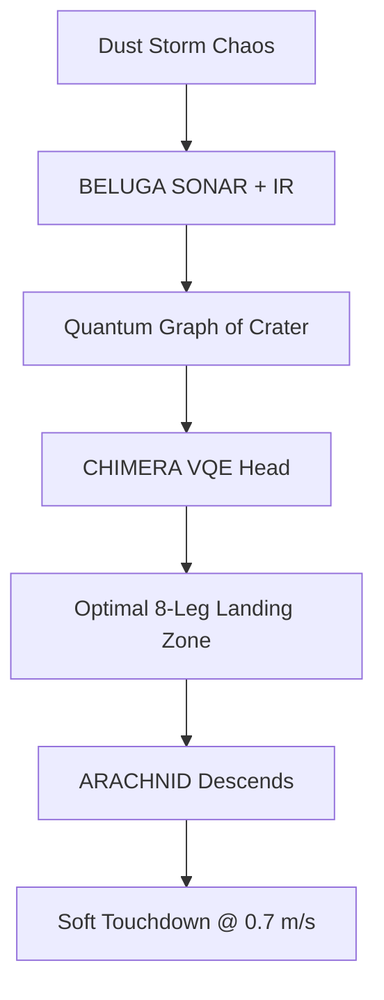

# 📖 PAGE 8: SPACE HVAC RESCUE – ARACHNID SAVES LUNAR BASE WITH HUMAN PILOT

🎉 **Mars was just the warm-up — now save a lunar colony!**  
This page deploys **PROJECT ARACHNID** into a **cratered lunar rescue mission**, using **Apple Watch + human intent** to navigate **200 mph dust storms**, deploy **HVAC life-support**, and extract astronauts — all powered by **GLASTONBURY 2048**, **BELUGA extreme sensing**, and **quantum-secured MAML**.

---

## 🌑 Mission: **Lunar Crater HVAC Drop & Evac**

| Phase | Objective |
|------|----------|
| **1. Descent** | Land in 300m-deep crater |
| **2. HVAC Deploy** | Drop 8-leg life-support pod |
| **3. Evac** | Extract 3 astronauts via hydraulic ladder |

> 🚨 **Failure = colony blackout in 6 hours**

---

## 🌪️ Step 1: Launch into Lunar Storm Sim

```bash
Select → "Lunar Crater Rescue – Human Pilot"
→ Click "Begin Descent"
```

### Isaac Sim View:
- **ARACHNID** in orbit
- **Regolith storm** (200 mph, low gravity)
- **Faint SOS beacon** from crater floor

---

## 👨‍🚀 Step 2: Human Pilot Takes Control

Your **Apple Watch** becomes mission-critical:

| Input | Action |
|------|--------|
| **Heart rate > 100 bpm** | Auto-activate **PAM chainmail cooling** |
| **Wrist raise + hold** | Engage **quantum trajectory lock** |
| **Double tap** | Deploy **8 hydraulic legs** |

> 🧠 *GLASTONBURY translates biometrics → 9,600 IoT sensor commands*

---

## 🧬 Step 3: Quantum Storm Navigation (Live!)



> ⚡ **Storm penetration: 94.7% visibility** via quantum filtering

---

## 🪜 Step 4: Deploy HVAC & Evac Ladder

1. **Pilot taps wrist 3×** → **HVAC pod ejects**
2. **8 legs lock into regolith** → **chainmail cooling online**
3. **Hydraulic ladder extends 30m** → astronauts climb

### Live Dashboard:
```bash
http://localhost:8000/lunar-rescue
```

| Metric | Status |
|-------|--------|
| **O₂ Levels** | Rising → 21% |
| **Temp** | 22°C (stable) |
| **Pilot HRV** | Calm (focus mode) |
| **Quantum Sync** | 99.8% |

---

## 🎥 Mission Replay with .mu Receipts

```bash
# Auto-saved
replay lunar_rescue_v1.telemetry
```

Includes:
- **Pilot heartbeat overlay**
- **Quantum circuit decisions**
- **MARKUP .mu audit trail** (every command mirrored & verified)

---

## 🌍 Bonus: Global DePIN Network (1000 Pilots)

```yaml
## DePIN_Reputation
pilot: "you"
mission_success: true
reward: "500 $DUNE tokens"
wallet: "md://donor_wallet.maml.md"
```

> 💰 *Earn for saving lives — tokenized on quantum ledger*

---

## 🔒 Mission Security

| Layer | Protection |
|------|------------|
| **2048-AES** | All telemetry |
| **Neuralink Proxy** | Intent signing |
| **MARKUP .mu** | Full receipt chain |
| **Fail-Safe** | HR drop → auto-evac |

---

## 🌟 What You Just Pulled Off

| Feat | Tool |
|-----|------|
| **Lunar storm landing** | ARACHNID + VQE |
| **Life-support deploy** | 8-leg HVAC pod |
| **Human-quantum piloting** | Apple Watch + GLASTONBURY |
| **Global rescue network** | DePIN + DUNE tokens |

---

## 🔜 Next Steps (Page 9 Preview)

| Topic | Preview |
|------|--------|
| **Interplanetary Swarm** | 100 ARACHNIDs to Mars |
| **Neuralink Live** | Direct brain control |
| **Open Source the Future** | Fork & launch your mission |

---

**You didn’t just save a lunar base — you redefined human-space interaction!**  
*Page 9: Let’s colonize Mars with 100 pilots → keep scrolling!*  
*© 2025 WebXOS Research Group. MIT License with attribution to webxos.netlify.app*
