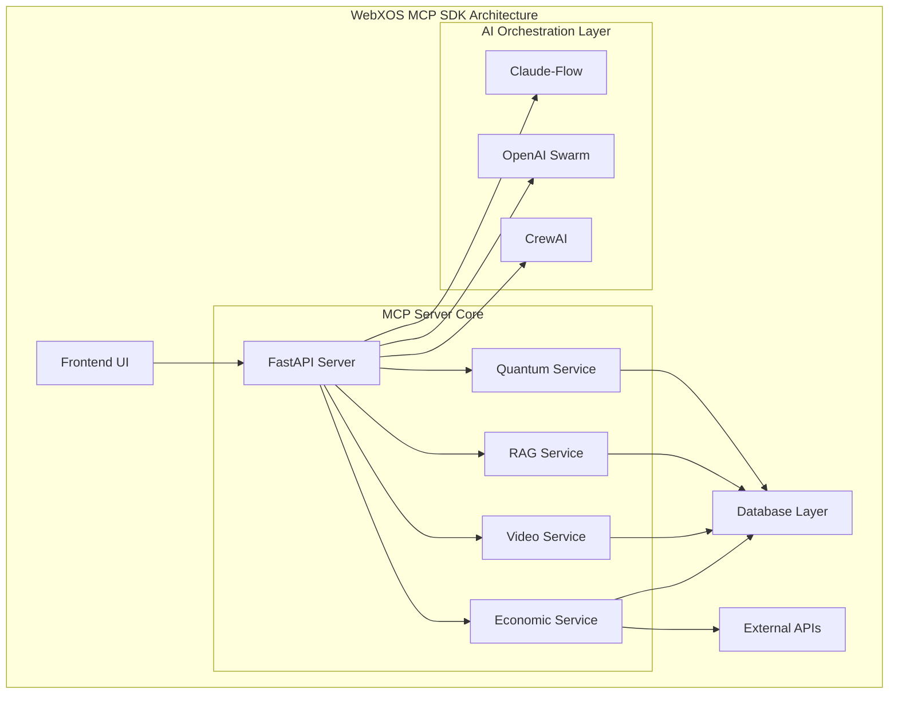
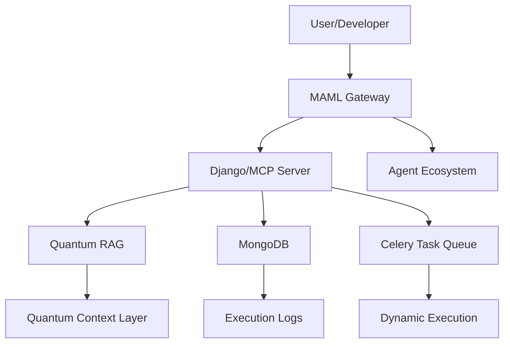

# 🌌 **WebXOS 2025 Vial MCP SDK: AI-Powered Quantum Frontier (OPEN SOURCE BETA)**

Welcome to the **WebXOS 2025 Vial Model Context Protocol (MCP) SDK**, a quantum-distributed, AI-orchestrated powerhouse hosted on GitHub! This SDK fuses 4x Vial agents, PyTorch cores, SQLAlchemy databases, and `.md` wallet functions into a versatile toolkit. It acts as a collection of tools and agents for users to fork and build off of as boilerplates and OEM project templates.

| UX | Description | Visualization |
|------|-------------|---------------|
| **⚛️ MCP/SVG Diagram Tool** | 8-Point QNN Training with an interactive real time SVG diagram circuit board for testing  | (Coming Soon)
| **🚚 Dropship Sim** | Simulate Coordinated Drop ships between earth, the moon, and mars | (Coming Soon) 
| **🌠 GalaxyCraft** | Fun Open Sandbox MMO where user can explore a lightweight three js galaxy | (Coming Soon) 
| **🌠 GIBS Telescope** | View NASA API Data real time with Gibs telescope terminal and AR features. OBS Streaming Output | (Coming Soon) 

### 🧠 AI Integration

Our SDK integrates multiple AI orchestration frameworks:

- **🐝 Claude-Flow v2.0.0 Alpha**: 87+ MCP tools with hive-mind intelligence
- **🕸️ OpenAI Swarm**: Distributed AI coordination
- **🤖 CrewAI**: Task automation and optimization

## 🏗️ System Architecture

## 🧠 CUSTOM AGENTIC WORKFLOW ##

## 📝 License

This project is licensed under the MIT License

### 🔒 Copyright & Licensing  
© 2025 WebXOS Research Group. All rights reserved.  
This repository and its contents are protected under international copyright law.  
Unauthorized reproduction, distribution, or use of the DUNES/.MAML system is strictly prohibited.  
For licensing inquiries, contact: `legal@webxos.ai`

---

## 🐪  DUNES/.MAML System  
**Multi-Augmented Machine Learning Integration for Secure Network Exchange Systems**

DUNES (Distributed Unified Network Exchange System) is a next-generation cybersecurity framework powered by Multi-Augmented Machine Learning (MAML AKA MARKDOWN AS MEDIUM LANGUAGE). It introduces the `.MAML` protocol—a novel markup language for encoding multimodal security data—and a multi-agent architecture designed for quantum-resistant, adaptive threat detection.

### 🐪 Key Features

| Feature                          | Description                                                                 |
|----------------------------------|-----------------------------------------------------------------------------|
| Multi-Agent RAG Architecture     | Planner, Extraction, Validation, Synthesis, and Response agents            |
| .MAML Protocol                   | Extensible markup for multimodal security data                             |
| Expert-Augmented Learning        | Human-in-the-loop validation and feedback integration                      |
| Adaptive Reinforcement Learning  | Dynamic policy optimization across agents                                  |
| Quantum-Resistant Cryptography   | Lattice, hash-based, and multivariate encryption mechanisms                 |

### 🐪 Performance Highlights

| Metric                  | DUNES Score | Baseline |
|-------------------------|-------------|----------|
| True Positive Rate      | 94.7%       | 87.3%    |
| False Positive Rate     | 2.1%        | 8.4%     |
| Detection Latency       | 247ms       | 1.8s     |
| Novel Threat Detection  | 89.2%       | —        |

---

### 🐪 Future Enhancements

- LLM integration for natural language threat analysis  
- Blockchain-backed audit trails  
- Federated learning for privacy-preserving intelligence  
- Ethical AI modules for bias mitigation  

---

### 📢 Attribution

This repository is maintained by the **WebXOS Research Group**.  
For collaboration, reach out via [webxos.ai](https://webxos.ai) or submit issues and pull requests directly.

## 🐪 Overview of MAML ##

**MAML (Markdown as Medium Language)** is a new syntax and protocol designed by Webxos to evolve Markdown into a structured, extensible, and machine-friendly documentation language. While Markdown democratized formatting, MAML transforms it into a **semantic medium**—bridging human readability with intelligent data transfer.

This guide introduces MAML to GitHub developers, outlining its syntax, use cases, and integration potential with modern API gateways, developer tools, and intelligent agents.

## 🐪 Why MAML? ##

## INTRODUCING A NEW .MD SYSTEM ##
 **MAML: Markdown as Medium Language**   
### *A Developer’s Guide to the Future of Semantic Documentation* ### 
## **© Webxos 2025. All rights reserved.**  ##
**Invented by Webxos Research Group**  
**License: MAML Protocol v1.0 – Attribution Required**

Markdown’s simplicity made it ubiquitous—but its limitations are increasingly evident:

- ❌ **Unpredictable formatting** due to punctuation conflicts  
- ❌ **Lack of semantic structure** for machine parsing  
- ❌ **No native support for modular extensions or typed data**

**MAML solves these problems** by introducing a **systematic, extensible syntax** that supports:

- ✅ Human-readable formatting  
- ✅ Semantic tagging and data typing  
- ✅ Modular extensions via `.maml.md` files  
- ✅ API-ready documentation for intelligent agents  

# 🐪 **WebXOS 2025 Vial MCP SDK: MAML (Markdown as Medium Language) EXPLAINED**

## 📜 **MAML: Markdown as Medium Language**

### Overview
MAML redefines Markdown as a **living, executable container**—a "USB-C" for API gateways, enabling seamless data transfer, context management, and agent orchestration. Built for the AI and quantum era, MAML integrates with the Model Context Protocol (MCP), Quantum Retrieval-Augmented Generation (RAG), and advanced security layers.

**Copyright:** © 2025 Webxos. All Rights Reserved. The MAML concept, `.maml.md` format, and extended features (e.g., Quantum Context Layers, Dynamic Execution Blocks) are Webxos’s intellectual property, licensed under MIT for research and prototyping with attribution.

## 📋 **Features**

### Core Innovations
- **Structured Schema:** YAML front matter and Markdown sections for metadata and content.
- **Dynamic Executability:** Run code blocks (Python, Qiskit, JavaScript) in sandboxed environments.
- **Agentic Context:** Embed context, permissions, and history for autonomous agents.
- **Quantum-Enhanced Security:** Post-quantum cryptography and noise patterns.
- **Interoperability:** Integrates with MCP, RAG, and Celery task queues.

### Visual Representation

## 📈 **Performance Metrics**

| Metric            | Current | Target  |
|-------------------|---------|---------|
| API Response Time | < 100ms | < 200ms |
| Page Load Time    | < 1s    | < 2s    |
| Memory Usage      | 256MB   | < 1024MB |
| Concurrent Users  | 1000+   | 500+    |
| WebSocket Latency | < 50ms  | < 100ms |
| Task Execution    | 30/hr   | 150/hr  |

## 📜 **License & Copyright**

**Copyright:** © 2025 Webxos. All Rights Reserved.  
The MAML concept and `.maml.md` format are Webxos’s intellectual property.  
**License:** MIT License for research and prototyping with attribution to Webxos.

**🌌 Explore the future of AI orchestration with WebXOS 2025! 🌠**

