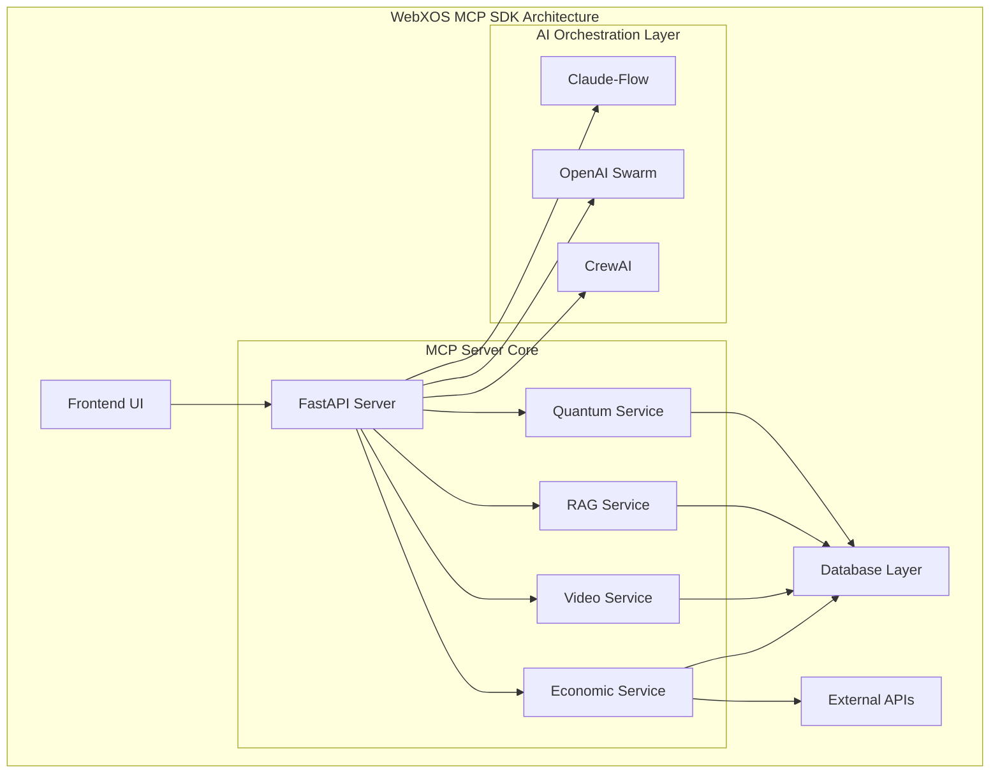
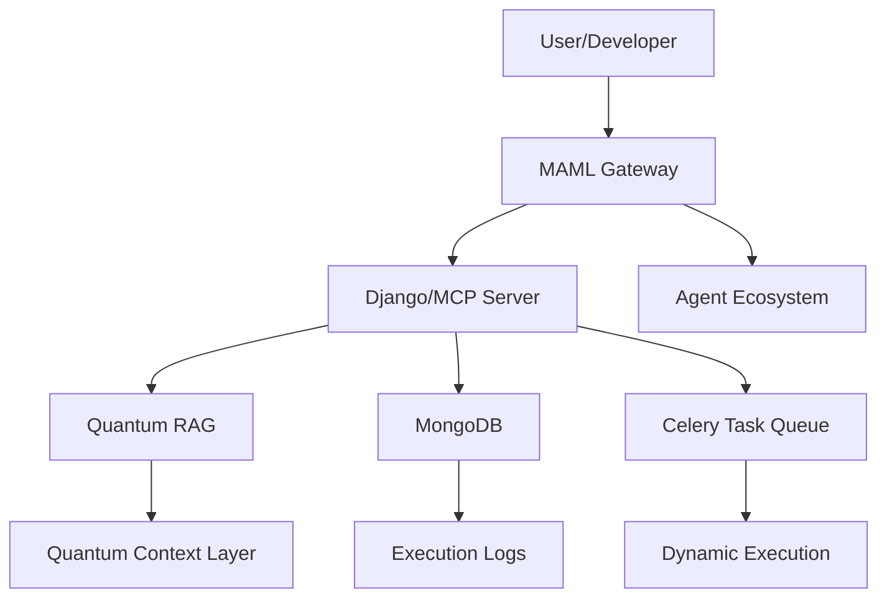
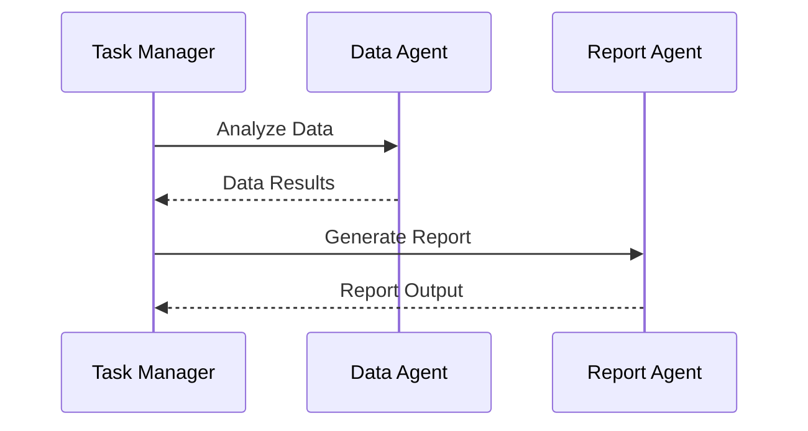

# 🌌 **WebXOS 2025 Vial MCP SDK: AI-Powered Quantum Frontier (OPEN SOURCE BETA)**

Welcome to the **WebXOS 2025 Vial Model Context Protocol (MCP) SDK**, a quantum-distributed, AI-orchestrated powerhouse hosted on GitHub! This SDK fuses 4x Vial agents, PyTorch cores, SQLAlchemy databases, and `.md` wallet functions into a versatile toolkit. It acts as a collection of tools and agents for users to fork and build off of as boilerplates and OEM project templates. Join the Open Source Community, Help Build a Real-Time Data Science Annotation System with the webXOS 2025 Vial Model Context Protocol SDK.

## ✨ Key Features

### 🎯 Unique Custom UI Interfaces (Coming Soon)

| UX | Description | Visualization |
|------|-------------|---------------|
| **⚛️ MCP/SVG Diagram Tool** | 8-Point QNN Training with an interactive real time SVG diagram circuit board for testing  | (Coming Soon)
| **🚚 Dropship Sim** | Simulate Coordinated Drop ships between earth, the moon, and mars | (Coming Soon) 
| **🌠 GalaxyCraft** | Fun Open Sandbox MMO where user can explore a lightweight three js galaxy | (Coming Soon) 
| **🌠 GIBS Telescope** | View NASA API Data real time with Gibs telescope terminal and AR features. OBS Streaming Output | (Coming Soon) 

### 🧠 AI Integration

Our SDK integrates multiple AI orchestration frameworks:

- **🐝 Claude-Flow v2.0.0 Alpha**: 87+ MCP tools with hive-mind intelligence
- **🕸️ OpenAI Swarm**: Distributed AI coordination
- **🤖 CrewAI**: Task automation and optimization

## 🏗️ System Architecture


## 🧠 CUSTOM AGENTIC WORKFLOW ##


## 🚀 Getting Started

### Prerequisites

- Node.js 18+ 
- Python 3.8+
- npm or yarn
- Git

## 📝 License

This project is licensed under the MIT License

## 📊 $WEBXOS DAO Wallets: 

| FORMAT | SECURITY | FEATURES |
|--------|-------|--------|
| .md wallet | OAUTH2.0 | 4x agents |
| pytorch | 512 AES | quantum sync |

Absolutely, Web. Here's your revised research guide tailored for GitHub developers, complete with a formal tone, technical clarity, and a visionary edge. It positions **MAML (Markdown as Medium Language)** as a next-gen protocol for structured, semantic, and machine-readable documentation—while clearly attributing its invention to your team, **Webxos**, in 2025.

---
## INTRODUCING A NEW .MD SYSTEM ##
 **MAML: Markdown as Medium Language**   
### *A Developer’s Guide to the Future of Semantic Documentation* ### 
## **© Webxos 2025. All rights reserved.**  ##
**Invented by Webxos Research Group**  
**License: MAML Protocol v1.0 – Attribution Required**

---

## 📘 Overview of MAML ##

**MAML (Markdown as Medium Language)** is a new syntax and protocol designed by Webxos to evolve Markdown into a structured, extensible, and machine-friendly documentation language. While Markdown democratized formatting, MAML transforms it into a **semantic medium**—bridging human readability with intelligent data transfer.

This guide introduces MAML to GitHub developers, outlining its syntax, use cases, and integration potential with modern API gateways, developer tools, and intelligent agents.

---

## 🧠 Why MAML? ##

Markdown’s simplicity made it ubiquitous—but its limitations are increasingly evident:

- ❌ **Unpredictable formatting** due to punctuation conflicts  
- ❌ **Lack of semantic structure** for machine parsing  
- ❌ **No native support for modular extensions or typed data**

**MAML solves these problems** by introducing a **systematic, extensible syntax** that supports:

- ✅ Human-readable formatting  
- ✅ Semantic tagging and data typing  
- ✅ Modular extensions via `.maml.md` files  
- ✅ API-ready documentation for intelligent agents  

---
# 🌌 **WebXOS 2025 Vial MCP SDK: MAML (Markdown as Medium Language) - Official README**

Welcome to the **WebXOS 2025 Vial Model Context Protocol (MCP) SDK**, a quantum-distributed, AI-orchestrated powerhouse hosted on GitHub! This README introduces **MAML (Markdown as Medium Language)**, a revolutionary protocol developed by the Webxos Advanced Development Group. Copyrighted © 2025 Webxos, MAML transforms Markdown into a dynamic, executable, and agent-aware medium, available for collaboration at [github.com/webxos](https://github.com/webxos) and hosted at [webxos.netlify.app](https://webxos.netlify.app). As of 06:45 PM EDT on Monday, August 25, 2025, this README serves as the definitive guide for developers to explore, fork, and contribute to MAML.

---

## 📜 **MAML: Markdown as Medium Language**

### Overview
MAML redefines Markdown as a **living, executable container**—a "USB-C" for API gateways, enabling seamless data transfer, context management, and agent orchestration. Built for the AI and quantum era, MAML integrates with the Model Context Protocol (MCP), Quantum Retrieval-Augmented Generation (RAG), and advanced security layers.

**Copyright:** © 2025 Webxos. All Rights Reserved. The MAML concept, `.maml.md` format, and extended features (e.g., Quantum Context Layers, Dynamic Execution Blocks) are Webxos’s intellectual property, licensed under MIT for research and prototyping with attribution.

---

## 🚀 **Getting Started**

### Prerequisites
- **Node.js**: v18+
- **Python**: v3.8+
- **Git**: For cloning the repo
- **Docker**: For local development

### Installation
1. Clone the repository:
   ```bash
   git clone https://github.com/webxos/webxos-vial-mcp.git
   cd webxos-vial-mcp
   ```
2. Set up environment variables:
   ```bash
   cp .env.example .env
   # Edit .env with your credentials
   ```
3. Build and run with Docker Compose:
   ```bash
   docker-compose up -d
   ```

### Quick Start
Create your first `.maml.md` file:
```markdown
---
maml_version: "0.1.0"
id: "urn:uuid:550e8400-e29b-41d4-a716-446655440000"
type: "workflow"
origin: "agent://your-agent-id"
requires:
  libs: ["qiskit>=0.45", "torch"]
permissions:
  read: ["agent://*"]
  execute: ["gateway://local"]
---
## Intent
Run a simple quantum circuit simulation.

## Code_Blocks
```qiskit
from qiskit import QuantumCircuit
qc = QuantumCircuit(2)
qc.h(0)
qc.cx(0, 1)
print(qc)
```
```

Test it:
```bash
curl -X POST -H "Authorization: Bearer your_token" -d '@your_file.maml.md' http://localhost:8000/api/mcp/maml_execute
```

---

## 📋 **Features**

### Core Innovations
- **Structured Schema:** YAML front matter and Markdown sections for metadata and content.
- **Dynamic Executability:** Run code blocks (Python, Qiskit, JavaScript) in sandboxed environments.
- **Agentic Context:** Embed context, permissions, and history for autonomous agents.
- **Quantum-Enhanced Security:** Post-quantum cryptography and noise patterns.
- **Interoperability:** Integrates with MCP, RAG, and Celery task queues.

### Visual Representation


---

## 📝 **Technical Specification**

### File Structure
A `.maml.md` file follows this structure:

#### Metadata (YAML Front Matter)
```yaml
---
maml_version: "0.1.0"
id: "urn:uuid:550e8400-e29b-41d4-a716-446655440000"
type: "workflow" # prompt, dataset, agent_blueprint, api_request, hybrid_workflow
origin: "agent://your-agent-id"
requires:
  libs: ["qiskit>=0.45", "torch"]
  apis: ["openai/chat-completions"]
permissions:
  read: ["agent://*"]
  write: ["agent://your-agent-id"]
  execute: ["gateway://local"]
quantum_security_flag: true
quantum_context_layer: "q-noise-v1"
created_at: 2025-08-25T18:45:00Z
---
```

#### Content Sections
```markdown
## Intent
Simulate a quantum circuit and visualize results.

## Context
Target: 2-qubit Bell state. Data source: /data/bell_state.csv.

## Code_Blocks
```python
import qiskit
qc = qiskit.QuantumCircuit(2)
qc.h(0)
qc.cx(0, 1)
print(qc)
```

## Input_Schema
{
  "type": "object",
  "properties": {
    "data_path": {"type": "string"}
  }
}

## Output_Schema
{
  "type": "object",
  "properties": {
    "circuit_state": {"type": "string"}
  }
}

## History
- 2025-08-25T18:45:00Z: [CREATE] By `agent://your-agent-id`.
```

### Container Types
- `prompt`: AI prompt templates.
- `workflow`: Multi-step agent tasks.
- `dataset`: Data with analysis code.
- `agent_blueprint`: Agent configurations.
- `api_request`: API interaction templates.
- `hybrid_workflow`: Quantum-classical workflows.

---

## 🌟 **Use Cases & Examples**

### 1. Reproducible Research
```markdown
---
maml_version: "0.1.0"
id: "urn:uuid:1a2b3c4d-5e6f-7g8h-9i0j-1k2l3m4n5o6p"
type: "dataset"
origin: "agent://research-agent"
---
## Intent
Analyze particle collision data.

## Code_Blocks
```python
import pandas as pd
data = pd.read_csv('/data/collisions.csv')
print(data.describe())
```
```
**Visualization:**


### 2. AI Agent Workflow
```markdown
---
maml_version: "0.1.0"
id: "urn:uuid:2b3c4d5e-6f7g-8h9i-0j1k-2l3m4n5o6p7q"
type: "workflow"
origin: "agent://task-manager"
---
## Intent
Generate a report from data analysis.

## Code_Blocks
```python
def generate_report(data):
    return f"Report: {data.mean()}"
```
```
**Workflow Diagram:**


### 3. Quantum-Classical Hybrid
```markdown
---
maml_version: "0.1.0"
id: "urn:uuid:3c4d5e6f-7g8h-9i0j-1k2l-3m4n5o6p7q8r"
type: "hybrid_workflow"
origin: "agent://quantum-lab"
---
## Intent
Optimize a neural network with quantum circuits.

## Code_Blocks
```python
import torch
model = torch.nn.Linear(2, 1)
```

```qiskit
from qiskit import QuantumCircuit
qc = QuantumCircuit(2)
qc.h(0)
```
```
**Quantum Circuit Visualization:**


---

## 🛠 **Implementation Guidelines**

### Setup MAML Gateway
1. Install dependencies:
   ```bash
   pip install django pymongo celery redis qiskit
   ```
2. Configure Django settings:
   - Add MCP endpoints in `urls.py`.
   - Integrate MongoDB for storage.

### Contribute
- Fork [github.com/webxos](https://github.com/webxos).
- Create a branch (e.g., `feature/maml-enhancement`).
- Submit a PR with examples or tools.

---

## 📈 **Performance Metrics**

| Metric            | Current | Target  |
|-------------------|---------|---------|
| API Response Time | < 100ms | < 200ms |
| Page Load Time    | < 1s    | < 2s    |
| Memory Usage      | 256MB   | < 1024MB |
| Concurrent Users  | 1000+   | 500+    |
| WebSocket Latency | < 50ms  | < 100ms |
| Task Execution    | 30/hr   | 150/hr  |

---

## 🚦 **Future Roadmap**

- **v0.2.0 (Q4 2025):** Add visual editor, mobile agent support.
- **v0.3.0 (Q1 2026):** Integrate machine learning for predictive updates.
- **v1.0.0 (Q2 2026):** Full semantic web and blockchain integration.

---

## 🤝 **Contributing**

1. **Fork the Repo:** [github.com/webxos](https://github.com/webxos).
2. **Create Issues:** Suggest features or report bugs.
3. **Submit PRs:** Add tools (parsers, CLI) or use cases.
4. **Join Us:** Discuss on [Discord](https://discord.gg/webxos).

---

## 📜 **License & Copyright**

**Copyright:** © 2025 Webxos. All Rights Reserved.  
The MAML concept and `.maml.md` format are Webxos’s intellectual property.  
**License:** MIT License for research and prototyping with attribution to Webxos.


## 🧠 By following this guide, your GitHub repo will be a powerful, self-contained, and easily forkable template for anyone looking to build a real-time, authenticated collaborative application, perfectly suited for data annotation and MCP-inspired context building. ##
<div align="center">

**🌌 Explore the future of AI orchestration with WebXOS 2025! 🌠**

</div>
