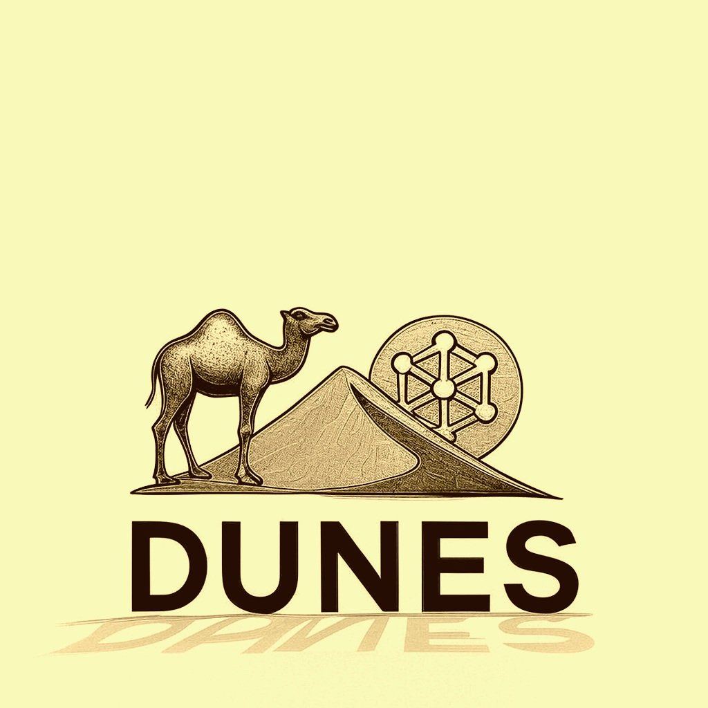
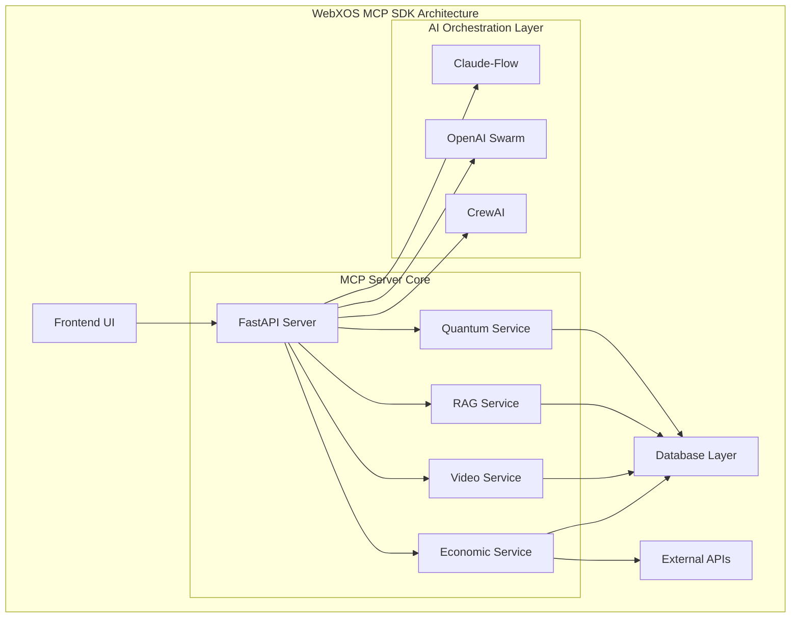
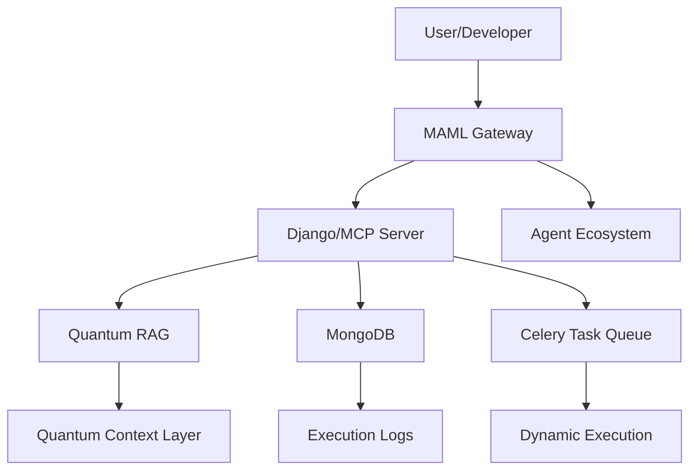
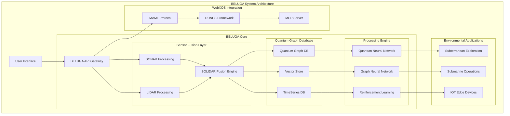

# 🐪  **PROJECT DUNES 2048-AES: MODEL CONTEXT PROTOCOL SDK**
*Multi-Augmented Model Agnositc Meta Machine Learning and 2048-AES Integration for Network Exchange Systems*

Welcome to the **PROJECT DUNES 2048-AES: OPEN SOURCE BETA** by WEBXOS ([webxos.netlify.app](https://webxos.netlify.app)), a quantum-distributed, AI-orchestrated project hosted on GitHub! 

This model context protocol SDK fuses: 

- ✅ **PyTorch cores**
- ✅ **SQLAlchemy databases**
- ✅ **Advanced .yaml and .md files**
- ✅ **Multi-stage Dockerfile deployments**
- ✅ **$custom`.md` wallets and tokenization**

*📋 It acts as a collection of tools and agents for users to fork and build off of as boilerplates and OEM 2048-AES project templates.* ✨





## PROJECT DUNES 🐪 (2048-AES Distributed Unified Network Exchange System) ##

*📋 PROJECT DUNES CLAUDE CODE ARTIFACT: https://claude.ai/public/artifacts/77e9ef0d-fb8b-4124-aa31-ac4a49a29bca*

🐪 Introducing the MAML Encryption Protocol standardized model context protocol use in 2025. A quantum-resistant encryption protocol for .MAML.ml files. Branded with the camel emoji 🐪, PROJECT DUNES transforms Markdown into secure, virtual data containers for workflows, datasets, and agent blueprints, with seamless OAuth2.0 synchronization and global encryption validation. 

PROJECT DUNES is a next-generation cybersecurity framework powered by Multi-Augmented Machine Learning (aka MARKDOWN AS MEDIUM LANGUAGE). It introduces the `.MAML` protocol—a novel markup language for encoding multimodal security data—and a multi-agent architecture designed for quantum-resistant, adaptive threat detection. ✨

**💻 PROJECT DUNES 2048-AES empowers open-source developers to build secure, MAML-compliant applications. ✨**

📜 .MAML.ml Files: Virtual camel containers for structured, executable data, validated with MAML schemas. Dual-Mode Encryption: 256-bit AES (lightweight, fast) and 512-bit AES (advanced, secure) with CRYSTALS-Dilithium signatures. OAuth2.0 Sync: JWT-based authentication via AWS Cognito for secure import/export. Reputation-Based Validation: Integrates with $CUSTOM wallet (using $webxos for example) reputation system by default but it can be modified to fit any type of token as a templated system. Quantum-Resistant Security: Implements post-quantum cryptography (liboqs) and Qiskit-based key generation. Prompt Injection Defense: Semantic analysis and jailbreak detection for secure MAML processing. ✨

*📋 MAML CLAUDE CODE ARTIFACT:https://claude.ai/public/artifacts/b3f2ded2-dbd6-41ee-a7d4-703ce4358048*

# MARKUP Agent for Project Dunes 📜✨

Welcome to the **MARKUP Agent**! 🚀 This is a modular, hybrid **PyTorch-SQLAlchemy-FastAPI** micro-agent designed to revolutionize Markdown/MAML processing in the **Project Dunes** ecosystem. It introduces a novel **Reverse Markdown** syntax called **Markup (.mu)** 📝, which reverses the structure and content of Markdown files (literally mirroring words like "Hello" to "olleH" for receipts) to enable error detection 🕵️‍♂️, shutdown scripting 🔄, and recursive training for machine learning data studies 🧠. The agent also supports **digital receipts** for self-checking, quantum-parallel processing 🌌, and 3D ultra-graph visualization 📊 for debugging and analysis.

Whether you're a data scientist 👨‍🔬, a developer 🧑‍💻, or a researcher 🔍, this manual will guide you through setup, usage, and advanced features to make the most of the MARKUP Agent in your workflows. Let's dive in! 🎉

### 💻 2048-AES AI Integration

Our SDK integrates multiple AI orchestration frameworks:

- **🐝 Claude-Flow v2.0.0 Alpha**: 87+ MCP tools with hive-mind intelligence
- **🕸️ OpenAI Swarm**: Distributed AI coordination
- **🤖 CrewAI**: Task automation and optimization

  **2048-AES DUNES AGENT**
  
- **🐋 BELUGA**: SOLIDAR™ Sensor Fusion Technology
- ✅ **Bilateral data processing** (SONAR + LIDAR = SOLIDAR™)
- ✅ **Environmental adaptive architecture**
- ✅ **Quantum-distributed graph database**
- ✅ **Edge-native IOT framework**

  
## FUTURE UI DEVELOPMENTS 2048-AES (COMING SOON) ##
| UX | Description | Visualization |
|------|-------------|---------------|
| **🌠 GalaxyCraft** | Fun Open Sandbox MMO where user can explore a lightweight three js galaxy | (BETA TEST: webxos.netlify.app/galaxycraft)
| **⚛️ 2048-AES SVG Diagram Tool** | Jupyter Notebook interactive real time SVG diagram circuit board for testing  | (Coming Soon)
| **🚚 Interplanetary Dropship Sim** | Simulate Coordinated Dropships between earth, the moon, and mars with real-time data | (Coming Soon) 
| **🏗️ GIBS Telescope** | View NASA API Data real time with Gibs telescope terminal and AR features. OBS Streaming Output | (Coming Soon) 
| **🏗️ Lawmakers Suite** | Boilerplate files for the core build of the Lawmakers Suite 2048-AES | (Coming Soon) 

## 🏗️ 2048-AES Jupyter Notebook and Angular.js (Coming Soon) ##

With 2048-AES integration, your Jupyter notebook and Angular.js, you workflow evolves from an isolated analysis environment into a connected powerhouse that can leverage the full capabilities of your organization's data and tooling ecosystem while maintaining the flexibility and interactivity that makes notebooks so valuable for data science work. ✨

## 🏗️ 2048-AES System Architecture





## 🧠 2048-AES CUSTOM AGENTIC WORKFLOW ##


### Visual Representation



# 🐋 BELUGA 2048-AES: Bilateral Environmental Linguistic Ultra Graph Agent

## 🌊 **Introduction to BELUGA 2048-AES**

** 💻 BELUGA 2048-AES** (Bilateral Environmental Linguistic Ultra Graph Agent) is a quantum-distributed database and sensor fusion system designed for extreme environmental applications. Inspired by the biological efficiency of whales and naval submarine systems, BELUGA combines SONAR (sound) and LIDAR (video) data streams into a unified graph-based storage and processing architecture. ✨

BELUGA 2048-AES features:
- ✅ **Bilateral data processing** (SONAR + LIDAR = SOLIDAR™)
- ✅ **Environmental adaptive architecture**
- ✅ **Quantum-distributed graph database**
- ✅ **Edge-native IOT framework**

## 🐋 **2048-AES Core Architecture**



## 🐪 2048-AES DUNES/.MAML System  
**Multi-Augmented Machine Learning Integration for Secure Network Exchange Systems**

PROJECT DUNES 2048-AES (Distributed Unified Network Exchange System) is a next-generation cybersecurity framework powered by Multi-Augmented Machine Learning (AKA MARKDOWN AS MEDIUM LANGUAGE). It introduces the `.MAML` protocol—a novel markup language for encoding multimodal security data—and a multi-agent architecture designed for quantum-resistant, adaptive threat detection. ✨


### 💻 2048-AES Key Features

| Feature                          | Description                                                                 |
|----------------------------------|-----------------------------------------------------------------------------|
| Multi-Agent RAG Architecture     | Planner, Extraction, Validation, Synthesis, and Response agents            |
| .MAML Protocol                   | Extensible markup for multimodal security data                             |
| Expert-Augmented Learning        | Human-in-the-loop validation and feedback integration                      |
| Adaptive Reinforcement Learning  | Dynamic policy optimization across agents                                  |
| Quantum-Resistant Cryptography   | Lattice, hash-based, and multivariate encryption mechanisms                 |

### 💻 2048-AES Performance Highlights

| Metric                  | DUNES Score | Baseline |
|-------------------------|-------------|----------|
| True Positive Rate      | 94.7%       | 87.3%    |
| False Positive Rate     | 2.1%        | 8.4%     |
| Detection Latency       | 247ms       | 1.8s     |
| Novel Threat Detection  | 89.2%       | —        |

---

### 🐪 2048-AES MAML as the OCaml Orchestrator**

✅ MAML 2048-AES becomes the perfect vehicle for distributing and executing OCaml code itself.

*   ** ✨ 2048-AES Verifiable Workflows:** A complex, verified algorithm written in OCaml can be packaged into a MAML file. The `Context` section explains the proof, the `Code_Blocks` section contains the OCaml code, and the `Input_Schema`/`Output_Schema` define its interface.
    ````markdown
    ## Code_Blocks
    ```ocaml
    (* Formal verification of a neural network property *)
    let verify_network_property (network : nn) (property : prop) : bool =
      ... (* OCaml code for verification *)
    ```
    ````
*   ** ✨ 2048-AES Hybrid Workflows:** MAML orchestrates workflows that span multiple languages. OCaml can handle the high-assurance components, while Python pre-processes data and Qiskit runs a quantum circuit. The MAML file is the manifest that ties them all together.

---

### 💻 2048-AES Future Enhancements

- LLM integration for natural language threat analysis  
- Blockchain-backed audit trails  
- Federated learning for privacy-preserving intelligence  
- Ethical AI modules for bias mitigation  

---

### 💻 2048-AES Attribution

This repository is maintained by the **WebXOS Research and Development project_dunes@outlook.com**.  

## 📜 2048-AES Overview of MAML ##

**MAML (Markdown as Medium Language)** is a new syntax and protocol designed by Webxos to evolve Markdown into a structured, extensible, and machine-friendly documentation language. While Markdown democratized formatting, MAML transforms it into a **semantic medium**—bridging human readability with intelligent data transfer. ✨

This guide introduces MAML to GitHub developers, outlining its syntax, use cases, and integration potential with modern API gateways, developer tools, and intelligent agents. ✨

## 🐪 Why MAML 2048-AES? ##

## INTRODUCING A NEW .MD SYSTEM with 2048-AES##
 **MAML: Markdown as Medium Language**   
### *A Developer’s Guide to the Future of Semantic Documentation* ### 
## **© Webxos 2025. All rights reserved.**  ##
**Invented by Webxos Research Group**  
**License: MAML Protocol v1.0 – Attribution Required**


Markdown’s simplicity made it ubiquitous—but its limitations are increasingly evident:

- ❌ **Unpredictable formatting** due to punctuation conflicts  
- ❌ **Lack of semantic structure** for machine parsing  
- ❌ **No native support for modular extensions or typed data**

**2048-AES MAML solves these problems** by introducing a **systematic, extensible syntax** that supports:

- ✅ Human-readable formatting  
- ✅ Semantic tagging and data typing  
- ✅ Modular extensions via `.maml.md` files  
- ✅ API-ready documentation for intelligent agents  

# 🐪 **WebXOS MAML 2048-AES (Markdown as Medium Language) FURTHER EXPLAINED**

## 📜 **MAML 2048-AES: Markdown as Medium Language**

### Overview
MAML redefines Markdown as a **living, executable container**—a "USB-C" for API gateways, enabling seamless data transfer, context management, and agent orchestration. Built for the AI and quantum era, MAML integrates with the Model Context Protocol (MCP), Quantum Retrieval-Augmented Generation (RAG), and advanced security layers. ✨

**Copyright:** © 2025 Webxos. All Rights Reserved. The MAML concept, `.maml.md` format, and extended features (e.g., Quantum Context Layers, Dynamic Execution Blocks) are Webxos’s intellectual property, licensed under MIT for research and prototyping with attribution. ✨

## 📋 **Features**

### Core 2048-AES Innovations
- **Structured Schema:** YAML front matter and Markdown sections for metadata and content.
- **Dynamic Executability:** Run code blocks (Python, Qiskit, JavaScript) in sandboxed environments.
- **Agentic Context:** Embed context, permissions, and history for autonomous agents.
- **Quantum-Enhanced Security:** Post-quantum cryptography and noise patterns.
- **Interoperability:** Integrates with MCP, RAG, and Celery task queues.

```
## 📈 **2048-AES Performance Metrics**

| Metric            | Current | Target  |
|-------------------|---------|---------|
| API Response Time | < 100ms | < 200ms |
| Page Load Time    | < 1s    | < 2s    |
| Memory Usage      | 256MB   | < 1024MB |
| Concurrent Users  | 1000+   | 500+    |
| WebSocket Latency | < 50ms  | < 100ms |
| Task Execution    | 30/hr   | 150/hr  |


```
Welcome to the ** 🕵️‍♂️ MARKUP Agent**! 🚀 This is a modular, hybrid **PyTorch-SQLAlchemy-FastAPI** micro-agent designed to revolutionize Markdown/MAML processing in the **Project Dunes** ecosystem. It introduces a novel **Reverse Markdown** syntax called **Markup (.mu)** 📝, which reverses the structure and content of Markdown files (literally mirroring words like "Hello" to "olleH" for receipts) to enable error detection 🕵️‍♂️, shutdown scripting 📜, and recursive training for machine learning data studies 🧠. 

## The agent also supports **digital receipts 📜 ** for self-checking, quantum-parallel processing 🌌, and 3D ultra-graph visualization 📊 for debugging and analysis.

## 🛠️ Features
- **Error Detection** 🛡️: Compares forward and reverse structures to catch syntax or structural issues.
- **Digital Receipts** 📜: Creates `.mu` files as literal reverse mirrors (e.g., "Hello" to "olleH") for self-checking and auditability.
- **Shutdown Scripts** 🔧: Generates reverse operations to undo workflows, ensuring robust rollback capabilities.
- **Recursive Training** 🧬: Builds agentic recursion networks for intense ML data studies using mirrored `.mu` receipts.
- **3D Visualization** 📈: Renders interactive 3D graphs to analyze transformations and mirroring.
- **API Access** 🌐: Provides FastAPI endpoints for standalone or integrated operation.
- **Quantum Integration** ⚛️: Supports quantum-parallel validation for high-assurance applications.
- **Markdown-to-Markup Conversion** 📝: Converts `.md` or `.maml.md` to `.mu` with reversed structure and content.
- **Receipt Generation** 📜: Creates `.mu` files as digital receipts with literal word reversal (e.g., "Hello" to "olleH") for self-checking.
- **Error Detection** 🕵️‍♂️: Uses PyTorch-based models to identify structural and semantic errors.
- **Regenerative Learning** 🧠: Trains on transformation logs to suggest fixes and improve error detection.
- **Shutdown Scripts** 📜: Generates `.mu` scripts to reverse operations for cleanup or rollback.
- **3D Ultra-Graph Visualization** 📊: Visualizes transformations and receipt mirroring with Plotly.
- **Quantum-Parallel Processing** 🌌: Integrates with Qiskit for parallel validation in quantum environments.
- **API-Driven Workflow** 🌐: Exposes FastAPI endpoints for external systems to validate, convert, or visualize.
- **Database Logging** 💾: Stores transformation and receipt logs in SQLAlchemy for auditability.
- **Docker Deployment** 🐳: Runs as a containerized application for easy setup and scalability.

## 🎯 Use Cases

1. **Error Detection in MAML** 🕵️‍♂️: Validate `.maml.md` files for syntax errors before execution in Project Dunes.
2. **Digital Receipts** 📜: Generate self-checking `.mu` receipts for ML workflows, ensuring data integrity.
3. **Recursive ML Training** 🧠: Use mirrored receipts for agentic recursion networks in data studies.
4. **Shutdown Scripts** 🔄: Create reverse scripts for workflow cleanup or rollback.
5. **Quantum Validation** ⚛️: Perform high-assurance validation in quantum-parallel environments.
6. **API Integration** 🌐: Enable external systems to validate and transform Markdown via APIs.
7. **Visualization for Debugging** 📊: Analyze transformations and receipt mirroring with 3D graphs.

---

## 🇳🇬 HUMANITARIAN EFFORT: Connection Machine 2048-AES

Version: 1.0.0
Inspired by: Philip Emeagwali's Connection Machine
Mission: To empower Nigerian developers with a quantum-ready, high-performance SDK and server framework for Web3, AI, and advanced computational fields, fostering global collaboration and innovation.

Overview
The Connection Machine 2048-AES  Project provides and open source initiative that reimagines Philip Emeagwali’s Connection Machine as a modern, decentralized computational fabric. The project provides a Python-based SDK (dunes-sdk) and a Model Context Protocol (MCP) server, leveraging NVIDIA CUDA for accelerated computing, Qiskit for quantum simulation, and OCaml/Ortac for formal verification. The SDK enables developers to build applications that perform parallel computations across four logical nodes (the "Quadrilinear Core"), simulating a high-throughput system suitable for AI/ML, data analysis, and quantum workflows.

## 🌌 GalaxyCraft: Ultimate Space MMO - Open Source Web3 Sandbox Universe

Welcome to GalaxyCraft, the premier open-source, lightweight, and innovative Web3 sandbox universe designed to redefine the future of online gaming! Brought to you by the developers at webXOS.netlify.app, this GitHub repository hosts the source code, documentation, and community resources for GalaxyCraft, a cutting-edge project that combines state-of-the-art WebGPU technology, an expansive real-time galaxy, and a robust API Gateway tailored for API-driven gaming. 🎮 Whether you're a player, developer, or enthusiast, GalaxyCraft offers a limitless playground for exploration, creativity, and collaboration. 🌍

*BETA TEST IS NOW LIVE: webxos.netlify.app/galaxycraft*


## 📜 **2048-AES License & Copyright**

**Copyright:** © 2025 Webxos. All Rights Reserved.  
The MAML concept and `.maml.md` format are Webxos’s intellectual property.  
**License:** MIT License for research and prototyping with attribution to Webxos.

**Copyright:** © 2025 Webxos. All Rights Reserved. The MAML concept, `.maml.md` format, and extended features (e.g., Quantum Context Layers, Dynamic Execution Blocks) are Webxos’s intellectual property, licensed under MIT for research and prototyping with attribution. ✨

**Copyright:** © 2025 WebXOS Research Group. All rights reserved.  
BELUGA system concepts, architecture, and implementations are proprietary intellectual property. ✨

### 🔒 2048-AES Copyright & Licensing  
© 2025 WebXOS Research Group. All rights reserved.  
This repository and its contents are protected under international copyright law.  
Unauthorized reproduction, distribution, or use of the DUNES/.MAML system is strictly prohibited. ✨  
For licensing inquiries, contact: `legal@webxos.ai`


** 🐪 Explore the future of 2048-AES AI orchestration with WebXOS 2025! ✨ **

</div>
