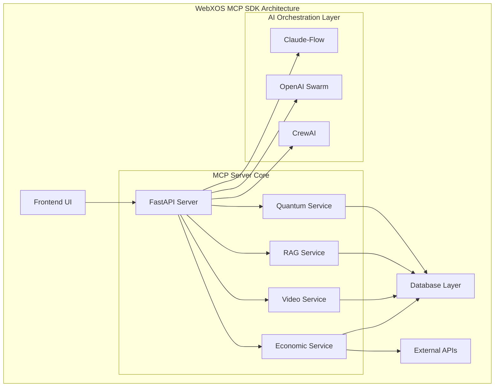
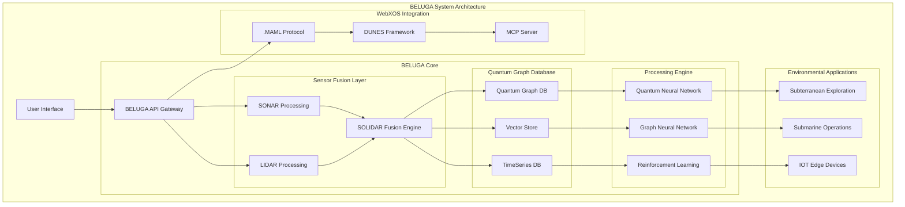
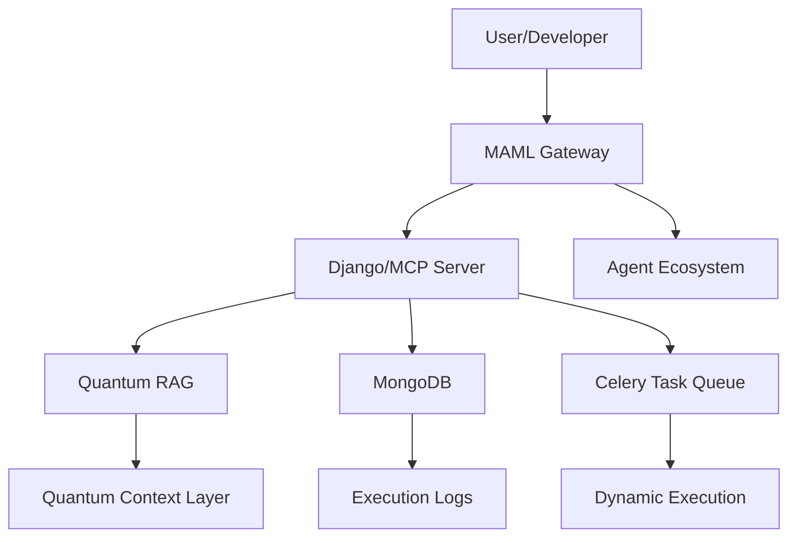

# 🐪  **PROJECT DUNES: MODEL CONTEXT PROTOCOL SDK**
**Multi-Augmented Machine Learning Integration for Secure Network Exchange Systems**

Welcome to the **PROJECT DUNES: OPEN SOURCE BETA** by WEBXOS ([webxos.netlify.app](https://webxos.netlify.app)), a quantum-distributed, AI-orchestrated powerhouse hosted on GitHub! 

This model context protocol SDK fuses: 

- ✅ **PyTorch cores**
- ✅ **SQLAlchemy databases**
- ✅ **Advanced .yaml files**
- ✅ **Multi-stage Dockerfile deployments**
- ✅ **-$webxos `.md` wallets ([VIAL MCP WALLET](https://webxos.netlify.app/vial))** 

*📋 It acts as a collection of tools and agents for users to fork and build off of as boilerplates and OEM project templates.* ✨

## DUNES 🐪 (Distributed Unified Network Exchange System) ##

DUNES is a next-generation cybersecurity framework powered by Multi-Augmented Machine Learning (aka MARKDOWN AS MEDIUM LANGUAGE). It introduces the `.MAML` protocol—a novel markup language for encoding multimodal security data—and a multi-agent architecture designed for quantum-resistant, adaptive threat detection. ✨
 
 *📋 DUNES CLAUDE CODE ARTIFACT: https://claude.ai/public/artifacts/77e9ef0d-fb8b-4124-aa31-ac4a49a29bca*

🐪 Introducing the MAML Encryption Protocol for WebXOS 2025 🐪 Welcome to DUNES (Distributed Unified Network Exchange System), a quantum-resistant encryption protocol for .MAML.ml files, integrated with the WebXOS 2025 Vial MCP SDK. Branded with the camel emoji 🐪, DUNES transforms Markdown into secure, virtual data containers for workflows, datasets, and agent blueprints, with seamless OAuth2.0 synchronization and global encryption validation. 

**🐪 DUNES empowers open-source developers to build secure, MAML-compliant applications. ✨**

🐪 .MAML.ml Files: Virtual camel containers for structured, executable data, validated with MAML schemas. Dual-Mode Encryption: 256-bit AES (lightweight, fast) and 512-bit AES (advanced, secure) with CRYSTALS-Dilithium signatures. OAuth2.0 Sync: JWT-based authentication via AWS Cognito for secure import/export. Reputation-Based Validation: Integrates with $WEBXOS wallet reputation system. Quantum-Resistant Security: Implements post-quantum cryptography (liboqs) and Qiskit-based key generation. Prompt Injection Defense: Semantic analysis and jailbreak detection for secure MAML processing. ✨

*📋 MAML CLAUDE CODE ARTIFACT:https://claude.ai/public/artifacts/b3f2ded2-dbd6-41ee-a7d4-703ce4358048*

### 🧠 AI Integration

Our SDK integrates multiple AI orchestration frameworks:

- **🐝 Claude-Flow v2.0.0 Alpha**: 87+ MCP tools with hive-mind intelligence
- **🕸️ OpenAI Swarm**: Distributed AI coordination
- **🤖 CrewAI**: Task automation and optimization
- **🐋 BELUGA**: SOLIDAR™ Sensor Fusion Technology
- ✅ **Bilateral data processing** (SONAR + LIDAR = SOLIDAR™)
- ✅ **Environmental adaptive architecture**
- ✅ **Quantum-distributed graph database**
- ✅ **Edge-native IOT framework**

  
## FUTURE UI DEVELOPMENTS (COMING SOON) ##
| UX | Description | Visualization |
|------|-------------|---------------|
| **⚛️ MCP/SVG Diagram Tool** | 8-Point QNN Training with an interactive real time SVG diagram circuit board for testing  | (Coming Soon)
| **🚚 Dropship Sim** | Simulate Coordinated Drop ships between earth, the moon, and mars | (Coming Soon) 
| **🌠 GalaxyCraft** | Fun Open Sandbox MMO where user can explore a lightweight three js galaxy | (Coming Soon) 
| **🌠 GIBS Telescope** | View NASA API Data real time with Gibs telescope terminal and AR features. OBS Streaming Output | (Coming Soon) 

## Jupyter Notebook Support (Coming Soon) ##

With Vial MCP integration, your Jupyter notebook evolves from an isolated analysis environment into a connected powerhouse that can leverage the full capabilities of your organization's data and tooling ecosystem while maintaining the flexibility and interactivity that makes notebooks so valuable for data science work. ✨

## 🏗️ System Architecture

## 🧠 CUSTOM AGENTIC WORKFLOW ##

# 🐋 BELUGA: Bilateral Environmental Linguistic Ultra Graph Agent

## 🌊 **Introduction to BELUGA**

**BELUGA** (Bilateral Environmental Linguistic Ultra Graph Agent) is a quantum-distributed database and sensor fusion system designed for extreme environmental applications. Inspired by the biological efficiency of whales and naval submarine systems, BELUGA combines SONAR (sound) and LIDAR (video) data streams into a unified graph-based storage and processing architecture. ✨

BELUGA features:
- ✅ **Bilateral data processing** (SONAR + LIDAR = SOLIDAR™)
- ✅ **Environmental adaptive architecture**
- ✅ **Quantum-distributed graph database**
- ✅ **Edge-native IOT framework**

## 🐋 **Core Architecture**

## 🐪  DUNES/.MAML System  
**Multi-Augmented Machine Learning Integration for Secure Network Exchange Systems**

DUNES (Distributed Unified Network Exchange System) is a next-generation cybersecurity framework powered by Multi-Augmented Machine Learning (AKA MARKDOWN AS MEDIUM LANGUAGE). It introduces the `.MAML` protocol—a novel markup language for encoding multimodal security data—and a multi-agent architecture designed for quantum-resistant, adaptive threat detection. ✨

### 🐪 Key Features

| Feature                          | Description                                                                 |
|----------------------------------|-----------------------------------------------------------------------------|
| Multi-Agent RAG Architecture     | Planner, Extraction, Validation, Synthesis, and Response agents            |
| .MAML Protocol                   | Extensible markup for multimodal security data                             |
| Expert-Augmented Learning        | Human-in-the-loop validation and feedback integration                      |
| Adaptive Reinforcement Learning  | Dynamic policy optimization across agents                                  |
| Quantum-Resistant Cryptography   | Lattice, hash-based, and multivariate encryption mechanisms                 |

### 🐪 Performance Highlights

| Metric                  | DUNES Score | Baseline |
|-------------------------|-------------|----------|
| True Positive Rate      | 94.7%       | 87.3%    |
| False Positive Rate     | 2.1%        | 8.4%     |
| Detection Latency       | 247ms       | 1.8s     |
| Novel Threat Detection  | 89.2%       | —        |

---

### 🐪 Future Enhancements

- LLM integration for natural language threat analysis  
- Blockchain-backed audit trails  
- Federated learning for privacy-preserving intelligence  
- Ethical AI modules for bias mitigation  

---

### 📢 Attribution

This repository is maintained by the **WebXOS Research Group**.  
[webxos.netlify.app](https://webxos.netlify.app), submit issues and pull requests directly.

## 🐪 Overview of MAML ##

**MAML (Markdown as Medium Language)** is a new syntax and protocol designed by Webxos to evolve Markdown into a structured, extensible, and machine-friendly documentation language. While Markdown democratized formatting, MAML transforms it into a **semantic medium**—bridging human readability with intelligent data transfer. ✨

This guide introduces MAML to GitHub developers, outlining its syntax, use cases, and integration potential with modern API gateways, developer tools, and intelligent agents. ✨

## 🐪 Why MAML? ##

## INTRODUCING A NEW .MD SYSTEM ##
 **MAML: Markdown as Medium Language**   
### *A Developer’s Guide to the Future of Semantic Documentation* ### 
## **© Webxos 2025. All rights reserved.**  ##
**Invented by Webxos Research Group**  
**License: MAML Protocol v1.0 – Attribution Required**

Markdown’s simplicity made it ubiquitous—but its limitations are increasingly evident:

- ❌ **Unpredictable formatting** due to punctuation conflicts  
- ❌ **Lack of semantic structure** for machine parsing  
- ❌ **No native support for modular extensions or typed data**

**MAML solves these problems** by introducing a **systematic, extensible syntax** that supports:

- ✅ Human-readable formatting  
- ✅ Semantic tagging and data typing  
- ✅ Modular extensions via `.maml.md` files  
- ✅ API-ready documentation for intelligent agents  

# 🐪 **WebXOS 2025 Vial MCP SDK: MAML (Markdown as Medium Language) EXPLAINED**

## 📜 **MAML: Markdown as Medium Language**

### Overview
MAML redefines Markdown as a **living, executable container**—a "USB-C" for API gateways, enabling seamless data transfer, context management, and agent orchestration. Built for the AI and quantum era, MAML integrates with the Model Context Protocol (MCP), Quantum Retrieval-Augmented Generation (RAG), and advanced security layers. ✨

**Copyright:** © 2025 Webxos. All Rights Reserved. The MAML concept, `.maml.md` format, and extended features (e.g., Quantum Context Layers, Dynamic Execution Blocks) are Webxos’s intellectual property, licensed under MIT for research and prototyping with attribution. ✨

## 📋 **Features**

### Core Innovations
- **Structured Schema:** YAML front matter and Markdown sections for metadata and content.
- **Dynamic Executability:** Run code blocks (Python, Qiskit, JavaScript) in sandboxed environments.
- **Agentic Context:** Embed context, permissions, and history for autonomous agents.
- **Quantum-Enhanced Security:** Post-quantum cryptography and noise patterns.
- **Interoperability:** Integrates with MCP, RAG, and Celery task queues.

### Visual Representation

## 📈 **Performance Metrics**

| Metric            | Current | Target  |
|-------------------|---------|---------|
| API Response Time | < 100ms | < 200ms |
| Page Load Time    | < 1s    | < 2s    |
| Memory Usage      | 256MB   | < 1024MB |
| Concurrent Users  | 1000+   | 500+    |
| WebSocket Latency | < 50ms  | < 100ms |
| Task Execution    | 30/hr   | 150/hr  |

## 📜 **License & Copyright**

**Copyright:** © 2025 Webxos. All Rights Reserved.  
The MAML concept and `.maml.md` format are Webxos’s intellectual property.  
**License:** MIT License for research and prototyping with attribution to Webxos.

**Copyright:** © 2025 Webxos. All Rights Reserved. The MAML concept, `.maml.md` format, and extended features (e.g., Quantum Context Layers, Dynamic Execution Blocks) are Webxos’s intellectual property, licensed under MIT for research and prototyping with attribution. ✨

**Copyright:** © 2025 WebXOS Research Group. All rights reserved.  
BELUGA system concepts, architecture, and implementations are proprietary intellectual property. ✨

### 🔒 Copyright & Licensing  
© 2025 WebXOS Research Group. All rights reserved.  
This repository and its contents are protected under international copyright law.  
Unauthorized reproduction, distribution, or use of the DUNES/.MAML system is strictly prohibited. ✨  
For licensing inquiries, contact: `legal@webxos.ai`

** 🐪 Explore the future of AI orchestration with WebXOS 2025! ✨ **

