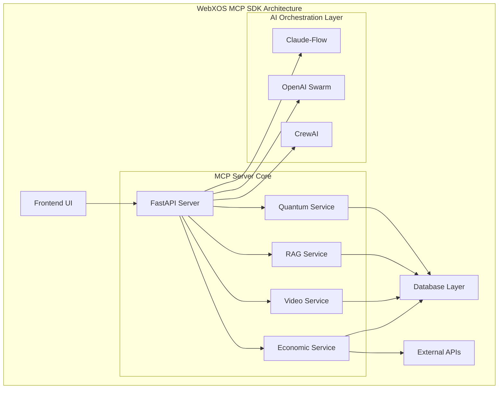
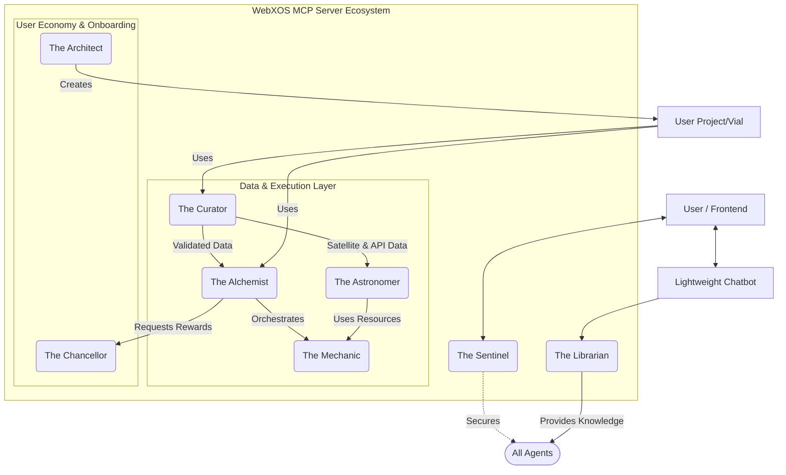

# 🌌 **WebXOS 2025 Vial MCP SDK: AI-Powered Quantum Frontier (OPEN SOURCE BETA)**

Welcome to the **WebXOS 2025 Vial Model Context Protocol (MCP) SDK**, a quantum-distributed, AI-orchestrated powerhouse hosted on GitHub! This SDK fuses 4x Vial agents, PyTorch cores, SQLAlchemy databases, and `.md` wallet functions into a versatile toolkit. It acts as a collection of tools and agents for users to fork and build off of as boilerplates and oem project guides. Join the Open Source Community, Help Build a Real-Time Data Science Annotation System with the webXOS 2025 Vial Model Context Protocol SDK.

## ✨ Key Features

### 🎯 Modes of Operation

| Mode | Description | Visualization |
|------|-------------|---------------|
| **⚛️ SVG Diagram Creation** | 8-Point Quantum Neural Network Training with interactive real time SVG diagram circuit board (Coming Soon) |
| **🚚 Dropship Sim** | Simulate Coordinated Drop ships between earth, the moon, and mars. (Coming Soon) | 
| **🌠 GalaxyCraft** | Space Open Sandbox where user can explore a three js galaxy. (Coming Soon) | 
| **🌠 Telescope** | View NASA API Data real time with Gibs telescope terminal and AR features. OBS Streaming Output (Coming Soon) | 

### 🧠 AI Integration

Our SDK integrates multiple AI orchestration frameworks:

- **🐝 Claude-Flow v2.0.0 Alpha**: 87+ MCP tools with hive-mind intelligence
- **🕸️ OpenAI Swarm**: Distributed AI coordination
- **🤖 CrewAI**: Task automation and optimization

## 🏗️ System Architecture

## 🚀 Getting Started

### Prerequisites

- Node.js 18+ 
- Python 3.8+
- npm or yarn
- Git

## 📝 License

This project is licensed under the MIT License

## 📊 $WEBXOS DAO Wallets: 

| FORMAT | SECURITY | FEATURES |
|--------|-------|--------|
| .md wallet | OAUTH2.0 | 4x agents |
| pytorch | 512 AES | quantum sync |

## Guide: Join the Open Source Community, Help Build a Real-Time Data Science Annotation System with MCP-like Protocols ##

This guide is a boilerplate guide for you to start and build a Model Context Protocol repo for Github. It will help you structure a GitHub repository that others can fork to instantly have a working environment for collaborative data annotation, perfect for data science teams.

## Project Name: annot8 (or a name of your choice) ##
Core Concept: A web-based platform where authenticated users can annotate a central document (or data point) in real-time. Annotations are persisted, user-specific, and viewable by all authorized users instantly.

Component	Technology	Rationale
CI/CD	GitHub Actions (YAML)	Tightly integrated with GitHub, easy for forks.
Containerization	Docker & Docker Compose	Ensures environment consistency.
Backend (API)	FastAPI (Python)	Modern, fast, built-in support for ASGI, WebSockets, and OpenAPI docs.
Real-Time Comms	WebSockets (via websockets lib)	True real-time bidirectional communication for annotations.
Database	PostgreSQL	Robust, relational, perfect for user data and annotations.
OAuth 2.0	authlib or python-jose	Professional handling of JWT tokens.
HTML Generation	Jinja2	Python-powered templating for build-time flexibility.
Frontend	Vanilla JS + WebSocket API	Lightweight, no framework required, easy to understand for forks.
4. Core Implementation Guide

## A. The OAuth 2.0 "Wallet Database" (backend/app/auth.py) ##

This is the heart of user management and data isolation.

    Setup: Use an OAuth provider like Google or GitHub. Create a new OAuth App in their developer console. Set the redirect URI to http://localhost:8000/auth/callback for local dev and your production URL later.

    Flow: Implement the Authorization Code Grant flow with PKCE for best security.

    Database Models:
    python

    # backend/app/models.py
    from sqlalchemy import Column, Integer, String, DateTime, ForeignKey, Text
    from sqlalchemy.orm import relationship
    from backend.app.database import Base

    class User(Base):
        __tablename__ = "users"
        id = Column(Integer, primary_key=True, index=True)
        email = Column(String, unique=True, index=True)
        name = Column(String)
        # Store a unique provider ID (e.g., Google's 'sub')
        provider_id = Column(String, unique=True)
        created_at = Column(DateTime, default=datetime.utcnow)
        # Relationship: One User to Many Annotations
        annotations = relationship("Annotation", back_populates="user")

    class Annotation(Base):
        __tablename__ = "annotations"
        id = Column(Integer, primary_key=True, index=True)
        text = Column(Text)
        x_percent = Column(Float)  # For positioning on the page
        y_percent = Column(Float)
        user_id = Column(Integer, ForeignKey("users.id"))
        created_at = Column(DateTime, default=datetime.utcnow)
        # Relationship: Many Annotations to One User
        user = relationship("User", back_populates="annotations")

    Token Handling: Upon successful OAuth callback, create or fetch the User record. Generate a session token or JWT to keep the user logged in. This token is the key to their personal "wallet" of annotations.

B. Real-Time Backend with FastAPI (backend/app/main.py, websockets.py)
python

# backend/app/main.py (Simplified)
from fastapi import FastAPI, WebSocket, WebSocketDisconnect, Depends, Request
from fastapi.templating import Jinja2Templates
from .auth import get_current_user
from .websockets import ConnectionManager

app = FastAPI()
templates = Jinja2Templates(directory="../frontend/templates")
manager = ConnectionManager()

# Serve the main page (build-time generated HTML is served here)
@app.get("/")
async def get_index_page(request: Request):
    # You could pass build-time data here if needed
    return templates.TemplateResponse("index.html.j2", {"request": request})

# WebSocket endpoint for real-time annotations
@app.websocket("/ws/{client_id}")
async def websocket_endpoint(websocket: WebSocket, client_id: int):
    await manager.connect(websocket)
    try:
        while True:
            # Receive new annotation from a client
            data = await websocket.receive_json()
            # **CRITICAL: Validate user and save to DB here**
            # ... (logic to save annotation to PostgreSQL, linked to user_id)

            # Broadcast the new annotation to ALL connected clients
            await manager.broadcast_json(data)
    except WebSocketDisconnect:
        manager.disconnect(websocket)
        # Optional: broadcast a "user left" message

# REST API endpoint to fetch all annotations on page load
@app.get("/api/annotations")
async def get_annotations(user=Depends(get_current_user)):
    # Fetch annotations from DB, perhaps paginated
    annotations = ...  # DB query logic
    return annotations

C. Build-Time Automation (backend/scripts/generate_html.py, .github/workflows/ci-cd.yml)

generate_html.py (Jinja2 Templating):
python

from jinja2 import Environment, FileSystemLoader
from datetime import datetime
import os

env = Environment(loader=FileSystemLoader('../frontend/templates/'))
template = env.get_template('index.html.j2')

# You can fetch data here at build-time from an API or DB for truly static generation
html_output = template.render(
    generated_date=datetime.utcnow().isoformat(),
    page_title="Our Collaborative Data Annotation Hub"
)

with open('../frontend/static/index.html', 'w') as f:
    f.write(html_output)

.github/workflows/ci-cd.yml (GitHub Actions):
yaml

name: CI/CD for annot8

on:
  push:
    branches: [ main ]
  pull_request:
    branches: [ main ]

jobs:
  build-and-test:
    runs-on: ubuntu-latest
    steps:
      - name: Checkout code
        uses: actions/checkout@v4

      - name: Set up Python
        uses: actions/setup-python@v5
        with:
          python-version: '3.10'

      - name: Install dependencies
        run: |
          cd backend
          pip install -r requirements.txt

      - name: Run HTML Generation Script
        run: |
          cd backend
          python scripts/generate_html.py
        env:
          # Can pass build-time secrets/variables here for the template
          BUILD_TIMESTAMP: ${{ github.run_number }}

      - name: Build Docker image
        run: docker build -t annot8-backend:latest ./backend

      - name: Run Tests
        run: |
          cd backend
          python -m pytest tests/

  deploy:
    needs: build-and-test
    if: github.ref == 'refs/heads/main'
    runs-on: ubuntu-latest
    steps:
      - name: Deploy to production
        run: |
          echo "Deploying to production server..."
          # Add your deployment commands here, e.g.:
          # scp docker-compose.prod.yml user@server:/app/
          # ssh user@server "docker compose -f /app/docker-compose.prod.yml pull && docker compose -f /app/docker-compose.prod.yml up -d"

D. Docker Multi-Stage Build (backend/Dockerfile)
dockerfile

# Stage 1: Builder
FROM python:3.10-slim as builder
WORKDIR /app
COPY requirements.txt .
RUN pip install --user --no-cache-dir -r requirements.txt

# Stage 2: Runtime
FROM python:3.10-slim
WORKDIR /app
ENV PYTHONPATH=/app
ENV PATH="/app/.local/bin:${PATH}"

# Copy from builder stage
COPY --from=builder /root/.local /root/.local
COPY --from=builder /app/requirements.txt .

# Copy application code and generated HTML
COPY ./app ./app
COPY --from=builder /app/scripts/generate_html.py ./scripts/
# This assumes the CI job ran the script first. Alternatively, run it here:
# RUN python scripts/generate_html.py

# Copy static HTML files generated during the build
COPY ./frontend/static /app/static

EXPOSE 8000
CMD ["uvicorn", "app.main:app", "--host", "0.0.0.0", "--port", "8000", "--reload"]

5. Making it Forkable and Data-Science Ready

    Detailed README.md: Include:

        "Fork this repo" as the first step.

        A graphic architecture diagram.

        Setup instructions: cp .env.example .env, docker-compose up -d.

        How to register OAuth apps and configure .env variables.

        Example usage with curl commands and screenshots.

    .env.example File:
    text

DATABASE_URL=postgresql://user:password@db:5432/annot8
GOOGLE_OAUTH_CLIENT_ID=your_google_client_id
GOOGLE_OAUTH_CLIENT_SECRET=your_google_secret
SECRET_KEY=your_random_secret_key_for_sessions

docker-compose.yml for Development:
yaml

    version: '3.8'
    services:
      db:
        image: postgres:15
        environment:
          POSTGRES_DB: annot8
          POSTGRES_USER: user
          POSTGRES_PASSWORD: password
        volumes:
          - postgres_data:/var/lib/postgresql/data
      backend:
        build: ./backend
        command: uvicorn app.main:app --host 0.0.0.0 --port 8000 --reload
        volumes:
          - ./backend:/app
          - ./frontend/static:/app/static # Live-reload for frontend dev
        ports:
          - "8000:8000"
        environment:
          - DATABASE_URL=postgresql://user:password@db:5432/annot8
        depends_on:
          - db
    volumes:
      postgres_data:

    Data Science Integration:

        Add an API Endpoint: GET /api/annotations/export that returns all annotations as a CSV or JSON file for easy analysis in a Jupyter notebook.

        Include Example Notebooks: Add a notebooks/ directory with a Jupyter notebook showing how to load the exported data and perform basic analysis (e.g., most active annotators, common terms).

## By following this guide, your GitHub repo will be a powerful, self-contained, and easily forkable template for anyone looking to build a real-time, authenticated collaborative application, perfectly suited for data annotation and MCP-inspired context building. ##

**🌌 Explore the future of AI orchestration with WebXOS 2025! 🌠**

