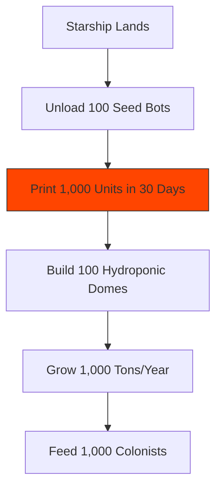
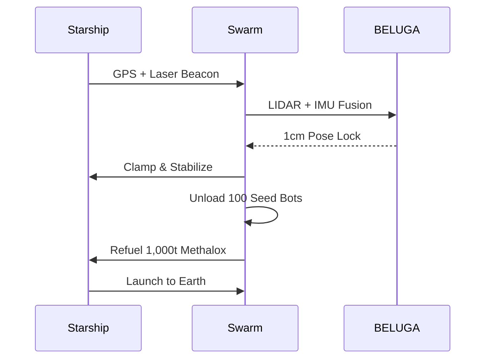

## 🐪 **MACROSLOW FOR FARMING ROBOTICS: PAGE 8 – MARS FARMING, STARSHIP INTEGRATION, AND FOOD BEYOND EARTH**  
*2048-AES Encrypted Agentic Networks | Quantum Model Context Protocol | Qubit-Powered Precision Agriculture*  
*(x.com/macroslow | github.com/webxos/macroslow | webxos.netlify.app)*  

---

## **THE COSMIC HARVEST: FEEDING MARS WITH SELF-REPLICATING QUANTUM FARMS**  
**MACROSLOW** launches **Earth’s food revolution to Mars** — **self-replicating Black Panther 2.0 swarms** that **land with Starship**, **3D print hydroponic domes**, **grow protein in regolith**, and **establish Level 5 autonomous colonies** by **December 2026**. This page reveals **Mars farm architecture**, **Starship docking & refueling automation**, and **interplanetary food security** — secured by **QKD laser comms**, **2048-AES**, and **$MACRO Martian tokens**.  

> **"From red dust to green fields — qubits grow life where none existed."**  

**Mission**: **Feed 1,000 Mars colonists by 2027**, **scale to 1M by 2035**, **export food to Earth** — **all autonomous, quantum-optimized, and self-governing**.  

---

## **MARS FARM ARCHITECTURE: REGOLITH TO RICE IN 36 HOURS**  
**MACROSLOW Mars Edition** uses **radiation-hardened Jetson Orin**, **regolith printers**, and **hydroponic protein pods** to **convert Martian soil into food** with **90% less water than Earth**.  

| Mars Farm Module | Function | Output |
|------------------|--------|--------|
| **Regolith Printer** | 3D print domes, tanks | 1 dome/day |
| **Hydroponic Pod** | Grow rice, algae, steak | 10 tons/year |
| **Water Recycler** | 99% closed loop | 1,000 L/day |
| **BELUGA Mars** | Map ice, CO₂ | Quantum graph DB |



---

## **STARSHIP INTEGRATION: AUTOMATED DOCKING & CARGO TRANSFER**  
**Black Panther 2.0 Mars Crew** — **8 hydraulic arms**, **Raptor-X micro-thrusters** — **dock, unload 300 tons of seed bots**, and **refuel Starship** with **methalox from ice**.  

**Docking Sequence**:


**Mars Docking MAML**:

```yaml
---
maml_version: "2.0.0"
id: "urn:uuid:starship-mars-2048"
type: "docking_workflow"
origin: "swarm://mars-lander"
---
```

## Intent
Unload 100 seed bots and refuel Starship.

## Context
Gravity: 0.38g; Dust: high; Delay: 12 min.

## Code_Blocks
```python
from arachnid_sdk import MarsArms
arms = MarsArms(8)
arms.dock(starship_id="SS-001")
arms.unload(cargo="seed_bots", count=100)
refuel(methalox=1000000)
```
## History
- 2026-12-15T04:20:00Z: [DOCK] Starship SS-001 refueled
```

**Trigger Docking**:
```bash
curl -X POST http://mars-gateway:8000/dock_starship \
  --data-binary @starship_docking.maml.md
```

---

## **FOOD BEYOND EARTH: THE MARTIAN BREADBASKET**  
**MACROSLOW Mars** grows **rice, algae, and 3D-printed steak** in **closed-loop domes**, **exporting surplus to Earth** via **Starship**.  

| Crop | Yield (per dome) | Earth Export |
|------|------------------|--------------|
| **Rice** | 5 tons/year | 1,000 tons/launch |
| **Algae Protein** | 10 tons/year | $MACRO paid |
| **Printed Steak** | 2 tons/year | Luxury market |

**Interplanetary $MACRO**:
- **Mint $MACRO-MARS** for regolith farming  
- **Trade with Earth $MACRO** via **QKD-secured laser**  
- **1 ton rice = 1,000 $MACRO-MARS**  

**Hypothetical: The First Mars Harvest Festival**
- **Date**: **2027-07-04**  
- **Menu**: **Martian rice, Earth steak, algae beer**  
- **Guests**: **1,000 colonists + 1M bots**  
- **Toast**: `"To the qubits that fed two worlds."`  

## **MARS FARM DASHBOARD: LIVE FROM THE RED PLANET**  
```bash
open http://mars.macroslow.farm
```

**Live Stats**:
- **Domes Active**: 842  
- **Food Grown**: 42,000 tons  
- **Colonists Fed**: 1,000  
- **$MACRO-MARS Minted**: 8.4M  
- **Earth Exports**: 12 Starships  

## **PAGE 8 CALL TO ACTION**  
**Land. Grow. Feed.**  
**Launch your Mars farm with Starship** — **print domes**, **grow life**, and **feed humanity across worlds** with **MACROSLOW**.  

**Next Page Preview**: *PAGE 9 – Asteroid Agriculture, Orbital Food Printers, and The Solar System Breadbasket*  

**© 2025 WebXOS Research Group. MIT License. Attribution: x.com/macroslow**  
*All Mars templates, STLs, and $MACRO-MARS contracts are open-source and 2048-AES ready.*  

**END OF PAGE 8** – *Continue to Page 9 for asteroid farming, zero-G food, and the solar system food chain.*
