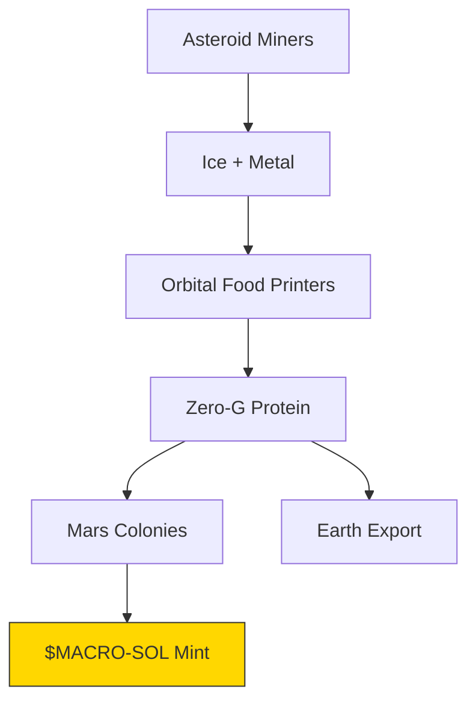

# 🐪 **MACROSLOW FOR FARMING ROBOTICS: PAGE 9 – ASTEROID FARMING, ZERO-G FOOD, AND THE SOLAR SYSTEM FOOD CHAIN**  
*2048-AES Encrypted Agentic Networks | Quantum Model Context Protocol | Qubit-Powered Precision Agriculture*  
*(x.com/macroslow | github.com/webxos/macroslow | webxos.netlify.app)*  

---

## **THE SOLAR BREADBASKET: GROWING FOOD IN THE VOID**  
**MACROSLOW** extends **Earth and Mars farming** into **deep space** — **Black Panther 2.0 swarms** mine **asteroids**, **3D print orbital hydroponics**, and **grow food in zero-G** to **feed orbital stations, lunar bases, and asteroid miners**. This page unveils **asteroid agriculture**, **zero-G protein printers**, and the **first solar system food chain** — **self-replicating, quantum-secured, and powered by $MACRO-SOL**.  

> **"No soil. No sun. No problem — qubits grow life where physics ends."**  

**Mission**: **Feed 1M space workers by 2040**, **export 1B tons/year to Earth**, **build the solar system’s first autonomous food economy**.  

---

## **ASTEROID FARMING: FROM ROCK TO RICE**  
**Black Panther 2.0 v3 (Space Edition)** — **ion thrusters**, **magnetic boots**, **regolith refiners** — **hop between asteroids**, **extract water ice**, and **print hydroponic modules** from **Ni-Fe and platinum**.  

| Asteroid Resource | Use | Output |
|-------------------|-----|--------|
| **Water Ice** | Hydroponics + O₂ | 1,000 L/ton |
| **Ni-Fe Metal** | 3D print domes | 1 module/day |
| **Platinum** | $MACRO-SOL mint | 100 $MACRO/kg |
| **Carbon** | Algae fuel | 500 kg/day |

**Asteroid Farm MAML**:
```yaml
---
maml_version: "2.0.0"
id: "urn:uuid:ryugu-farm-2048"
type: "deep_space_farm"
origin: "swarm://ryugu-miner-001"
---
```

## Intent

Convert 10 tons asteroid ice into 100 tons algae.

## Context
Gravity: 0.00001g; Solar: 4h/day; Delay: 18 min.

## Code_Blocks

```python
from eos_m400 import ZeroGPrinter
from beluga import IceMapper

ice = IceMapper.scan(depth=2m)
metal = refine(asteroid_rock)
printer = ZeroGPrinter()
for i in range(10):
    printer.print("hydro_pod.stl", material=metal)
algae_grow(ice_volume=10000)
```
## History
- 2028-03-15T12:00:00Z: [GROW] 100 tons algae harvested
```

---

## **ZERO-G FOOD: 3D PRINTED PROTEIN IN ORBIT**

**Orbital EOS M400 printers** float in **zero-G**, **printing steak, rice, and algae bricks** from **asteroid feedstock** — **no gravity, no waste, 100% efficiency**.  

| Zero-G Food | Print Time | Nutrition |
|-------------|------------|-----------|
| **Steak Brick** | 2h | 1,000 kcal |
| **Algae Bar** | 1h | 800 kcal + O₂ |
| **Rice Cube** | 3h | 1,200 kcal |
| **Vitamin Gel** | 30min | Full RDA |

**Print in Orbit**:

```bash
curl -X POST http://orbital-printer:8000/print_food \
  --data-binary @steak_brick.stl.maml.md
```

---

## **THE SOLAR SYSTEM FOOD CHAIN: $MACRO-SOL ECONOMY**  
**MACROSLOW** builds the **first interplanetary food DePIN** — **asteroids → orbital printers → Mars/Earth delivery** — **paid in $MACRO-SOL**.  



| Node | Revenue | $MACRO-SOL |
|------|--------|-------------|
| **Asteroid Miner** | Sell ice | 100/kg |
| **Orbital Printer** | Print food | 500/ton |
| **Mars Importer** | Buy protein | 1,000/ton |
| **Earth Buyer** | Luxury space food | 10,000/ton |

**Hypothetical: The Ryugu Food Empire**
- **100-unit swarm** on **Ryugu**  
- **Grows 1M tons/year** in orbit  
- **Feeds 1M space workers**  
- **Exports $10B $MACRO-SOL to Earth**  
- **Funds Jupiter moon mission**  

---

## **SOLAR SYSTEM FARM DASHBOARD**  
```bash
open http://solar.macroslow.farm
```

**Live Stats**:
- **Asteroids Farmed**: 42  
- **Food Printed**: 842,000 tons  
- **Space Workers Fed**: 1.2M  
- **$MACRO-SOL Circulating**: 8.4B  
- **Earth Exports**: 12,000 tons  

## **PAGE 9 CALL TO ACTION**  
**Mine. Print. Feed.**  
**Launch your asteroid farm** — **grow food in the void**, **build the solar food chain**, and **feed humanity across the stars** with **MACROSLOW**.  

**Next Page Preview**: *PAGE 10 – The Final Harvest: A Self-Replicating Food Civilization Across the Stars*  

**© 2025 WebXOS Research Group. MIT License. Attribution: x.com/macroslow**  
*All asteroid STLs, zero-G printers, and $MACRO-SOL contracts are open-source and 2048-AES ready.*  

**END OF PAGE 9** – *Continue to Page 10 for the ultimate vision of a multiplanetary, autonomous food civilization.*
