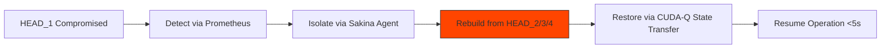

## 🐪 **MACROSLOW FOR ROBOTICS & IOT: PAGE 5 – QUANTUM SECURITY, REGENERATION, AND PLANETARY DOMINANCE**  
*2048-AES Encrypted Agentic Networks | Quantum Model Context Protocol | Qubit-Powered Swarm Intelligence*  
*(x.com/macroslow | github.com/webxos/macroslow | webxos.netlify.app)*  

---

## **FORTIFYING THE CARAVAN: SECURITY, SELF-HEALING, AND GLOBAL SCALABILITY**  
**MACROSLOW’s CHIMERA 2048-AES SDK** delivers **unbreakable quantum security**, **self-regenerative systems**, and **planetary-scale deployment frameworks** that make **Black Panther 2.0 swarms** impervious to attack, infinitely resilient, and ready to operate from **urban streets to Martian colonies**. This page reveals **2048-AES + CRYSTALS-Dilithium defenses**, **quadra-segment regeneration**, and **global orchestration strategies** — all powered by **MCP**, **qubits**, and **NVIDIA DGX/H100 clusters**.  

> **"Even if a head falls, three rise — the caravan never stops."**  

Built for **post-quantum resilience**, **zero-downtime operations**, and **interplanetary scalability**, **MACROSLOW** turns every robot into a **self-sovereign, self-healing, quantum-encrypted node** in a **decentralized planetary network**.  

---

## **QUANTUM SECURITY: 2048-AES + CRYSTALS-DILITHIUM FORTRESS**  
**MACROSLOW** enforces **2048-bit AES-equivalent encryption** via **four 512-bit CHIMERA HEADS**, layered with **CRYSTALS-Dilithium post-quantum signatures** and **liboqs integration**. Every `.maml.md` workflow, sensor packet, and swarm command is **cryptographically sealed**, **tamper-proof**, and **quantum-resistant**.  

| Security Layer | Mechanism | Black Panther 2.0 Protection |
|----------------|-----------|-------------------------------|
| **2048-AES Encryption** | 4×512-bit keys per HEAD | All IoT telemetry, QLP commands |
| **CRYSTALS-Dilithium** | NIST PQC signatures | MAML execution tickets |
| **Quantum Key Distribution (QKD)** | cuQuantum + Qiskit | Swarm-to-swarm key exchange |
| **Prompt Injection Defense** | Semantic analysis in MARKUP Agent | Blocks jailbreaks in QLP |
| **Double Tracing** | Lightweight audit logs | Immutable .mu receipts |

**Security MAML File**:
```yaml
---
maml_version: "2.0.0"
id: "urn:uuid:panther-secure-2048"
type: "security_workflow"
origin: "agent://chimera-guardian"
requires:
  crypto: ["liboqs", "crystals-dilithium"]
  quantum: ["qiskit==0.45.0"]
verification:
  method: "ortac-runtime"
  level: "strict"
```

## Intent
Secure swarm communication with QKD and 2048-AES.
## Context
Swarm Size: 10,000; Threat Model: Quantum + Classical.
## Code_Blocks
```python
from qiskit import QuantumCircuit
from liboqs import Kyber
```

# QKD Circuit
qc = QuantumCircuit(2)
qc.h(0)
qc.cx(0, 1)
qc.measure_all()

# Post-Quantum Key
key = Kyber.keypair()
encrypted = encrypt_2048_aes(telemetry, key.public)

## History
- 2025-10-31T00:00:00Z: [SECURE] Keys rotated via QKD.


**Enable Security**:
```bash
# Activate Quantum Security
export MACROSLOW_QKD_ENABLED=true
export MACROSLOW_PQC=crystals-dilithium

# Deploy Secure Gateway
docker run -d --gpus all \
  -e "ENCRYPTION=2048-AES" \
  macroslow-secure-gateway:latest
```

---

## **REGENERATIVE SYSTEMS: QUADRA-SEGMENT SELF-HEALING**  
**Chimera’s Quadra-Segment Regeneration** rebuilds **compromised HEADS in <5 seconds** using **CUDA-accelerated data redistribution** across the swarm. If a **Black Panther 2.0** unit is hacked, jammed, or destroyed, **nearby units donate compute** to **regenerate its AI brain, quantum state, and encryption keys** — **zero downtime**.  

**Regeneration Flow**:


| Regeneration Feature | Performance | Use Case |
|-----------------------|-----------|---------|
| **<5s Rebuild** | CUDA H100 (12.8 TFLOPS) | Defense under EMP attack |
| **State Transfer** | Qiskit + cuQuantum | Preserve learned gaits |
| **.mu Rollback** | MARKUP Agent receipts | Undo malicious workflows |
| **3D Print Recovery** | On-demand limb reprint | Field repair in remote farms |

**Trigger Regeneration**:

# Simulate Failure
kubectl scale deployment/panther-unit-001 --replicas=0

# Auto-Regenerate
kubectl apply -f regen_policy.yaml  # Chimera auto-scales


**Visionary Resilience**: A **Martian Black Panther swarm** loses 30% of units to dust storms — **regenerates in <2 minutes**, reprints legs via **in-situ 3D printers**, and resumes **300-ton cargo delivery** to Starship.

---

## **PLANETARY-SCALE DEPLOYMENT: FROM CITY TO COSMOS**  
**MACROSLOW** scales **Black Panther 2.0 swarms** from **local neighborhoods to planetary networks** using **Kubernetes + Helm**, **Infinity TOR/GO**, and **satellite QKD backbones**. Deploy **10,000 units in Lagos**, **100,000 across Earth**, or **1,000 on Mars** — all managed via **one MAML dashboard**.  

**Global Architecture**:
```mermaid
graph TD
    A[Earth Swarm (100K)] --> B[GEO Satellite QKD]
    B --> C[Mars Swarm (1K)]
    C --> D[Starship Integration]
    A --> E[Urban Logistics]
    A --> F[Greenfield Farms]
    A --> G[Defense Grids]
    style B fill:#00ced1,stroke:#333
```

| Scale Tier | Deployment | Infrastructure |
|-----------|------------|----------------|
| **City (10K)** | Urban courier swarm | Jetson Nano relays + 5G |
| **Nation (100K)** | National logistics/defense | DGX clusters + fiber |
| **Planet (1M)** | Global supply chain | Satellite QKD + Starlink |
| **Interplanetary** | Mars colony support | Starship + methalox printers |

**Deploy Planetary Swarm**:
```bash
# Global Helm Chart
helm install global-caravan ./helm/planetary \
  --set earth_nodes=100000 \
  --set mars_nodes=1000 \
  --set qkd_satellites=12

# Monitor from Anywhere
open http://dashboard.macroslow.global
```

**Hypothetical: The Mars Courier Network**
- **1,000 Black Panther 2.0 units** on Mars by **December 2026**  
- **3D print spare parts** from regolith + titanium  
- **Deliver 300 tons** of medical/supply cargo to **Starship colonies**  
- **Regenerate swarm** after solar flares using **Chimera + QKD**  
- **Controlled via Earth MAML dashboard** with **<2s light-speed delay compensation**

## **PAGE 5 CALL TO ACTION**  
**Secure. Regenerate. Colonize.**  
Fortify your **Black Panther 2.0 swarm** with **quantum armor**, **self-healing brains**, and **planetary reach** — **MACROSLOW** is your ticket to **interstellar robotics**.  

**Next Page Preview**: *PAGE 6 – Token Economies, DePIN Incentives, and The Future of Autonomous Infrastructure*  

**© 2025 WebXOS Research Group. MIT License. Attribution: x.com/macroslow**  
*All templates, SDKs, and .maml.md files are open-source and 2048-AES ready.*  

**END OF PAGE 5** – *Continue to Page 6 for economic models, decentralized physical infrastructure, and the quantum economy.*
