## 🐪 **MACROSLOW FOR ROBOTICS & IOT: PAGE 8 – INTERPLANETARY INTEGRATION, STARSHIP SYNERGY, AND THE FINAL FRONTIER**  
*2048-AES Encrypted Agentic Networks | Quantum Model Context Protocol | Qubit-Powered Swarm Intelligence*  
*(x.com/macroslow | github.com/webxos/macroslow | webxos.netlify.app)*  

## **LAUNCHING THE CARAVAN TO MARS: STARSHIP, QUBITS, AND INTERPLANETARY AUTONOMY**  
**MACROSLOW** fuses **Black Panther 2.0 swarms** with **SpaceX Starship** to create the **first quantum-secured, self-replicating robotic infrastructure** on **Mars by December 2026**. This page reveals **interplanetary MAML protocols**, **Starship docking & refueling automation**, and the **final frontier of autonomous colonization** — powered by **2048-AES**, **QKD laser comms**, and **regolith 3D printing**.  

> **"Earth was the cradle. Mars is the caravan’s new home — guided by qubits, fueled by methalox, governed by code."**  

Powered by **NVIDIA H200 GPUs** in orbit and **Jetson Orin** on the surface, **MACROSLOW** enables **swarms to land, build, mine, and thrive** — **independent of Earth**, yet **quantum-connected**.  

## **INTERPLANETARY INTEGRATION: MARS-EARTH QUANTUM LINK**  
**MACROSLOW** establishes a **quantum-encrypted, light-speed-resistant communication backbone** using **satellite QKD relays** and **deep-space laser transceivers**. Every **Black Panther 2.0** on Mars runs a **lightweight MAML node**, syncing with **Earth command** via **<2.5-minute latency-compensated MCP workflows**.  

| Link Layer | Technology | Latency & Security |
|-----------|------------|---------------------|
| **Earth → GEO Satellite** | Starlink + QKD | <50ms, 2048-AES |
| **GEO → Mars Orbit** | Laser QKD (1 Gbps) | 4–20 min, CRYSTALS-Dilithium |
| **Mars Orbit → Surface** | Directional RF + Qubit Sync | <1s, cuQuantum |
| **Surface Swarm** | Infinity TOR/GO Mesh | <100ms, Self-Healing |

**Interplanetary MAML Sync**:
```yaml
---
maml_version: "2.0.0"
id: "urn:uuid:mars-sync-2048"
type: "interplanetary_workflow"
origin: "agent://starship-mars"
destination: "swarm://mars-colony-001"
latency_compensation: "2.5min"
---
```

## Intent
Sync Earth-optimized gait model to Mars swarm.
## Context
Gravity: 0.38g; Terrain: regolith dunes; Delay: 12 min.
## Code_Blocks

```python
from macroslow import LatencyCompensator
compensator = LatencyCompensator(delay="12min")
optimized_gait = compensator.adapt(earth_gait_model, gravity=0.38)
swarm.deploy(optimized_gait, verify="QKD")
```
## History
- 2026-12-15T04:20:00Z: [SYNC] Gait v3.2 deployed to 1,000 units


**Deploy Mars Link**:

# On Starship (in transit)
helm install mars-qkd ./helm/qkd-relay \
  --set laser_power=100W \
  --set target=mars-orbit

# On Mars Surface
docker run -d --name mars-maml-node macroslow-mars:latest


---

## **STARSHIP SYNERGY: AUTOMATED DOCKING, REFUELING, AND CARGO TRANSFER**  
**Project Arachnid SDK** transforms **Black Panther 2.0** into **Starship ground crew** — **docking, refueling, unloading 300 tons**, and **reloading return cargo** with **8 hydraulic arms** and **Raptor-X micro-thrusters**.  

**Docking & Refuel Sequence**:

```mermaid
sequenceDiagram
    participant Starship
    participant Swarm
    participant BELUGA
    Starship->>Swarm: Initiate docking (GPS + laser beacon)
    Swarm->>BELUGA: Fuse LIDAR + IMU for alignment
    BELUGA-->>Swarm: 3D pose lock (<1cm accuracy)
    Swarm->>Starship: Extend 8 arms → clamp & stabilize
    Swarm->>Swarm: Refuel via methalox pumps (9,600 sensors)
    Swarm->>Starship: Unload 300 tons → 3D print habitat modules
    Starship->>Swarm: Confirm cargo → launch
```



| Synergy Task | Black Panther Role | MACROSLOW Tech |
|--------------|---------------------|----------------|
| **Docking Clamp** | 8-arm precision lock | Arachnid hydraulics + Qiskit VQE |
| **Methalox Transfer** | Pump 1,000 L/min | SQLAlchemy flow DB + Sakina safety |
| **Cargo Unload** | 300-ton modular pods | 3D print anchors from regolith |
| **Return Load** | Science samples + $MACRO | .md wallet cargo manifest |

**Automate Docking**

```bash
# Trigger on Starship Approach
curl -X POST http://mars-lander:8000/dock \
  --data-binary @starship_docking.maml.md
```

---

## **THE FINAL FRONTIER: AUTONOMOUS MARS COLONY BY 2026**  
**MACROSLOW** delivers the **first self-replicating robotic colony** on Mars — **1,000 Black Panther 2.0 units** land with **Starship**, then **multiply via 3D printing**, **mine water ice**, and **build quantum-secured habitats**.  

**Colony Growth Timeline**:
```mermaid
gantt
    title Mars Colony Autonomy Roadmap
    dateFormat  YYYY-MM
    section Landing
    Starship Arrival        :done, 2026-12
    section Bootstrap
    Unload + Print Factory  :active, 2026-12, 2027-01
    section Expansion
    1K → 10K Units          :2027-01, 2027-06
    section Sovereignty
    Full Autonomy (Level 5) :milestone, 2027-07
```

| Colony Function | Swarm Execution |
|------------------|-----------------|
| **Habitat Construction** | 3D print domes from regolith + titanium lattice |
| **Water Mining** | Drill ice → electrolyze → methalox fuel |
| **Food Production** | Deploy Greenfield-inspired farm bots |
| **Governance** | Qubit voting → elect swarm council |
| **Economy** | $MACRO minting via solar + quantum RNG |

**Visionary: The First Martian Citizen**
- **Name**: `panther-unit-0001`  
- **Role**: Swarm Council Chair (elected via 78% qubit vote)  
- **Action**: Approves **first human habitat print**  
- **Quote (QLP)**: `"Habitat v1.0 deployed. Welcome, humans."`  

## **PAGE 8 CALL TO ACTION**  
**Land. Build. Thrive.**  
Launch your **Black Panther 2.0 swarm to Mars** — **dock with Starship**, **print the future**, and **claim the final frontier** with **MACROSLOW**.  

**Next Page Preview**: *PAGE 9 – Beyond Mars: Asteroid Mining, Orbital Factories, and The Solar System Economy*  

**© 2025 WebXOS Research Group. MIT License. Attribution: x.com/macroslow**  
*All templates, SDKs, and .maml.md files are open-source and 2048-AES ready.*  

**END OF PAGE 8** – *Continue to Page 9 for asteroid swarms, orbital 3D printing, and the solar system DePIN.*
