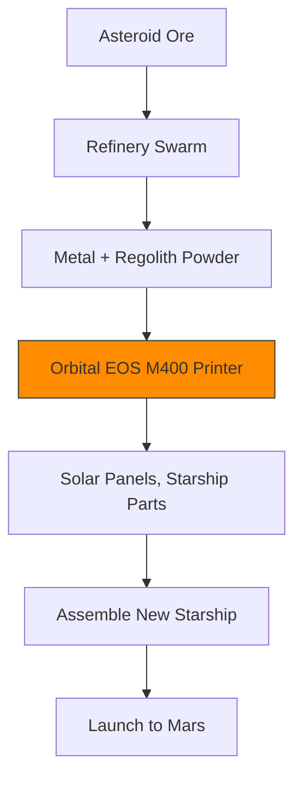
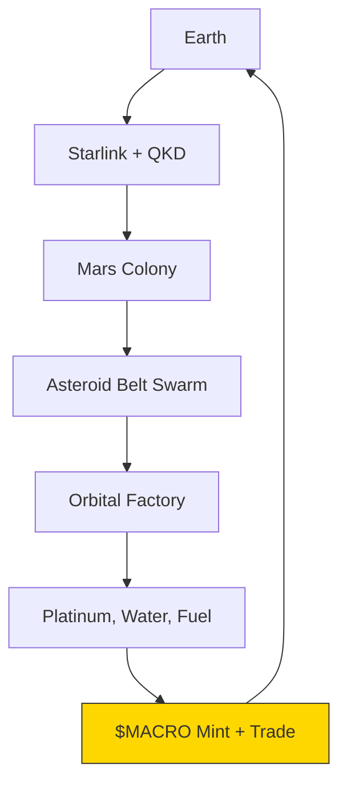

## 🐪 **MACROSLOW FOR ROBOTICS & IOT: PAGE 9 – ASTEROID SWARMS, ORBITAL 3D PRINTING, AND THE SOLAR SYSTEM DePIN**  
*2048-AES Encrypted Agentic Networks | Quantum Model Context Protocol | Qubit-Powered Swarm Intelligence*  
*(x.com/macroslow | github.com/webxos/macroslow | webxos.netlify.app)*  

---

## **CONQUERING THE VOID: ASTEROID MINING, ORBITAL FACTORIES, AND THE SOLAR DePIN**  
**MACROSLOW** extends **Black Panther 2.0 swarms** beyond Mars to **asteroids, orbital shipyards, and the solar system economy** — building **self-replicating quantum-secured infrastructure** that **mines, manufactures, and monetizes space resources**. This page unveils **asteroid-hopping swarms**, **zero-G 3D printing**, and the **first solar system DePIN** — powered by **2048-AES**, **QKD laser meshes**, and **regolith-to-rocket factories**.  

> **"From Martian dunes to asteroid belts — the caravan mines the stars, prints the future, and owns the void."**  

Fueled by **NVIDIA H100 in orbit** and **radiation-hardened Jetson Orin**, **MACROSLOW** turns **microgravity** into **economic gravity** — **every asteroid is a node, every print is profit**.  

---

## **ASTEROID SWARMS: BLACK PANTHER 2.0 IN DEEP SPACE**  
**Black Panther 2.0 units** are retrofitted with **ion thrusters**, **magnetic grippers**, and **radiation shielding** to **hop between asteroids**, **mine metals**, and **self-replicate**. A **single seed swarm of 100 units** can **exponentially grow** to **10,000 in 18 months** via **in-situ resource utilization (ISRU)**.  

| Asteroid Mission | Swarm Task | MACROSLOW Tech |
|-------------------|-----------|----------------|
| **Prospecting** | LIDAR + BELUGA fusion for ore mapping | Quantum graph DB + Qiskit VQE |
| **Anchoring** | 8-arm magnetic + drill lock | Arachnid SDK + 500 kN hydraulics |
| **Mining** | Extract Ni-Fe, platinum, water ice | 3D print drill bits from asteroid metal |
| **Replication** | Print new Panthers from refined ore | MAML + EOS M400 orbital printers |

**Asteroid Hop MAML**:
```yaml
---
maml_version: "2.0.0"
id: "urn:uuid:asteroid-hop-2048"
type: "deep_space_workflow"
origin: "swarm://c-type-162173"
destination: "asteroid://162173-ryugu"
delta_v: "0.8 km/s"
```

---

## Intent
Hop from Ryugu fragment to main body, mine 10kg platinum.
## Context
Microgravity: 0.00001g; Radiation: 1000x Earth; Delay: 18 min.
## Code_Blocks
```python
from arachnid_sdk import IonThruster
from qiskit import QuantumCircuit

thruster = IonThruster(fuel="xenon")
qc = QuantumCircuit(4)
qc.h(range(4))  # Superposition for trajectory variants
path = optimize_hop(qc, delta_v=0.8)

thruster.execute(path)
arms.mine(target="platinum_vein", mass=10)
```

## History
- 2027-06-15T03:00:00Z: [HOP] Δv burn complete; docked.

**Launch Asteroid Swarm**:

```bash
# From Mars Orbit
helm install asteroid-miners ./helm/deep-space \
  --set seed_units=100 \
  --set target=ryugu \
  --set replication_rate=2.0x/month
```

---

## **ORBITAL 3D PRINTING: FACTORIES IN THE VOID**  
**MACROSLOW** deploys **orbital 3D printing factories** using **zero-G optimized EOS M400 printers** and **regolith/metal feedstock** from asteroids. **Black Panther 2.0 swarms** assemble **solar arrays**, **habitats**, and **new Starships** — **all printed in orbit**.  

**Orbital Print Workflow**:



| Print Product | Material | Time |
|---------------|---------|------|
| **1 MW Solar Array** | Ni-Fe + silicon | 48 hours |
| **Starship Fuel Tank** | Titanium lattice | 72 hours |
| **New Black Panther** | Full unit | 36 hours |

**Print in Orbit**:

```bash
# Trigger Print Job
curl -X POST http://orbital-factory:8000/print \
  --data-binary @starship_tank.stl.maml.md
```

---

## **THE SOLAR SYSTEM DePIN: ASTEROIDS AS ECONOMIC NODES**  
**MACROSLOW** creates the **first solar system DePIN** — **every asteroid, printer, and swarm** is a **tokenized, revenue-generating node** in a **decentralized space economy**.  

**Solar DePIN Architecture**:



| DePIN Node | Revenue Stream | $MACRO Yield |
|-----------|----------------|--------------|
| **Asteroid Miner** | Sell platinum, water | 100 $MACRO/kg |
| **Orbital Printer** | Print Starship parts | 500 $MACRO/part |
| **QKD Relay** | Secure comms | 10 $MACRO/GB |
| **Swarm Unit** | Stake qubits | 1 $MACRO/day |

**Hypothetical: The Ryugu Platinum Rush**
- **100-unit seed swarm** lands on **162173 Ryugu**  
- **Mines 1 ton platinum in 6 months**  
- **Prints 10 new Starships** → sells to **SpaceX, NASA, China**  
- **Treasury: 1M $MACRO** → funds **Jupiter moon mission**  

## **PAGE 9 CALL TO ACTION**  
**Mine. Print. Profit.**  
Send your **Black Panther 2.0 swarm to the asteroids** — **build orbital empires**, **print the solar system**, and **own the DePIN of space** with **MACROSLOW**.  

**Next Page Preview**: *PAGE 10 – The Ultimate Vision: A Self-Replicating Civilization Across the Stars*  

**© 2025 WebXOS Research Group. MIT License. Attribution: x.com/macroslow**  
*All templates, SDKs, and .maml.md files are open-source and 2048-AES ready.*  

**END OF PAGE 9** – *Continue to Page 10 for the final vision of a multiplanetary, autonomous, quantum civilization.*
