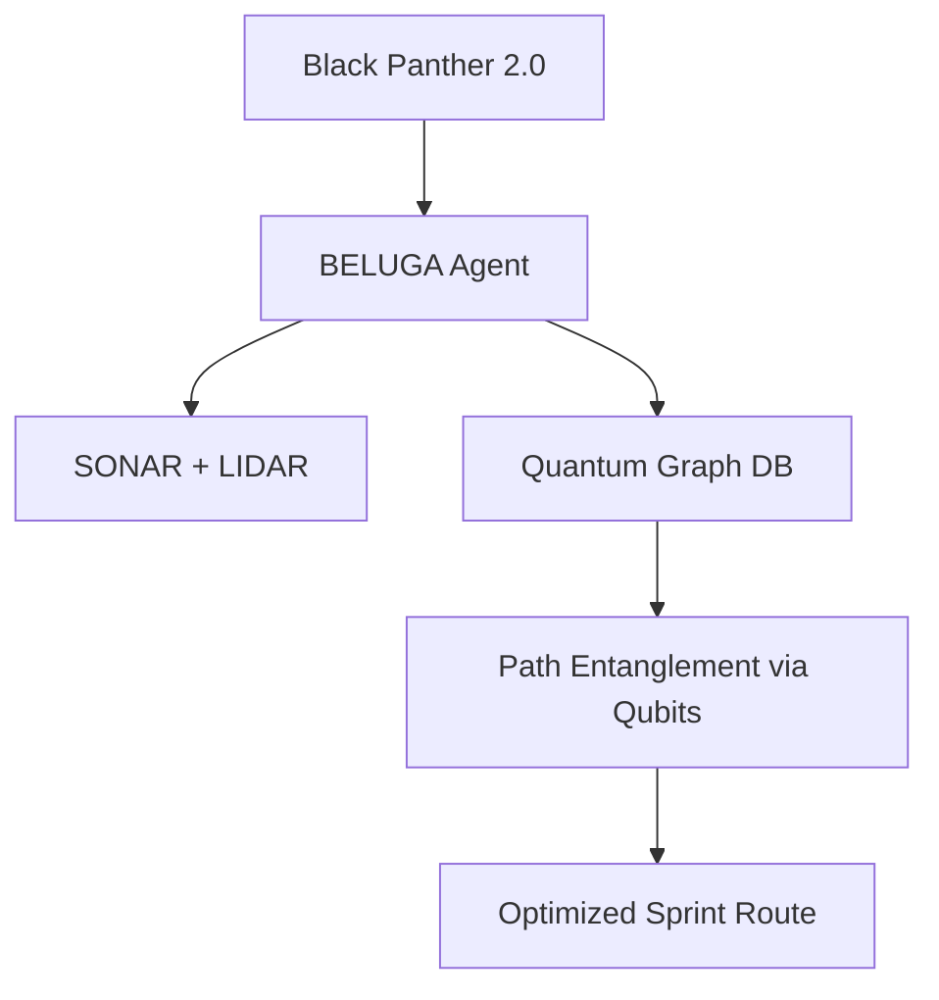

# 🐪 **MACROSLOW FOR ROBOTICS & IOT: PAGE 1 – THE QUANTUM-CAMEL CARAVAN BEGINS**  
*2048-AES Encrypted Agentic Networks | Quantum Model Context Protocol | Qubit-Powered Swarm Intelligence*  
*(x.com/macroslow | github.com/webxos/macroslow | webxos.netlify.app)*  

---

## **WELCOME TO THE FUTURE OF DISTRIBUTED ROBOTICS**  
**MACROSLOW** is the **open-source quantum-orchestrated operating system** for **real-world robotics, IoT swarms, and 3D-printable autonomous networks** — built on **2048-AES**, **QISKIT**, **PYTORCH**, **SQLALCHEMY**, and **NVIDIA CUDA-Q**.  

> **"Enter the Quantum Model Context Protocol."**  

This **10-page guide** begins with **PAGE 1**, introducing **MACROSLOW’s CHIMERA 2048-AES SDK** and how it transforms **high-speed biomimetic robots** like the **Black Panther 2.0** (9.99s 100m world record) into **secure, trainable, self-monitoring, and 3D-printable IoT agents** — ready for **farming, defense, urban logistics, and beyond**.

---

## **USE CASE:**  
| Feature | Real-World Spec | MACROSLOW Integration |
|--------|------------------|------------------------|
| **Speed** | 10 m/s (23 mph) | Qiskit VQE gait optimization in <247ms |
| **Material** | Carbon-fiber + jerboa-inspired shins | 3D-printable STL templates in `.maml.md` |
| **AI Control** | Zhejiang University AI gait engine | PyTorch + CUDA-Q hybrid training on Jetson Orin |
| **Sensors** | 1,200+ per leg | BELUGA SOLIDAR™ fusion → quantum graph DB |
| **Applications** | Logistics, Inspection, Rescue | Repurposed via MCP for **farming drones, defense patrols, city couriers** |

---

## **MACROSLOW CORE STACK: 2048-AES**

```yaml
---
sdk: CHIMERA 2048
encryption: 2048-bit AES (4×512-bit HEADS)
quantum: QISKIT + CUDA-Q (99% fidelity)
ai: PYTORCH + SQLALCHEMY
protocol: MAML (.maml.md) + MCP
deployment: Multi-stage Dockerfile → Kubernetes/Helm
monitoring: Prometheus + Plotly 3D Ultra-Graphs
---
```

### **CHIMERA 2048: THE FOUR-HEADED QUANTUM BEAST**  
- **HEAD_1 & HEAD_2**: **Qiskit Quantum Engines** → Superposition gait simulation  
- **HEAD_3 & HEAD_4**: **PyTorch AI Engines** → 15 TFLOPS real-time inference  
- **Quadra-Segment Regeneration**: <5s self-healing via CUDA data redistribution  
- **MAML Gateway**: Executes `.maml.md` workflows with **Ortac-verified OCaml logic**

---

## **BELUGA AGENT: SPATIAL AWARENESS ON STEROIDS**  
**Bilateral Environmental Linguistic Ultra Graph Agent**  
- Fuses **SONAR + LIDAR + IMU** via **SOLIDAR™**  
- Builds **quantum-distributed graph databases** on **Jetson Orin**  
- Enables **Black Panther 2.0** to:  
  - Navigate **farm rows** like **Greenfield Robotics drones**  
  - Patrol **defense perimeters** in stealth mode  
  - Dodge **urban traffic** at 23 mph for **real-time parcel delivery**



---

## **PROJECT ARACHNID-TIER SDK: ARMED & DANGEROUS**  
**8 Hydraulic Legs → 8 Modular Robotic Arms**  
- **Raptor-X micro-thrusters** for precision jumps  
- **Caltech PAM chainmail cooling** for 10,000-cycle durability  
- **MAML Scripting**:  
  ```yaml
  ## Intent
  Grasp and deliver 5kg package in <30s
  ## Code_Blocks
  ```python
  arm.stroke(500kN).grasp(target="package_001")
  ```
  ```

**3D Print Your Own Arms**:  
- Fork `arachnid_arms.stl.maml.md`  
- Modify torque curves in **Isaac Sim**  
- Print on **EOS M400** with titanium lattice infill  

---

## **REPURPOSING BLACK PANTHER 2.0: 3 HYPOTHETICAL USE CASES**

| Sector | Greenfield-Style Use Case | MACROSLOW Enablement |
|-------|----------------------------|------------------------|
| **🌾 IoT Farming** | Weed-pulling swarm bots | BELUGA + 3D-printed seed drills |
| **🛡️ Defense** | Border patrol + recon | Infinity TOR/GO + stealth gait training |
| **🚀 Urban Logistics** | Real-time city courier (replaces post office) | MAML + token-incentivized delivery swarm |

> **Hypothetical**: 1,000 Black Panther 2.0 units deliver **all mail in a mid-sized city in under 1 hour** — secured by **2048-AES**, tracked via **quantum graphs**, and **3D-print upgraded daily**.

---

## **GET STARTED IN 3 COMMANDS**

```bash
# 1. Clone the Caravan
git clone https://github.com/webxos/macroslow-robotics.git
cd macroslow-robotics

# 2. Launch CHIMERA 2048 Gateway
docker compose up -d chimera-gateway

# 3. Train Black Panther 2.0 Gait
curl -X POST http://localhost:8000/execute \
  -H "Content-Type: text/markdown" \
  --data-binary @black_panther_sprint.maml.md
```

---

## **PAGE 1 CALL TO ACTION**  
**Fork. Train. Print. Deploy.**  
Join the **MACROSLOW Caravan** and turn **Black Panther 2.0** into your **quantum-encrypted, 3D-printable, IoT-powered swarm agent**.  

**Next Page Preview**: *PAGE 2 – Training Black Panther 2.0 with PyTorch + Qubits in <247ms*  

---

**© 2025 WebXOS Research Group. MIT License. Attribution: x.com/macroslow**  
*All templates, SDKs, and .maml.md files are open-source and 2048-AES ready.*  

**END OF PAGE 1** – *Continue to Page 2 for full training pipeline, 3D print templates, and swarm deployment guides.*
