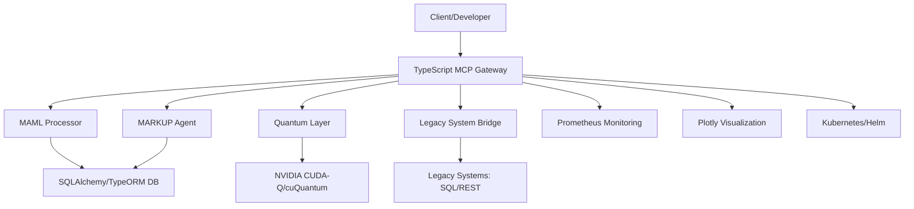

# 🐪 PROJECT DUNES 2048-AES: TypeScript Guide for Quantum-Secure Model Context Protocol (MCP) Server

*TypeScript-Powered Quantum MCP Server with DUNES Minimalist SDK for Legacy and Quantum Integration*

## PAGE 1: Foundations of a TypeScript-Driven Quantum-Secure MCP Server with PROJECT DUNES 2048-AES

Welcome to the **PROJECT DUNES 2048-AES TypeScript Guide**, a comprehensive 10-page manual designed to empower developers to build a quantum-secure **Model Context Protocol (MCP)** server using the **DUNES Minimalist SDK**. Hosted on GitHub by the WebXOS Research and Development Group, this open-source framework leverages **TypeScript**, NVIDIA’s CUDA-enabled hardware, and 2048-bit AES encryption to create a robust, scalable, and future-ready platform for orchestrating AI and quantum workflows. This guide focuses on TypeScript’s role in integrating quantum logic with legacy systems, enabling developers to craft secure, distributed applications for industries like healthcare, real estate, cybersecurity, and space exploration. With the camel emoji (🐪) symbolizing resilience in navigating the computational deserts of 2025, this first page lays the foundation for a TypeScript-driven MCP server, detailing its architecture, quantum security, and seamless legacy integration.

### Introduction to PROJECT DUNES and the MCP Vision

The **PROJECT DUNES 2048-AES** initiative, launched by WebXOS in 2025, is a quantum-distributed, AI-orchestrated framework that redefines how AI agents interact with data sources, tools, and services. At its heart lies the **Model Context Protocol (MCP)**, a standardized interface that enables agents to query quantum and classical resources securely, transforming bilinear input-output systems into quadralinear frameworks that process context, intent, environment, and history simultaneously. The **DUNES Minimalist SDK**, a lightweight yet powerful toolkit, provides 10 core files to build an MCP server with **MAML (Markdown as Medium Language)** processing, **MARKUP Agent** functionality, and quantum-resistant security via 2048-bit AES encryption. TypeScript, with its strong typing and modern JavaScript interoperability, serves as the ideal language to implement this server, bridging legacy systems with quantum-ready architectures.

This guide targets developers seeking to harness TypeScript’s capabilities for building an MCP server that integrates with legacy systems—such as SQL databases, REST APIs, and enterprise software—while preparing for the quantum computing era. By combining TypeScript’s type safety with DUNES’ quantum logic builds, developers can create applications that are secure, scalable, and interoperable with both classical and quantum environments. The focus on **2048-AES security** ensures protection against quantum threats, using post-quantum cryptography like CRYSTALS-Dilithium and lightweight double tracing. This page explores the foundational concepts, architecture, and TypeScript’s role in enabling quantum-secure workflows, setting the stage for the subsequent nine pages of detailed implementation, use cases, and advanced features.

### Why TypeScript for a Quantum-Secure MCP Server?

TypeScript, an open-source superset of JavaScript developed by Microsoft, brings static typing, interfaces, and advanced tooling to the dynamic world of JavaScript, making it an ideal choice for building a robust MCP server. Its benefits for PROJECT DUNES include:

- **Type Safety and Scalability**: TypeScript’s interfaces and type annotations ensure that MCP workflows, defined in `.maml.md` files, are validated at compile time, reducing runtime errors in complex quantum and classical integrations. For example, TypeScript can enforce schemas for MAML metadata, ensuring that permissions, resources, and quantum security flags are correctly structured.
- **Interoperability with Legacy Systems**: TypeScript’s compatibility with JavaScript allows seamless integration with existing Node.js-based APIs, SQL databases, and enterprise systems like SAP or Oracle, enabling the MCP server to bridge legacy infrastructure with quantum-ready workflows.
- **Quantum Integration**: TypeScript’s ecosystem, including libraries like `ts-node` and `qiskit.js` (a hypothetical TypeScript wrapper for Qiskit), supports quantum circuit definitions and simulations, aligning with DUNES’ quantum logic builds powered by NVIDIA’s CUDA-Q and cuQuantum SDK.
- **Developer Productivity**: Features like IntelliSense, type inference, and modular code organization streamline development of MCP servers, especially when handling complex quantum workflows with MAML and MARKUP agents.
- **Security and Maintainability**: TypeScript’s static analysis catches errors early, complementing DUNES’ 2048-AES encryption and CRYSTALS-Dilithium signatures to ensure secure, maintainable codebases for mission-critical applications.

By leveraging TypeScript, developers can build an MCP server that is both developer-friendly and quantum-ready, capable of orchestrating workflows across diverse domains while maintaining compatibility with legacy systems.

### Core Architecture of the TypeScript MCP Server

The **DUNES Minimalist SDK** provides a lean yet powerful foundation for building an MCP server, comprising 10 core files that integrate TypeScript, MAML processing, and quantum security. The architecture is designed to be modular, scalable, and interoperable, with the following key components:

- **MCP Server Core**: A TypeScript-based FastAPI equivalent (e.g., using `fastify` or `express` with TypeScript) that serves as the gateway for processing MAML workflows. It handles HTTP and WebSocket requests, routes tasks to quantum or classical compute nodes, and enforces security policies.
- **MAML Processor**: A TypeScript module that parses `.maml.md` files, validates YAML front matter, and executes code blocks (e.g., Python, Qiskit, or JavaScript) in sandboxed environments. TypeScript interfaces define strict schemas for MAML metadata, ensuring consistency.
- **MARKUP Agent**: A TypeScript implementation of the MARKUP Agent, which converts Markdown to `.mu` files for error detection, digital receipts, and recursive ML training. It uses TypeScript’s type system to validate mirrored structures (e.g., “Hello” to “olleH”).
- **Quantum Integration Layer**: A TypeScript module interfacing with NVIDIA’s CUDA-Q and cuQuantum SDK for quantum circuit execution and simulation. It supports Qiskit-based quantum logic builds, enabling quadralinear processing of context, intent, environment, and history.
- **Legacy System Bridge**: A TypeScript-based adapter that connects the MCP server to legacy systems via REST APIs, SQLAlchemy for databases, and OAuth2.0 for authentication. This ensures compatibility with enterprise systems while maintaining quantum security.
- **Security Layer**: Implements 2048-bit AES-equivalent encryption (combining four 512-bit AES keys) and CRYSTALS-Dilithium signatures. TypeScript’s type system enforces strict validation of cryptographic operations, reducing vulnerabilities.
- **Database Integration**: Uses TypeScript with SQLAlchemy (via a TypeScript-to-Python bridge or a TypeScript-native ORM like TypeORM) to manage workflow logs, execution histories, and digital receipts in a quantum-secure database.
- **NVIDIA Hardware Optimization**: Leverages NVIDIA’s Jetson Orin for edge computing, A100/H100 GPUs for high-performance training, and cuQuantum for quantum simulations, with TypeScript managing API calls to CUDA-enabled endpoints.
- **Docker Deployment**: Multi-stage Dockerfiles written in TypeScript-friendly environments ensure scalable deployment, with TypeScript scripts orchestrating Kubernetes and Helm charts for cluster management.
- **Monitoring and Visualization**: Integrates with Prometheus for real-time monitoring and Plotly for 3D visualization of quantum workflows, with TypeScript handling API endpoints for metrics and graphs.

This architecture, depicted below in a simplified Mermaid diagram, ensures modularity and scalability:



### Quantum Security with 2048-AES and TypeScript

The **2048-AES security protocol** in PROJECT DUNES combines four 512-bit AES keys to create a quantum-resistant encryption layer, supplemented by CRYSTALS-Dilithium signatures for post-quantum cryptography. TypeScript enhances this security through:

- **Type-Safe Cryptography**: Interfaces define cryptographic structures (e.g., keys, signatures, nonces), ensuring that encryption and decryption operations are correctly implemented.
- **OAuth2.0 Integration**: TypeScript manages JWT-based authentication via libraries like `jsonwebtoken`, syncing with AWS Cognito or custom identity providers for secure access control.
- **Prompt Injection Defense**: TypeScript’s type system validates MAML inputs to prevent injection attacks, using semantic analysis to detect anomalies in workflow definitions.
- **Digital Receipts**: The MARKUP Agent’s `.mu` files, implemented in TypeScript, create reversible receipts (e.g., “Hello” to “olleH”) for auditability, logged in a quantum-secure database.
- **Reputation-Based Validation**: TypeScript scripts manage token-based reputation systems, rewarding compliant agents and flagging suspicious behavior.

This security model ensures that the MCP server can handle sensitive data in industries like healthcare (e.g., medical IoT) and real estate (e.g., digital twins), while remaining resilient to quantum attacks.

### Legacy System Integration with TypeScript

One of the MCP server’s key strengths is its ability to integrate with legacy systems, a critical requirement for enterprises transitioning to quantum-ready architectures. TypeScript facilitates this through:

- **REST API Adapters**: TypeScript’s `axios` or `fetch` libraries connect to legacy REST endpoints, mapping responses to MAML schemas for processing.
- **SQL Database Integration**: Using TypeORM or a TypeScript-to-Python bridge (e.g., `pyodide`), the MCP server queries legacy SQL databases, transforming results into quantum-secure MAML workflows.
- **Enterprise Software Compatibility**: TypeScript scripts interface with systems like SAP or Oracle via APIs, ensuring that existing workflows can be augmented with quantum logic.
- **WebSocket Support**: TypeScript’s WebSocket libraries (e.g., `ws`) enable real-time data streams from legacy IoT devices, feeding into the MCP server for quantum-enhanced processing.

For example, a healthcare provider using a legacy SQL database for patient records can integrate with the MCP server to add quantum-secure billing workflows, with TypeScript ensuring type-safe data transformations.

### TypeScript’s Role in Quantum Integration

TypeScript’s flexibility makes it a natural fit for quantum integration, particularly with NVIDIA’s CUDA-Q and cuQuantum SDK. Key features include:

- **Quantum Circuit Definitions**: TypeScript interfaces define quantum circuit structures, which are transpiled to Qiskit or CUDA-Q for execution on NVIDIA GPUs.
- **Quadralinear Processing**: TypeScript scripts orchestrate quantum circuits to process context, intent, environment, and history simultaneously, leveraging tensor products and Hermitian operators.
- **Simulation and Optimization**: TypeScript manages API calls to cuQuantum for quantum simulations, achieving 99% fidelity in quantum key distribution and variational algorithms.
- **Real-Time Visualization**: TypeScript integrates with Plotly to render 3D visualizations of quantum states, aiding developers in debugging and analysis.

For instance, a TypeScript script might define a quantum circuit for threat detection, simulating it on an NVIDIA A100 GPU and integrating results into an MCP workflow.

### Getting Started with TypeScript and DUNES

To begin building your TypeScript-driven MCP server with the DUNES Minimalist SDK, follow these steps:

1. **Clone the Repository**:
   ```bash
   git clone https://github.com/webxos/dunes-2048-aes.git
   cd dunes-2048-aes
   ```

2. **Install Dependencies**:
   ```bash
   npm install typescript ts-node fastify axios typeorm jsonwebtoken qiskit.js
   pip install qiskit torch sqlalchemy
   ```

3. **Configure Environment**:
   Create a `.env` file with variables like `MCP_API_HOST`, `MCP_API_PORT`, `QUANTUM_API_URL`, and `DB_URI`.

4. **Define a Basic MCP Server**:
   ```typescript
   import Fastify from 'fastify';
   import { MamlProcessor } from './maml_processor';

   const server = Fastify();
   const mamlProcessor = new MamlProcessor();

   server.post('/maml/execute', async (request, reply) => {
     const mamlContent = request.body as string;
     const result = await mamlProcessor.execute(mamlContent);
     return reply.send(result);
   });

   server.listen({ port: 8000 }, (err) => {
     if (err) throw err;
     console.log('MCP Server running on port 8000');
   });
   ```

5. **Run the Server**:
   ```bash
   ts-node src/server.ts
   ```

This sets up a basic MCP server, ready to process MAML workflows and integrate with quantum and legacy systems.

### Looking Ahead

This first page has established the foundation for a TypeScript-driven MCP server using the DUNES Minimalist SDK, emphasizing quantum security, legacy integration, and TypeScript’s role in building scalable, type-safe applications. The next nine pages will delve into detailed implementation steps, advanced use cases (e.g., healthcare billing, real estate digital twins, cybersecurity), quantum circuit design, legacy system adapters, deployment strategies, and performance optimization. By the end of this guide, you’ll be equipped to build a quantum-secure MCP server that bridges the past and future of computing, leveraging TypeScript’s power to navigate the computational frontier.

**© 2025 WebXOS Research Group. All Rights Reserved. Licensed under MIT with attribution to [webxos.netlify.app](https://webxos.netlify.app).**

---

This page provides a comprehensive overview of the TypeScript-driven MCP server, setting the stage for a detailed 10-page guide. Let me know if you’d like to proceed with the remaining nine pages or focus on specific aspects, such as code examples, use cases, or deployment instructions!
