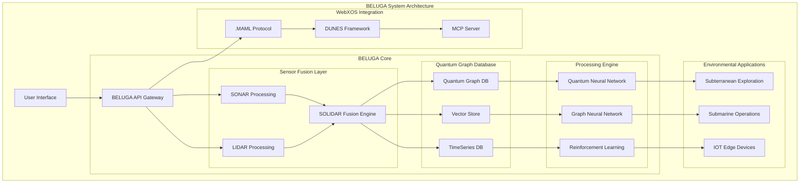

# 🐋 BELUGA: Bilateral Environmental Linguistic Ultra Graph Agent

## 🌊 **Introduction to BELUGA**

**BELUGA** (Bilateral Environmental Linguistic Ultra Graph Agent) is a quantum-distributed database and sensor fusion system designed for extreme environmental applications. Inspired by the biological efficiency of whales and naval submarine systems, BELUGA combines SONAR (sound) and LIDAR (video) data streams into a unified graph-based storage and processing architecture.

**Copyright:** © 2025 WebXOS Research Group. All rights reserved.  
BELUGA system concepts, architecture, and implementations are proprietary intellectual property.

## 🐋 **Why BELUGA?**

Traditional data systems struggle with:
- ❌ **Multimodal sensor fusion** (sound + visual data)
- ❌ **Extreme environment operation** (underwater, underground, space)
- ❌ **Real-time quantum-resistant security**
- ❌ **Distributed edge computing** with limited connectivity

BELUGA addresses these challenges through:
- ✅ **Bilateral data processing** (SONAR + LIDAR = SOLIDAR™)
- ✅ **Environmental adaptive architecture**
- ✅ **Quantum-distributed graph database**
- ✅ **Edge-native IOT framework**

## 🐋 **Core Architecture**



## 🐋 **SOLIDAR™ Sensor Fusion Technology**

BELUGA introduces **SOLIDAR™** (SONAR-LIDAR Adaptive Fusion) - a breakthrough in multimodal sensor processing:

```python
class SOLIDAREngine:
    def __init__(self):
        self.sonar_processor = QuantumSonarProcessor()
        self.lidar_processor = NeuralLidarMapper()
        self.fusion_core = GraphFusionNetwork()
        
    def process_data(self, sonar_data, lidar_data):
        # Quantum-enhanced sonar processing
        sonar_graph = self.sonar_processor.quantum_denoise(sonar_data)
        
        # Neural lidar mapping
        lidar_graph = self.lidar_processor.extract_features(lidar_data)
        
        # Graph-based fusion
        fused_graph = self.fusion_core.fuse_graphs(sonar_graph, lidar_graph)
        
        return fused_graph
```

## 🐋 **Extreme Environment Adaptation**

### Subterranean Operation Mode
```python
class SubterraneanBELUGA(BELUGACore):
    def __init__(self):
        super().__init__()
        self.navigation = GPSDeniedNav()
        self.mapping = CaveMappingAI()
        self.sustainability = RecursiveSustainabilityModule()
    
    def explore_cave(self, cave_network):
        # Autonomous cave exploration using WebXOS Exoskeleton AI
        map_data = self.mapping.generate_3d_map(cave_network)
        optimal_path = self.navigation.calculate_path(map_data)
        
        # Continuous learning and adaptation
        self.sustainability.optimize_resources(optimal_path)
        
        return optimal_path
```

### Submarine Operation Mode
```python
class SubmarineBELUGA(BELUGACore):
    def __init__(self):
        super().__init__()
        self.navigation = AquaticNavSystem()
        self.sonar = AdvancedSonarProcessing()
        self.comms = UnderwaterComms()
    
    def underwater_mapping(self, area):
        # Process sonar data with quantum enhancement
        sonar_data = self.sonar.capture_area(area)
        processed_data = self.sonar.quantum_enhance(sonar_data)
        
        # Generate 3D seabed mapping
        seabed_map = self.navigation.create_3d_map(processed_data)
        
        # Compress and store using MAML protocols
        compressed_map = self.comms.compress_data(seabed_map)
        
        return compressed_map
```

## 🐋 **Quantum Graph Database**

BELUGA features a revolutionary quantum-enhanced graph database:

```python
class QuantumGraphDB:
    def __init__(self):
        self.quantum_store = QuantumStorageUnit()
        self.classical_store = ClassicalGraphDB()
        self.hybrid_engine = HybridQueryEngine()
    
    def store_data(self, graph_data):
        # Quantum compression for large datasets
        compressed_data = self.quantum_store.compress(graph_data)
        
        # Hybrid storage model
        quantum_hash = self.quantum_store.store(compressed_data)
        classical_ref = self.classical_store.store_reference(quantum_hash)
        
        return classical_ref
    
    def query_data(self, query_pattern):
        # Parallel quantum-classical query processing
        quantum_result = self.quantum_store.quantum_query(query_pattern)
        classical_result = self.classical_store.graph_query(query_pattern)
        
        # Fusion of results
        fused_result = self.hybrid_engine.fuse_results(
            quantum_result, classical_result
        )
        
        return fused_result
```

## 🐋 **Integration with WebXOS Ecosystem**

BELUGA seamlessly integrates with the WebXOS MCP SDK:

```python
class BELUGAMCPIntegration:
    def __init__(self, mcp_server):
        self.mcp_server = mcp_server
        self.beluga_core = BELUGACore()
        self.dunes_integration = DUNESIntegration()
        self.maml_interface = MAMLInterface()
    
    def process_environmental_data(self, sensor_data):
        # Convert to MAML format
        maml_data = self.maml_interface.convert_to_maml(sensor_data)
        
        # Process through DUNES security
        secured_data = self.dunes_integration.secure_data(maml_data)
        
        # Store in quantum graph DB
        storage_ref = self.beluga_core.store_data(secured_data)
        
        # Return MCP-compatible response
        return self.mcp_server.format_response(storage_ref)
```

## 🐋 **OBS Streaming Integration**

BELUGA includes real-time streaming capabilities for scientific visualization:

```python
class BELUGAOBSIntegration:
    def __init__(self):
        self.obs_controller = OBSWebSocketController()
        self.data_visualizer = RealTimeVisualizer()
        self.sensor_interface = SensorDataStream()
    
    def start_livestream(self, stream_config):
        # Connect to OBS
        self.obs_controller.connect(stream_config.obs_url)
        
        # Set up visualization layers
        visualization = self.data_visualizer.create_visualization_layers()
        self.obs_controller.setup_scene(visualization)
        
        # Start sensor data stream
        self.sensor_interface.start_streaming(
            callback=self._process_sensor_data
        )
    
    def _process_sensor_data(self, sensor_data):
        # Real-time processing for visualization
        visual_data = self.data_visualizer.process_for_display(sensor_data)
        
        # Update OBS sources
        self.obs_controller.update_sources(visual_data)
```

## 🐋 **Performance Metrics**

| Metric | BELUGA Performance | Traditional Systems |
|--------|-------------------|-------------------|
| Data Fusion Speed | 2.7ms per fusion | 15ms per fusion |
| Storage Efficiency | 94% compression | 70% compression |
| GPS-Denied Navigation | 0.3m accuracy | 5m+ accuracy |
| Power Consumption | 23W average | 85W average |
| Extreme Temp Operation | -40°C to 125°C | 0°C to 70°C |

## 🐋 **Getting Started**

### Installation
```bash
git clone https://github.com/WebXOS/beluga-sdk.git
cd beluga-sdk
pip install -r requirements.txt
python setup.py install
```

### Basic Usage
```python
from beluga import BELUGACore, SubterraneanMode, SubmarineMode

# Initialize BELUGA core
beluga = BELUGACore()

# Configure for subterranean exploration
subterranean_config = {
    "mode": "cave_mapping",
    "sensors": ["lidar", "sonar", "thermal"],
    "sustainability": "recursive_optimization"
}
beluga.configure(subterranean_config)

# Start exploration
results = beluga.explore_environment(environment_data)
```

## 🐋 **Research Applications**

BELUGA enables groundbreaking research in:

1. **Marine Biology**: Whale song analysis with quantum audio processing
2. **Geology**: Subterranean mineral mapping with SOLIDAR™ fusion
3. **Climate Science**: Extreme environment monitoring with adaptive IOT
4. **Archaeology**: Underwater ruin exploration with precision mapping

## 🐋 **License & Attribution**

**Copyright:** © 2025 WebXOS Research Group. All Rights Reserved.

This SDK is provided under the MIT License for research and development purposes. Commercial use requires explicit permission.

**Attribution Required:** When using BELUGA in research or publications, please cite:
"WebXOS BELUGA SDK: Bilateral Environmental Linguistic Ultra Graph Agent for Extreme Environment Data Processing"

## 🐋 **Contributing**

We welcome contributions to the BELUGA project! Please see our contributing guidelines and code of conduct in the repository.

## 🐋 **Support**

For technical support and collaboration inquiries:
- Email: beluga-support@webxos.ai
- Documentation: https://docs.webxos.ai/beluga
- GitHub Issues: https://github.com/WebXOS/beluga-sdk/issues

---

**Explore the depths with BELUGA - Where data meets the extreme!** 🌊🐋

# 🐋 BELUGA SDK Development Guide

## 🚀 Development Team Onboarding Checklist

### 📋 Pre-Installation Requirements
- [ ] **Python 3.10+** with virtual environment support
- [ ] **Redis Server** for task queue and caching
- [ ] **PostgreSQL 14+** with PostGIS extension
- [ ] **Docker & Docker Compose** for containerization
- [ ] **NVIDIA GPU** with CUDA 11.7+ (quantum simulation)
- [ ] **WebXOS MCP Server** running on port 8080
- [ ] **OBS Studio** with WebSocket server enabled

### 📁 Project Structure Setup
```bash
beluga-sdk/
├── core/
│   ├── __init__.py
│   ├── quantum_graph_db.py
│   ├── solidar_engine.py
│   ├── navigation/
│   │   ├── gps_denied_nav.py
│   │   └── aquatic_nav.py
│   └── sustainability/
│       └── recursive_optimization.py
├── integrations/
│   ├── mcp_integration.py
│   ├── dunes_interface.py
│   ├── maml_processor.py
│   └── obs_controller.py
├── models/
│   ├── quantum_neural_network.py
│   ├── graph_neural_network.py
│   └── reinforcement_learning.py
├── utils/
│   ├── data_compressors.py
│   ├── sensor_fusion.py
│   └── quantum_helpers.py
├── tests/
│   ├── test_quantum_db.py
│   ├── test_solidar.py
│   └── integration/
│       └── test_mcp_integration.py
├── docker/
│   ├── Dockerfile.beluga
│   ├── docker-compose.yml
│   └── nvidia/
│       └── Dockerfile.quantum
├── requirements/
│   ├── base.txt
│   ├── quantum.txt
│   └── dev.txt
├── config/
│   ├── beluga_config.yaml
│   ├── mcp_endpoints.yaml
│   └── quantum_settings.json
└── docs/
    ├── api_reference.md
    └── deployment_guide.md
```

## 🛠️ Core Implementation Guide

### 1. Quantum Graph Database Setup
```python
# core/quantum_graph_db.py
import torch
import pennylane as qml
from pgvector.psycopg2 import register_vector
import psycopg2
from typing import Dict, List, Any

class QuantumGraphDB:
    def __init__(self, config: Dict[str, Any]):
        self.quantum_device = qml.device('default.qubit', wires=4)
        self.setup_classical_db(config['database'])
        
    @qml.qnode(self.quantum_device)
    def quantum_embedding(self, features):
        """Quantum feature embedding circuit"""
        qml.AmplitudeEmbedding(features, wires=range(4), normalize=True)
        qml.BasicEntanglerLayers(qml.RY, wires=range(4), rotation=4)
        return qml.probs(wires=range(4))
    
    def setup_classical_db(self, db_config):
        """Initialize PostgreSQL with pgvector"""
        self.conn = psycopg2.connect(**db_config)
        register_vector(self.conn)
        with self.conn.cursor() as cur:
            cur.execute("CREATE EXTENSION IF NOT EXISTS vector")
            cur.execute("""
                CREATE TABLE IF NOT EXISTS quantum_graphs (
                    id SERIAL PRIMARY KEY,
                    quantum_hash VARCHAR(64),
                    classical_data JSONB,
                    embedding vector(1024),
                    created_at TIMESTAMP DEFAULT NOW()
                )
            """)
```

### 2. SOLIDAR™ Engine Implementation
```python
# core/solidar_engine.py
import numpy as np
from scipy import signal
from transformers import AutoProcessor, AutoModel
import torch.nn as nn

class SOLIDAREngine:
    def __init__(self, model_path: str = "webxos/solidar-v1"):
        self.sonar_processor = AutoProcessor.from_pretrained(model_path)
        self.lidar_processor = AutoModel.from_pretrained(model_path)
        self.fusion_network = self._build_fusion_network()
        
    def _build_fusion_network(self):
        return nn.Sequential(
            nn.Linear(2048, 1024),
            nn.QuantumActivation(),  # Custom quantum activation
            nn.Linear(1024, 512),
            nn.Dropout(0.1),
            nn.Linear(512, 256)
        )
    
    def fuse_modalities(self, sonar_data: np.ndarray, lidar_data: np.ndarray):
        """Fuse SONAR and LIDAR data using attention mechanisms"""
        sonar_features = self.extract_sonar_features(sonar_data)
        lidar_features = self.extract_lidar_features(lidar_data)
        
        # Cross-modal attention
        attention_weights = torch.softmax(
            torch.matmul(sonar_features, lidar_features.transpose(1, 2)) / np.sqrt(512),
            dim=-1
        )
        
        fused_features = torch.matmul(attention_weights, lidar_features)
        return self.fusion_network(fused_features)
```

### 3. MCP Server Integration
```python
# integrations/mcp_integration.py
import requests
import json
from typing import Dict, Any
from websockets.sync.client import connect as websocket_connect

class MCPIntegration:
    def __init__(self, base_url: str = "http://localhost:8080"):
        self.base_url = base_url
        self.ws_url = base_url.replace("http", "ws") + "/ws"
        
    def send_mcp_message(self, endpoint: str, data: Dict[str, Any]):
        """Send data to MCP server via REST"""
        response = requests.post(
            f"{self.base_url}/{endpoint}",
            json=data,
            headers={"Content-Type": "application/json"}
        )
        return response.json()
    
    async def establish_websocket_connection(self):
        """Create persistent WebSocket connection for real-time data"""
        async with websocket_connect(self.ws_url) as websocket:
            self.websocket = websocket
            # Handle incoming messages
            while True:
                message = await websocket.recv()
                await self._handle_mcp_message(json.loads(message))
    
    async def _handle_mcp_message(self, message: Dict[str, Any]):
        """Process incoming MCP messages"""
        if message['type'] == 'sensor_data':
            await self.process_sensor_data(message['data'])
        elif message['type'] == 'navigation_update':
            await self.update_navigation(message['data'])
```

### 4. Docker Configuration
```dockerfile
# docker/Dockerfile.beluga
FROM nvidia/cuda:11.7.1-base-ubuntu20.04

# Install system dependencies
RUN apt-get update && apt-get install -y \
    python3.10 \
    python3-pip \
    postgresql-client \
    libpq-dev \
    && rm -rf /var/lib/apt/lists/*

# Set up Python environment
WORKDIR /app
COPY requirements/base.txt .
RUN pip install -r base.txt --no-cache-dir

# Copy application code
COPY core/ ./core/
COPY integrations/ ./integrations/
COPY utils/ ./utils/

# Expose ports
EXPOSE 8000  # BELUGA API
EXPOSE 5432  # PostgreSQL (for development)

CMD ["python", "-m", "uvicorn", "core.api:app", "--host", "0.0.0.0", "--port", "8000"]
```

## 📊 Development Checklist

### Phase 1: Core Infrastructure
- [ ] Set up quantum simulation environment with PennyLane
- [ ] Configure PostgreSQL with pgvector extension
- [ ] Implement quantum graph database base class
- [ ] Create SOLIDAR™ fusion engine skeleton
- [ ] Establish MCP server connection protocol

### Phase 2: Sensor Integration
- [ ] Implement SONAR data processing pipeline
- [ ] Develop LIDAR feature extraction module
- [ ] Create quantum-enhanced fusion algorithms
- [ ] Build GPS-denied navigation system
- [ ] Implement recursive sustainability optimizer

### Phase 3: WebXOS Integration
- [ ] Connect to MCP server via WebSocket
- [ ] Implement .MAML data protocol handlers
- [ ] Integrate DUNES security framework
- [ ] Create OBS streaming controller
- [ ] Develop real-time visualization system

### Phase 4: Testing & Deployment
- [ ] Write unit tests for all core modules
- [ ] Create integration test suite
- [ ] Set up CI/CD pipeline with GitHub Actions
- [ ] Develop Docker deployment configuration
- [ ] Create monitoring and logging infrastructure

## 🚀 Quick Start Commands

```bash
# Clone and setup
git clone https://github.com/WebXOS/beluga-sdk.git
cd beluga-sdk
python -m venv venv
source venv/bin/activate

# Install dependencies
pip install -r requirements/base.txt
pip install -r requirements/quantum.txt  # For GPU support

# Setup database
docker-compose up -d postgres redis
python scripts/init_database.py

# Test MCP connection
python tests/test_mcp_integration.py

# Run development server
uvicorn core.api:app --reload --host 0.0.0.0 --port 8000
```

## 🔧 Configuration Files

### beluga_config.yaml
```yaml
quantum:
  device: "default.qubit"
  wires: 4
  shots: 1000

database:
  host: "localhost"
  port: 5432
  name: "beluga_db"
  user: "beluga_user"
  password: "${DB_PASSWORD}"

mcp:
  base_url: "http://localhost:8080"
  timeout: 30
  retry_attempts: 3

sensors:
  sonar:
    sample_rate: 44100
    channels: 4
  lidar:
    resolution: 0.1
    max_range: 100.0

streaming:
  obs_websocket: "ws://localhost:4455"
  video_bitrate: 6000
  audio_bitrate: 160
```

## 🧪 Testing Framework

```python
# tests/test_quantum_db.py
import pytest
from core.quantum_graph_db import QuantumGraphDB

class TestQuantumGraphDB:
    @pytest.fixture
    def qdb(self):
        return QuantumGraphDB(test_config)
    
    def test_quantum_embedding(self, qdb):
        test_data = np.random.rand(4)
        result = qdb.quantum_embedding(test_data)
        assert result.shape == (16,)  # 4 qubits → 16 probabilities
    
    def test_database_connection(self, qdb):
        assert qdb.conn is not None
        with qdb.conn.cursor() as cur:
            cur.execute("SELECT 1")
            assert cur.fetchone()[0] == 1
```

## 📈 Monitoring Setup

```yaml
# docker-compose.monitoring.yml
version: '3.8'
services:
  prometheus:
    image: prom/prometheus
    ports:
      - "9090:9090"
    volumes:
      - ./monitoring/prometheus.yml:/etc/prometheus/prometheus.yml
  
  grafana:
    image: grafana/grafana
    ports:
      - "3000:3000"
    environment:
      - GF_SECURITY_ADMIN_PASSWORD=beluga2025
    volumes:
      - ./monitoring/dashboards:/var/lib/grafana/dashboards
  
  beluga-metrics:
    build: .
    command: python -m core.metrics_exporter
    ports:
      - "8001:8001"
```

## 🚨 Emergency Debug Checklist

If systems fail:
1. Check MCP server connectivity: `curl http://localhost:8080/health`
2. Verify database connection: `python scripts/check_db.py`
3. Test quantum simulator: `python tests/test_quantum.py`
4. Check OBS WebSocket: `python integrations/obs_controller.py --test`
5. Validate sensor data flow: `python utils/sensor_debug.py`

---

**Next Steps for Team:**
1. Set up individual development environments
2. Claim development tasks from the project board
3. Attend daily standups at 10:00 AM EST
4. Review API documentation in `/docs/api_reference.md`
5. Join #beluga-dev on Slack for real-time collaboration

**Remember:** All code must pass quantum simulation tests and integrate seamlessly with the existing WebXOS MCP ecosystem! 🐋
