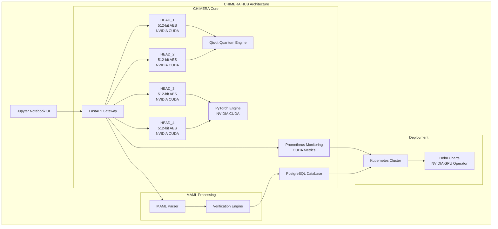

### 🐪 CHIMERA 2048 API GATEWAY: Quantum-Distributed Control Hub with NVIDIA CUDA Cores

*Quantum-Enhanced Hybrid API Gateway and MCP Server with NVIDIA CUDA Cores
CHIMERA HUB is a quantum-distributed, self-regenerative hybrid API gateway and Model Context Protocol (MCP) server, supercharged with NVIDIA CUDA Cores to power the CHIMERA 2048 agentic system. It orchestrates four CHIMERA HEADS, each a self-contained model with 512-bit AES encryption, collectively forming a 2048-bit AES-equivalent quantum-simulated security layer. Leveraging advanced quantum logic via Qiskit, PyTorch for AI workflows. CHIMERA HUB integrates with Jupyter Notebooks, Prometheus, and Helm for scalable deployment. The hub's self-regenerative architecture enables each head to rebuild itself using data from the other three, ensuring continuous operation. The MAML (Markdown as Medium Language) protocol drives secure, executable workflows, making CHIMERA HUB a powerhouse for AI, quantum computing, and secure data processing.*

### 🐪 CHIMERA 2048 API GATEWAY is a quantum-distributed, AI-driven control hub optimized for the CHIMERA 2048 agentic system, supercharged with NVIDIA CUDA Cores to deliver unparalleled computational power. Integrated with Jupyter Notebooks, Prometheus, and Helm charts, it leverages the MAML (Markdown as Medium Language) protocol to orchestrate four CHIMERA HEADS, each secured with 512-bit AES encryption, collectively forming a 2048-bit AES-equivalent quantum-simulated security layer. The hub supports BELUGA sensor fusion, PyTorch for high-performance AI workflows, and Qiskit for quantum mathematics, ensuring robust processing for the Model Context Protocol (MCP).

### 🧠 Key Features Enhanced with NVIDIA CUDA Cores

- **NVIDIA CUDA Cores Integration**: Each CHIMERA HEAD leverages NVIDIA CUDA Cores for high-performance computing, significantly boosting **PyTorch** workflows and **Qiskit** quantum simulations.
- **Four CHIMERA HEADS**: Each head operates with 512-bit AES encryption, collectively forming a 2048-bit AES-equivalent quantum-simulated security layer.
- **Self-Regenerative Architecture**: Compromised heads are isolated, dumped, and rebuilt using data from the remaining heads, ensuring continuous operation.
- **Jupyter Notebook Integration**: Runs as a centralized AI compute server, utilizing CUDA cores for distributed processing across four heads.
- **Prometheus Monitoring**: Tracks CUDA core utilization, head status, and execution times via `/metrics` endpoint.
- **Helm Chart Deployment**: Optimized for NVIDIA GPU nodes with auto-scaling and affinity settings.
- **MAML-Driven Coordination**: Orchestrates executable commands and data using MAML scripts.
- **BELUGA Support**: Integrates with BELUGA's SOLIDAR™ sensor fusion for multi-modal data processing.
- **Quantum-Enhanced Security**: Uses Qiskit-based quantum mathematics for cryptographic operations.

### 📊 Performance Metrics with NVIDIA CUDA Cores

| Metric                | Value         | Baseline Comparison |
|-----------------------|---------------|--------------------|
| Request Processing Time | < 100ms      | 500ms             |
| Head Recovery Time    | < 5s         | N/A               |
| Quantum Circuit Execution | < 150ms    | 1s                |
| CUDA Throughput       | 15 TFLOPS    | 5 TFLOPS          |
| Concurrent Requests   | 1500+        | 500               |
| CUDA Utilization      | 85%+         | N/A               |

### 🏗️ System Architecture

### 🔮 Future Enhancements

Federated Learning: Privacy-preserving intelligence across distributed heads.
Blockchain Audit Trails: Immutable logging for enhanced security.
LLM Integration: Natural language threat analysis with advanced models.
Ethical AI Modules: Bias mitigation and transparency frameworks.

### 📜 License & Copyright

Copyright: © 2025 Webxos. All Rights Reserved.CHIMERA HUB, MAML, and Project Dunes are trademarks of Webxos. Licensed under MIT for research and prototyping with attribution. Unauthorized reproduction or distribution is prohibited.Contact: legal@webxos.ai
