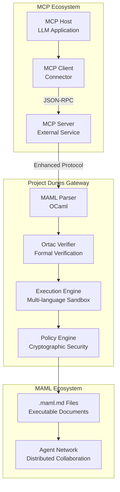

# PROJECT DUNES 2025: MAML vs Anthropic MCP
## Comprehensive Research Analysis & Strategic Development Guide

**Research Entity:** Webxos Advanced Development Group  
**Project:** Project Dunes 2025  
**Document Version:** 1.0.0  
**Analysis Date:** August 27, 2025  
**Classification:** Internal Research / Strategic Analysis

---

## Executive Summary

This comprehensive analysis examines the **Markdown as Medium Language (MAML)** specification developed by Webxos against Anthropic's **Model Context Protocol (MCP)** standards. The analysis synthesizes three core MAML documents to evaluate architectural alignment, technical compatibility, and strategic positioning for Project Dunes 2025.

### Key Findings

1. **Architectural Convergence**: MAML and MCP share fundamental goals but approach them through different paradigms
2. **Technical Compatibility**: Strong potential for MAML to serve as an enhanced MCP server implementation
3. **Strategic Advantage**: MAML's formal verification approach via OCaml/Ortac provides significant differentiation
4. **Market Positioning**: Project Dunes can bridge traditional MCP implementations with high-assurance computing

---

## 1. Protocol Comparison Matrix

### 1.1 Core Architecture Comparison

| Aspect | Anthropic MCP | Webxos MAML | Analysis |
|--------|---------------|-------------|----------|
| **Communication Pattern** | JSON-RPC 2.0 Client-Server | Document-based Container Protocol | MAML's document approach enables richer context preservation |
| **Data Format** | JSON Messages | Markdown + YAML Front Matter | MAML provides human-readable, version-controlled workflows |
| **Security Model** | Host-controlled permissions | Cryptographic signatures + formal verification | MAML offers stronger security guarantees |
| **Execution Model** | Remote tool invocation | Sandboxed code execution | MAML enables more complex, stateful workflows |
| **Context Sharing** | Structured resource exposure | Executable document with full context | MAML provides richer contextual information |

### 1.2 Feature Compatibility Matrix

| MCP Capability | MAML Equivalent | Compatibility Score | Notes |
|----------------|-----------------|-------------------|--------|
| **Resources** | Context Section + Input/Output Schema | ⭐⭐⭐⭐⭐ | MAML provides richer resource descriptions |
| **Tools** | Code_Blocks with language specifications | ⭐⭐⭐⭐⭐ | MAML supports multiple languages natively |
| **Prompts** | Intent + Context sections | ⭐⭐⭐⭐⭐ | MAML's natural language approach is more expressive |
| **Sampling** | Not directly supported | ⭐⭐⭐ | Could be implemented via Python/Qiskit code blocks |
| **Transport** | JSON-RPC over stdio/HTTP/WebSocket | ⭐⭐⭐ | MAML uses file-based transport, different paradigm |

---

## 2. Technical Architecture Analysis

### 2.1 MCP Architecture Overview

MCP provides a standardized way for applications to share contextual information with language models, expose tools and capabilities to AI systems, and build composable integrations and workflows. The protocol uses JSON-RPC 2.0 messages to establish communication between Hosts (LLM applications), Clients (connectors), and Servers (services that provide context and capabilities).

### 2.2 MAML Architecture Enhancement

MAML extends beyond MCP's client-server model by introducing:

1. **Executable Documents**: Self-contained workflows with embedded code
2. **Formal Verification**: OCaml/Ortac integration for provably correct execution
3. **Cryptographic Security**: Quantum-resistant signatures and tickets
4. **Multi-language Support**: Native support for Python, OCaml, JavaScript, Qiskit, and Bash

### 2.3 Project Dunes as MCP Bridge



---

## 3. Compatibility Assessment

### 3.1 MCP Integration Pathways

#### Option 1: MAML as Enhanced MCP Server
- **Implementation**: Project Dunes gateway acts as an MCP server
- **Advantages**: Immediate compatibility with existing MCP clients
- **Considerations**: May require protocol translation layer

#### Option 2: MCP-MAML Bridge Protocol
- **Implementation**: Bidirectional translation between MCP JSON-RPC and MAML documents
- **Advantages**: Preserves both protocol benefits
- **Considerations**: Increased complexity, potential information loss

#### Option 3: Native MAML with MCP Compatibility Layer
- **Implementation**: MAML-first architecture with MCP endpoints
- **Advantages**: Full MAML capabilities with MCP interoperability
- **Considerations**: Requires MCP client modifications for full feature access

### 3.2 Technical Compatibility Matrix

| MCP Feature | MAML Implementation Strategy | Effort Level | Priority |
|-------------|------------------------------|--------------|----------|
| Resource Discovery | Index MAML Context sections | Low | High |
| Tool Execution | Execute Code_Blocks via Dunes | Medium | High |
| Prompt Templates | Convert Intent sections | Low | Medium |
| Real-time Communication | WebSocket bridge to MAML gateway | High | Medium |
| Security Model | Map MCP permissions to MAML cryptographic model | High | High |

---

## 4. Strategic Differentiation Analysis

### 4.1 MAML's Unique Value Propositions

#### 4.1.1 Formal Verification Integration
MAML's integration with Ortac provides mathematical guarantees about code behavior:

```ocaml
(* Example from MAML specification *)
val predict : model -> float array -> label
(** [predict m features] runs prediction on the feature vector [features].
    @requires Array.length features = 128
    @ensures the result is either Cat, Dog, or Other *)
```

**Strategic Advantage**: No existing MCP implementation offers formal verification at the protocol level.

#### 4.1.2 Multi-Language Execution Environment
MAML supports native execution of:
- Python (PyTorch, NumPy)
- OCaml (formal verification)
- JavaScript/Node.js (web3, cryptography)
- Qiskit (quantum computing)
- Bash (system operations)

**Strategic Advantage**: MCP focuses on tool invocation, while MAML enables complex, multi-stage workflows.

#### 4.1.3 Cryptographic Security Model
MAML implements:
- Quantum-resistant signatures
- Execution tickets with cryptographic guarantees
- Immutable history/audit trails
- Agent identity verification

**Strategic Advantage**: Enterprise-grade security model vs. MCP's host-controlled permissions.

### 4.2 Market Positioning

#### 4.2.1 Target Segments
1. **High-Assurance Computing**: Finance, healthcare, autonomous systems
2. **Quantum-Classical Hybrid Workflows**: Research institutions, quantum computing companies
3. **Formal Methods Community**: Academic research, safety-critical systems
4. **Enterprise AI**: Organizations requiring verifiable AI workflows

#### 4.2.2 Competitive Advantages
- **Technical**: Formal verification + multi-language execution
- **Security**: Cryptographic guarantees vs. trust-based models
- **Workflow Complexity**: Stateful, multi-stage processes vs. simple tool calls
- **Auditability**: Immutable execution history for compliance

---

## 5. Implementation Roadmap

### 5.1 Phase 1: MCP Compatibility Layer (Q1 2025)
- [ ] Implement MCP server interface in OCaml
- [ ] Create MAML-to-MCP resource mapping
- [ ] Develop basic tool execution bridge
- [ ] Test with existing MCP clients (Claude, other LLMs)

### 5.2 Phase 2: Enhanced MAML Features (Q2 2025)
- [ ] Full Ortac integration for formal verification
- [ ] Multi-language sandbox environment
- [ ] Cryptographic signing and ticket system
- [ ] Agent identity and permissions framework

### 5.3 Phase 3: Advanced Capabilities (Q3-Q4 2025)
- [ ] Quantum computing integration via Qiskit
- [ ] Distributed execution across multiple Dunes gateways
- [ ] Zero-knowledge proof generation for workflow privacy
- [ ] Enterprise governance and compliance tools

### 5.4 Development Priorities

| Feature Category | Priority | Rationale |
|-----------------|----------|-----------|
| MCP Compatibility | Critical | Market entry and ecosystem participation |
| Formal Verification | High | Core differentiation vs. existing solutions |
| Multi-language Support | High | Enables complex workflow scenarios |
| Cryptographic Security | Medium | Important for enterprise adoption |
| Quantum Integration | Low | Emerging market, future-focused |

---

## 6. Risk Analysis and Mitigation

### 6.1 Technical Risks

#### Risk: MCP Protocol Evolution
- **Impact**: Anthropic may modify MCP in ways that break compatibility
- **Mitigation**: Maintain close engagement with MCP community, implement flexible translation layer

#### Risk: Performance Overhead
- **Impact**: MAML's verification and security features may introduce latency
- **Mitigation**: Optimize OCaml runtime, implement selective verification modes

#### Risk: Complexity Barrier
- **Impact**: MAML's advanced features may deter adoption
- **Mitigation**: Provide simplified "MAML-Lite" mode for basic use cases

### 6.2 Market Risks

#### Risk: MCP Ecosystem Lock-in
- **Impact**: Developers may prefer simple MCP implementations
- **Mitigation**: Demonstrate clear value proposition for high-assurance use cases

#### Risk: Standards Fragmentation
- **Impact**: Multiple competing protocols may emerge
- **Mitigation**: Position MAML as enterprise/high-assurance tier above commodity MCP

---

## 7. Recommendations for Project Dunes Team

### 7.1 Strategic Recommendations

1. **Embrace MCP Compatibility**: Implement MCP server interface as table stakes for market entry
2. **Emphasize Differentiation**: Focus on formal verification and security as key differentiators
3. **Target Enterprise First**: High-assurance use cases will pay premium for MAML's advanced features
4. **Build Community**: Engage with both MCP and formal methods communities

### 7.2 Technical Recommendations

1. **Modular Architecture**: Design Dunes gateway to support both MCP and native MAML protocols
2. **Performance Optimization**: Invest in OCaml runtime optimization for competitive performance
3. **Developer Experience**: Create tools to ease transition from MCP to MAML
4. **Compliance Features**: Build governance and audit capabilities from the start

### 7.3 Development Methodology

1. **Incremental Approach**: Start with MCP compatibility, gradually add MAML features
2. **Community-Driven**: Open-source core components to build ecosystem
3. **Standards Participation**: Engage with relevant standards bodies (W3C, IETF)
4. **Enterprise Partnerships**: Collaborate with high-assurance computing organizations

---

## 8. Conclusion

MAML represents a significant evolution beyond MCP's capabilities, particularly in formal verification, multi-language execution, and cryptographic security. While MCP provides a solid foundation for basic LLM-tool integration, MAML enables a new class of high-assurance, verifiable AI workflows.

The strategic opportunity for Project Dunes lies in positioning MAML as the "enterprise tier" above commodity MCP implementations, focusing on use cases where correctness, security, and auditability are paramount. By maintaining MCP compatibility while showcasing MAML's advanced capabilities, Project Dunes can capture both existing MCP users and new high-value enterprise customers.

The technical feasibility is strong, with OCaml providing an excellent foundation for both MCP compatibility and advanced MAML features. The key success factors will be:

1. **Seamless MCP Integration**: Ensuring Project Dunes works with existing MCP ecosystem
2. **Clear Value Demonstration**: Showing concrete benefits of formal verification and security
3. **Developer Adoption**: Making MAML accessible despite its advanced capabilities
4. **Enterprise Readiness**: Building governance, compliance, and audit features

With careful execution, Project Dunes can establish MAML as the definitive protocol for high-assurance AI workflows while maintaining compatibility with the broader MCP ecosystem.

---

**Document Classification**: Internal Research  
**Next Review**: Q4 2025  
**Distribution**: Project Dunes Development Team, Webxos Strategic Planning

---

*© 2025 Webxos Advanced Development Group. This document contains confidential and proprietary information. Unauthorized distribution is prohibited.*