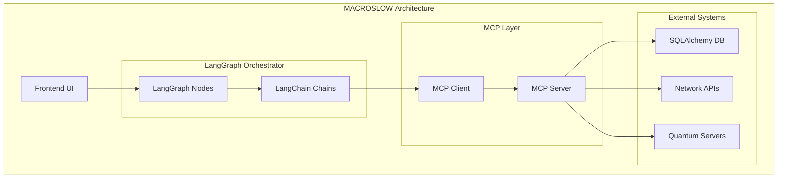

# 🐪 MACROSLOW 2048-AES: A 10-Page Guide to LangChain, LangGraph, and Model Context Protocol (Page 1)

## Introduction to MACROSLOW and LangChain/LangGraph Integration

**MACROSLOW 2048-AES**, developed by the WebXOS Research Group, is an open-source library designed for quantum-resistant, AI-orchestrated decentralized systems. This guide introduces the integration of **LangChain** and **LangGraph** with the **Model Context Protocol (MCP)**, focusing on use cases from the **DUNES Minimalist SDK**, **CHIMERA 2048 Powerhouse SDK Server**, and **Glastonbury Medical Science Research**. Tailored for novice to advanced users, this 10-page guide provides practical examples, code snippets, and deployment strategies using **PyTorch**, **SQLAlchemy**, **Qiskit**, **QuTiP**, and **Docker**.

### What is MACROSLOW?

MACROSLOW is a quantum-simulated, AI-driven framework for secure, decentralized network exchange systems. It leverages:

- **PyTorch** for machine learning.
- **SQLAlchemy** for robust database management.
- **Qiskit** and **QuTiP** for quantum computing integration.
- **Docker** for scalable deployments.
- **MAML (Markdown as Medium Language)** for structured, executable data containers.
- **MCP** for standardized tool and data access.

### Why LangChain and LangGraph?

**LangChain** is a framework for building applications powered by large language models (LLMs), enabling dynamic context retrieval and tool integration. **LangGraph** extends LangChain with graph-based state management, ideal for orchestrating multi-agent workflows. Together, they integrate seamlessly with MACROSLOW’s MCP to create secure, quantum-enhanced applications.

### Objectives of This Guide

1. Introduce **LangChain** and **LangGraph** for building AI-driven workflows.
2. Explain **MCP** as a standardized interface for external tools and quantum systems.
3. Provide use case examples from **DUNES**, **CHIMERA 2048**, and **Glastonbury**.
4. Offer practical code snippets and Docker deployment strategies.

## System Architecture Overview

MACROSLOW’s architecture combines LangChain/LangGraph with MCP for modular, secure, and scalable systems:

- **LangGraph Orchestrator**: Manages multi-agent workflows with stateful graph execution.
- **MCP Servers**: Microservices exposing tools (e.g., database queries, quantum circuits) via standardized interfaces.
- **MCP Clients**: Used within LangGraph agents to communicate with MCP Servers.
- **External Systems**: Databases, network APIs, and quantum computing servers (Qiskit/QuTiP).

## Page 1: Getting Started with LangChain and LangGraph

### LangChain Basics

LangChain enables developers to build applications that combine LLMs with external tools and memory. Key components include:

- **Prompt Templates**: Dynamic prompts for LLMs.
- **Tools**: Functions for external interactions (e.g., APIs, databases).
- **Memory**: Contextual state management across interactions.

### LangGraph Basics

LangGraph extends LangChain with graph-based workflows, allowing complex, cyclical agent interactions. Key features include:

- **Nodes**: Represent tasks or agent actions.
- **Edges**: Define transitions between nodes.
- **State Management**: Tracks context across the graph.

### Setting Up the Environment

To begin, set up a Python environment with LangChain, LangGraph, and MACROSLOW dependencies.

<xaiArtifact artifact_id="f5978049-94b5-40cd-b88f-9212c6e39a36" artifact_version_id="e1767a23-ca34-45a2-bfd4-3e933d01f2b6" title="requirements.txt" contentType="text/plain">

langchain==0.2.0
langgraph==0.1.0
pytorch==2.3.0
sqlalchemy==2.0.0
qiskit==1.1.0
qutip==4.7.0
fastapi==0.111.0
uvicorn==0.29.0
docker==7.0.0
