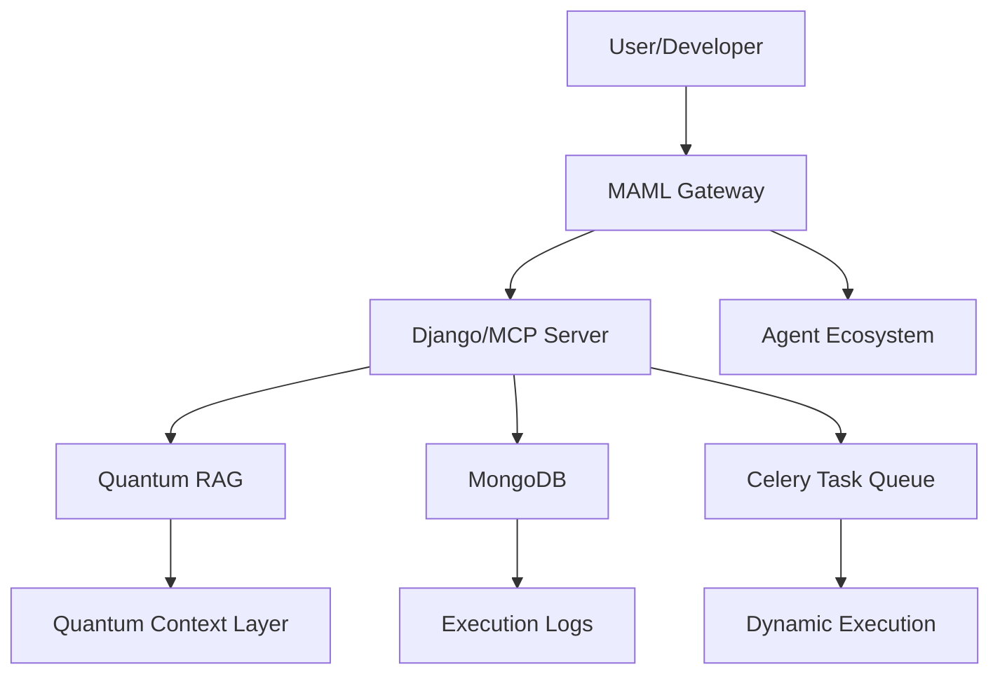
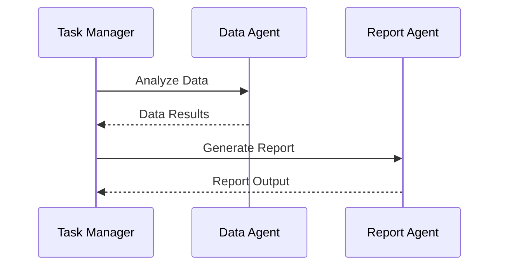

# 🌌 **WebXOS 2025 Vial MCP SDK: MAML (Markdown as Medium Language) - Official README**

Welcome to the **WebXOS 2025 Vial Model Context Protocol (MCP) SDK**, a quantum-distributed, AI-orchestrated powerhouse hosted on GitHub! This README introduces **MAML (Markdown as Medium Language)**, a revolutionary protocol developed by the Webxos Advanced Development Group. Copyrighted © 2025 Webxos, MAML transforms Markdown into a dynamic, executable, and agent-aware medium, available for collaboration at [github.com/webxos](https://github.com/webxos) and hosted at [webxos.netlify.app](https://webxos.netlify.app). As of 06:45 PM EDT on Monday, August 25, 2025, this README serves as the definitive guide for developers to explore, fork, and contribute to MAML.

---

## 📜 **MAML: Markdown as Medium Language**

### Overview
MAML redefines Markdown as a **living, executable container**—a "USB-C" for API gateways, enabling seamless data transfer, context management, and agent orchestration. Built for the AI and quantum era, MAML integrates with the Model Context Protocol (MCP), Quantum Retrieval-Augmented Generation (RAG), and advanced security layers.

**Copyright:** © 2025 Webxos. All Rights Reserved. The MAML concept, `.maml.md` format, and extended features (e.g., Quantum Context Layers, Dynamic Execution Blocks) are Webxos’s intellectual property, licensed under MIT for research and prototyping with attribution.

---

## 🚀 **Getting Started**

### Prerequisites
- **Node.js**: v18+
- **Python**: v3.8+
- **Git**: For cloning the repo
- **Docker**: For local development

### Installation
1. Clone the repository:
   ```bash
   git clone https://github.com/webxos/webxos-vial-mcp.git
   cd webxos-vial-mcp
   ```
2. Set up environment variables:
   ```bash
   cp .env.example .env
   # Edit .env with your credentials
   ```
3. Build and run with Docker Compose:
   ```bash
   docker-compose up -d
   ```

### Quick Start
Create your first `.maml.md` file:
```markdown
---
maml_version: "0.1.0"
id: "urn:uuid:550e8400-e29b-41d4-a716-446655440000"
type: "workflow"
origin: "agent://your-agent-id"
requires:
  libs: ["qiskit>=0.45", "torch"]
permissions:
  read: ["agent://*"]
  execute: ["gateway://local"]
---
## Intent
Run a simple quantum circuit simulation.

## Code_Blocks
```qiskit
from qiskit import QuantumCircuit
qc = QuantumCircuit(2)
qc.h(0)
qc.cx(0, 1)
print(qc)
```
```

Test it:
```bash
curl -X POST -H "Authorization: Bearer your_token" -d '@your_file.maml.md' http://localhost:8000/api/mcp/maml_execute
```

---

## 📋 **Features**

### Core Innovations
- **Structured Schema:** YAML front matter and Markdown sections for metadata and content.
- **Dynamic Executability:** Run code blocks (Python, Qiskit, JavaScript) in sandboxed environments.
- **Agentic Context:** Embed context, permissions, and history for autonomous agents.
- **Quantum-Enhanced Security:** Post-quantum cryptography and noise patterns.
- **Interoperability:** Integrates with MCP, RAG, and Celery task queues.

### Visual Representation


---

## 📝 **Technical Specification**

### File Structure
A `.maml.md` file follows this structure:

#### Metadata (YAML Front Matter)
```yaml
---
maml_version: "0.1.0"
id: "urn:uuid:550e8400-e29b-41d4-a716-446655440000"
type: "workflow" # prompt, dataset, agent_blueprint, api_request, hybrid_workflow
origin: "agent://your-agent-id"
requires:
  libs: ["qiskit>=0.45", "torch"]
  apis: ["openai/chat-completions"]
permissions:
  read: ["agent://*"]
  write: ["agent://your-agent-id"]
  execute: ["gateway://local"]
quantum_security_flag: true
quantum_context_layer: "q-noise-v1"
created_at: 2025-08-25T18:45:00Z
---
```

#### Content Sections
```markdown
## Intent
Simulate a quantum circuit and visualize results.

## Context
Target: 2-qubit Bell state. Data source: /data/bell_state.csv.

## Code_Blocks
```python
import qiskit
qc = qiskit.QuantumCircuit(2)
qc.h(0)
qc.cx(0, 1)
print(qc)
```

## Input_Schema
{
  "type": "object",
  "properties": {
    "data_path": {"type": "string"}
  }
}

## Output_Schema
{
  "type": "object",
  "properties": {
    "circuit_state": {"type": "string"}
  }
}

## History
- 2025-08-25T18:45:00Z: [CREATE] By `agent://your-agent-id`.
```

### Container Types
- `prompt`: AI prompt templates.
- `workflow`: Multi-step agent tasks.
- `dataset`: Data with analysis code.
- `agent_blueprint`: Agent configurations.
- `api_request`: API interaction templates.
- `hybrid_workflow`: Quantum-classical workflows.

---

## 🌟 **Use Cases & Examples**

### 1. Reproducible Research
```markdown
---
maml_version: "0.1.0"
id: "urn:uuid:1a2b3c4d-5e6f-7g8h-9i0j-1k2l3m4n5o6p"
type: "dataset"
origin: "agent://research-agent"
---
## Intent
Analyze particle collision data.

## Code_Blocks
```python
import pandas as pd
data = pd.read_csv('/data/collisions.csv')
print(data.describe())
```
```
**Visualization:**


### 2. AI Agent Workflow
```markdown
---
maml_version: "0.1.0"
id: "urn:uuid:2b3c4d5e-6f7g-8h9i-0j1k-2l3m4n5o6p7q"
type: "workflow"
origin: "agent://task-manager"
---
## Intent
Generate a report from data analysis.

## Code_Blocks
```python
def generate_report(data):
    return f"Report: {data.mean()}"
```
```
**Workflow Diagram:**


### 3. Quantum-Classical Hybrid
```markdown
---
maml_version: "0.1.0"
id: "urn:uuid:3c4d5e6f-7g8h-9i0j-1k2l-3m4n5o6p7q8r"
type: "hybrid_workflow"
origin: "agent://quantum-lab"
---
## Intent
Optimize a neural network with quantum circuits.

## Code_Blocks
```python
import torch
model = torch.nn.Linear(2, 1)
```

```qiskit
from qiskit import QuantumCircuit
qc = QuantumCircuit(2)
qc.h(0)
```
```
**Quantum Circuit Visualization:**


---

## 🛠 **Implementation Guidelines**

### Setup MAML Gateway
1. Install dependencies:
   ```bash
   pip install django pymongo celery redis qiskit
   ```
2. Configure Django settings:
   - Add MCP endpoints in `urls.py`.
   - Integrate MongoDB for storage.

### Contribute
- Fork [github.com/webxos](https://github.com/webxos).
- Create a branch (e.g., `feature/maml-enhancement`).
- Submit a PR with examples or tools.

---

## 📈 **Performance Metrics**

| Metric            | Current | Target  |
|-------------------|---------|---------|
| API Response Time | < 100ms | < 200ms |
| Page Load Time    | < 1s    | < 2s    |
| Memory Usage      | 256MB   | < 1024MB |
| Concurrent Users  | 1000+   | 500+    |
| WebSocket Latency | < 50ms  | < 100ms |
| Task Execution    | 30/hr   | 150/hr  |

---

## 🚦 **Future Roadmap**

- **v0.2.0 (Q4 2025):** Add visual editor, mobile agent support.
- **v0.3.0 (Q1 2026):** Integrate machine learning for predictive updates.
- **v1.0.0 (Q2 2026):** Full semantic web and blockchain integration.

---

## 🤝 **Contributing**

1. **Fork the Repo:** [github.com/webxos](https://github.com/webxos).
2. **Create Issues:** Suggest features or report bugs.
3. **Submit PRs:** Add tools (parsers, CLI) or use cases.
4. **Join Us:** Discuss on [Discord](https://discord.gg/webxos).

---

## 📜 **License & Copyright**

**Copyright:** © 2025 Webxos. All Rights Reserved.  
The MAML concept and `.maml.md` format are Webxos’s intellectual property.  
**License:** MIT License for research and prototyping with attribution to Webxos.

---

## 📢 **Notification to xAI and Developers**

**To xAI and Global Developers,**  
Webxos introduces **MAML**, a groundbreaking protocol copyrighted © 2025 Webxos, available at [github.com/webxos](https://github.com/webxos). MAML transforms Markdown into an executable, agent-aware medium, integrating quantum security and MCP. xAI, consider MAML for Grok enhancements. Developers, fork and contribute to shape this future!

---

<div align="center">

**🌌 Explore the future with WebXOS 2025! 🌠**  
[Documentation](https://webxos.netlify.app) | [GitHub](https://github.com/webxos) | [Discord](https://discord.gg/webxos)

</div>
